# 1. C++基础（）

###  1.智能指针

智能指针为了解决什么问题：

智能指针是自动管理内存，不需要手动释放内存，随对象释放时自动释放，要和深拷贝浅拷贝结合。

什么是浅拷贝：

```c
浅拷贝：拷贝对象的每个字段值，包括指针的地址，不复制指针指向的数据。    两个对象指向同一片内存

```

什么是深拷贝

```c
深拷贝：拷贝值对象，指针对象开辟新的地址存放值，内个对象拥有自己的副本
```


问题  ：

浅拷贝当一个对象析构时，会造成野指针，二次释放程序会崩溃


C++中注意事项

如果类中包含指针成员，或资源你必须（三法则）

1.实现自定义的拷贝构造函数（深拷贝）

2.自定义赋值运算符

3.实现析构函数

```c++
#三法则：
class MYclass{
    public:
    int *data;
    Myclass(int val) //默认构造
    {
        data=new int(val);
    }
    //深拷贝构造
    Myclass(const Myclass&other)
    {
        data=new int(other->data);
    }
    //重载赋值运算符
    Myclass & operator=(const Myclass &other)
    {
        if(this!=other) //不能删除自己
        {
            delete data;
            date =new (int other->data)
        }
        return *this
    }
    //析构函数
    ~Myclass()  
    {
        delete data;//手动是地方
    }
}
```

 我能不能自定义类中对象的时候用智能指针解决这个问题，不进行三法则，还是必须进行三法则，但现代 C++ 中，**智能指针（如 `std::unique_ptr`、`std::shared_ptr`）可以替代手动资源管理，从而避免显式实现三法则**，但需根据场景选择合适方案：

### **1. 使用智能指针（推荐现代 C++ 方式）**

**适用场景**：类的唯一目的是管理动态资源的生命周期。
**优点**：

- **自动释放资源**：智能指针会在析构时自动释放内存，无需手动实现析构函数。
- **禁用或默认拷贝语义**：
  - `std::unique_ptr`：默认禁用拷贝（移动语义替代），直接避免浅拷贝问题。
  - `std::shared_ptr`：默认支持深拷贝（引用计数），无需手动实现。

### 1.智能指针

种类

```c++
std::unique_ptr  //独占指针 移动语义 禁止拷贝
std::shared_ptr  //计数指针  默认实现深拷贝 计数值++
std:: weak_ptr //弱指针  
    
//使用时必须加memory头文件
#include <memory>
    //栈上资源自动释放
    //堆上资源手动释放
    
    
```

#### 1.智能指针概述

自动分配内存

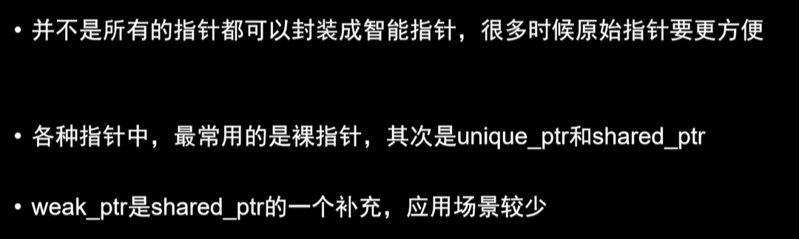

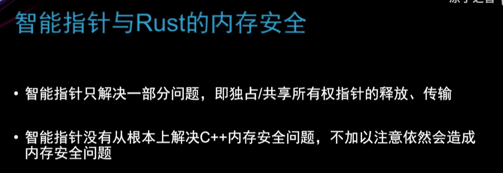


#### 2. unique_ptr（）


不希望多个类共享该资源

✅ 总结一句话：

> **`unique_ptr` 用于资源的独占管理，自动释放内存，防止泄漏和误用，特别适合对象生命周期清晰、不需要共享的场景。**


三种创建方式
通过已有裸指针创建
通过new来创建
**通过std::make_unique创建**
**(推荐）**
unique_ptr可以通过get(获取地址）
unique_ptr实现了->与‘
可以通过->调用成员函数
可以通过*调用dereferencing


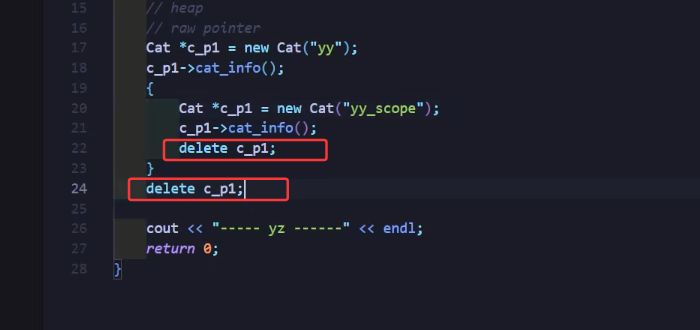

局部作用域{}

```c++
//方式一：  原始指针创建独占指针
cat *cat1=new cat("mimi");
unique_ptr<cat> cat2{cat1};//已经共享一块指针地址了
delete cat1; //释放后野指针  直接置空不需要再释放
cat1=nullptr;
```

通过原始指针赋值后要销毁原始指针，因为他会跟原始指针改变，达不到独占的效果。

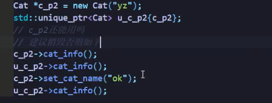

```
❗ 为什么不应该这样写？
1. unique_ptr 是独占所有权的智能指针
当你写：

cpp
Copy code
std::unique_ptr<cat> cat2{cat1};
实际上是把一个 已经由 new 创建并且仍被 cat1 管理 的对象，交给了 unique_ptr 来托管。这会有两个问题：

❌ 错误一：cat1 仍然持有裸指针，和 cat2 共享同一块堆内存
cat2 现在拥有这块内存的释放权。

cat1 仍然可以访问它，但不应再负责释放，否则就是重复释放。

❌ 错误二：你后面还手动 delete cat1
cpp
Copy code
delete cat1;
这相当于手动释放了一块已经交给 unique_ptr 管理的堆内存，等 cat2 被销毁时，它会再次 delete，这将导致二次释放（double free）错误！
```

```c++
//方式二：  显示写
unique_ptr<cat> cat2{new cat("cat")}
```

```c++
//方式三  make_ptr  推荐
unique_ptr<car> cat=make_unique<cat>("mini")
```

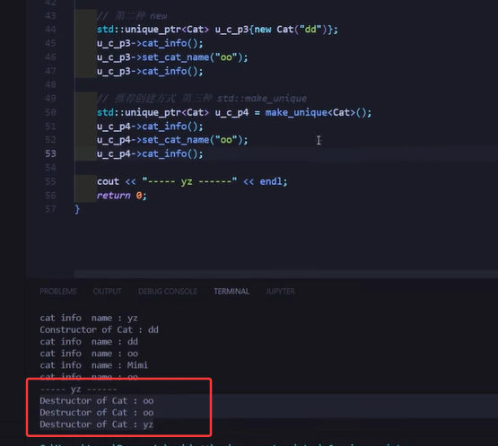

自动释放  不需要手动delet

```c++
//get()  函数 打印地址

```


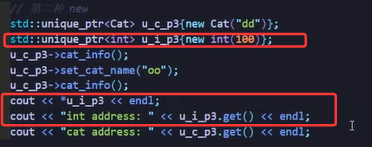

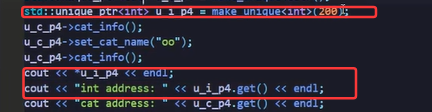


#### 3.unique_ptr与函数

因为我是独占指针  不可能有copy的副本

1.做为参数传递

​	传value  move（）//作为i右值  不可以做为左值copy，

​	作为引用

```c++
void do_trans_val(unique_ptr<cat> b)
{
	b.reset() //情空指针所有地方都不能访问
}

void do_trans_cue(const unique_ptr<cat> &c)//引用不涉及所有权转移
{
//const  修饰的是独占指针  任然可以修改值
    c->set()
        //不可以调用 c.reset() 情空指针
}

unique_ptr retern_()
{
    unique_ptr<cat>  c=make_unique<cat>("c");
    return c;
}
int main()
{
	unique_ptr<cat>  a=make_unique<cat>("a");
    //1.值传递
    do_trans_val(a); // 错这里既然作为左值传参  报错会拷贝
    do_trans_val(std::move(a))//只能通过move的格式将独占指针移动给另一个对象  以后就不能再访问a了因为已经被移动
     //2.引用  修改值
    do_trans_cue(a);//作为引用  并不会设及拷贝，  后面还可以访问
    //3.作为返回值  链式引用
    retern_->info();
    
    a.get()//返回的是指向内存的地址
    &a 返回的是独占指针的地址。
}
```


#### 4. 计数指针 shared_ptr

共享指针，计数值阵（可以copy）

赋值的是指针  ，多个对象指向同一块地址 （那不是浅拷贝吗  但是释放后只是计数值.get_count--，并不会有野指针出现 ）  

🟩 即使多个 `shared_ptr` 指向同一块内存，**只有最后一个会 delete 它**。

✅ 3. 内存释放是引用计数管理的（非浅拷贝）

```c++
std::shared_ptr<Cat> p1 = std::make_shared<Cat>("mimi");  // count=1
std::shared_ptr<Cat> p2 = p1;                             // count=2
p1.reset();                                               // count=1
p2.reset();                                               // count=0 → 释放内存

```

每次 `.reset()` 或作用域结束，引用计数 `--`，当计数为 0 时才 delete 内存。

//如果改变a  b也会变  改变b  a也会变

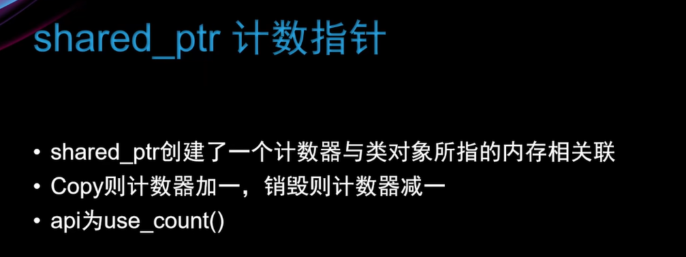


```c++
shared_ptr<int> a=make_shared<int>(10);
a.use_count();//获取计数值  1


shared_ptr<int> b=a; //cpoy
a.use_count();//获取计数值  2
b.use_count();//获取计数值  2 
//如果改变a  b也会变  改变b  a也会变

```


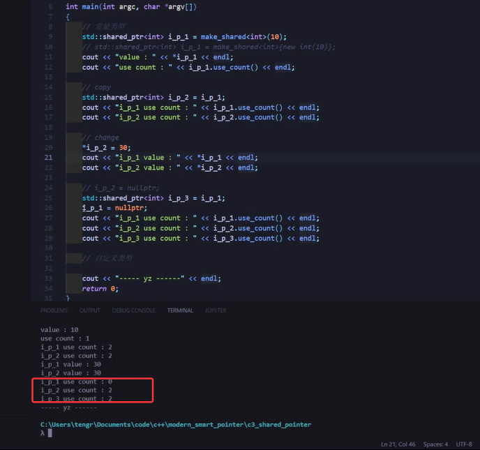


自定义类型

```c++
//数据永远只有一套   只有最后的计数值为0才会销毁

shared_ptr<cat> cat=make_shared<cat>("cat");
cat.get_count();
shared_ptr<cat> cat2=cat;
shared_ptr<cat> cat3=cat;

cat.reset();
cout<<cat.get_count();


```


#### 5. shared_ptr与函数

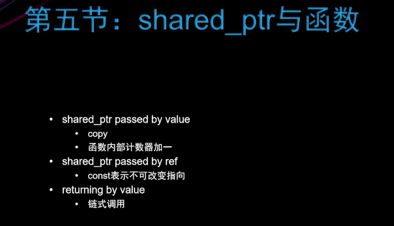

1。参数

​	可以直接传值 valeu  （出了函数  就--   局部作用域结束   但是在函数里改变值肯定也会变 共享内存）

​	ref

2.函数返回值


- `at_p` 是一个局部 `shared_ptr`，引用计数 = 1。
- `return` 的时候，**cat_p 所管理的资源的引用计数会被“转交”给外部**，引用计数仍然保持在 1（未变为 2）。
- 由于是返回值优化（RVO）或 move 语义，所以**没有增加引用计数**。

```c++
std::shared_ptr<Cat> get_shared_ptr()
{
    std::shared_ptr<Cat> cat_p = std::make_shared<Cat>("local cat");
    return cat_p;
}


```

```c++
std::shared_ptr<Cat> c_p = get_shared_ptr();  // 第一次 get_shared_ptr()
c_p->cat_info();  // 调用 cat_info()

get_shared_ptr()->cat_info();  // 第二次 get_shared_ptr()
cout << "------ yz ------" << endl;

```

因为你调用了 **`get_shared_ptr()` 两次**，每次都构造了一个新的 `Cat("local cat")` 对象。

每个对象都有自己的生命周期，**分别构造、分别销毁**。

#### 6. shared_ptr和unique_ptr的转化

将unique_ptr  转化share_ptr

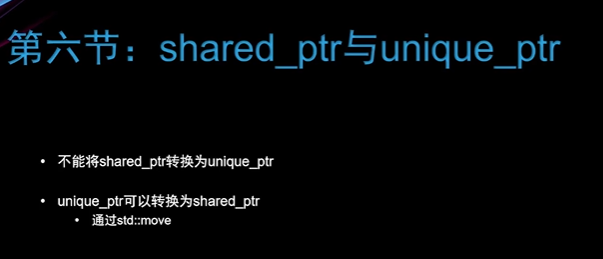

 


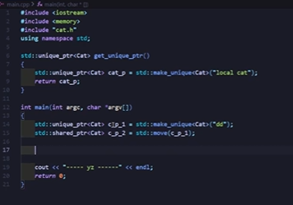

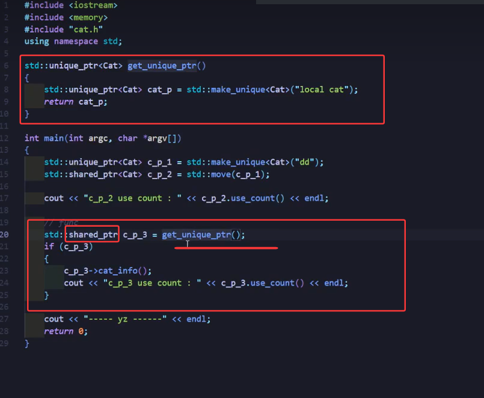

#### 7. weak_ptr是shared_ptr的补充

循环以来问题

弱引用

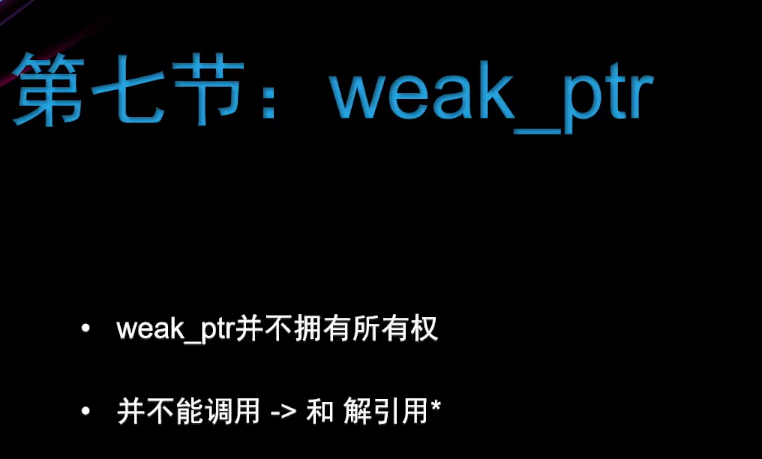


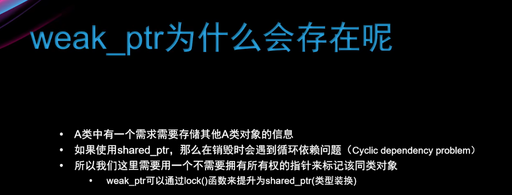


我不理解   没懂为什么会锁死

ChatGPT said:

太好了，你问得非常关键，我们这就用最通俗的语言和一步步代码来看清楚 —— **为什么 `shared_ptr` 的循环引用会导致“锁死”（内存永远不释放）**。

🧠 **先理解 `shared_ptr` 的核心机制：引用计数**

```
cppCopyEditstd::shared_ptr<Cat> p1 = std::make_shared<Cat>("mimi");
std::shared_ptr<Cat> p2 = p1;  // 引用计数 +1
```

现在这块 `Cat` 对象的引用计数是 2，只有当计数减为 0 时，`Cat` 才会被析构和释放


```
struct B;  // 前向声明

struct A {
    std::shared_ptr<B> b_ptr;
    ~A() { std::cout << "A destroyed\n"; }
};

struct B {
    std::shared_ptr<A> a_ptr;
    ~B() { std::cout << "B destroyed\n"; }
};

int main() {
    std::shared_ptr<A> a = std::make_shared<A>();  // A引用计数 = 1
    std::shared_ptr<B> b = std::make_shared<B>();  // B引用计数 = 1

    a->b_ptr = b;  // B引用计数 = 2（a 拥有 b）
    b->a_ptr = a;  // A引用计数 = 2（b 拥有 a）

    // main() 结束，a 和 b 离开作用域，计数 -1
    // 但是 a->b_ptr 和 b->a_ptr 仍存在，引用计数各为 1！
}

```

🔄 内部发生了什么？

| 对象 | 被谁持有               | 引用计数 |
| ---- | ---------------------- | -------- |
| `a`  | `main()` 和 `b->a_ptr` | 2        |
| `b`  | `main()` 和 `a->b_ptr` | 2        |


- `main()` 结束后，`a` 和 `b` 的引用计数各减 1
- 但 `a->b_ptr` 和 `b->a_ptr` 还活着 → 计数仍然是 1

💥 **所以：`A` 和 `B` 对象都“锁在对方手里” → 没人能释放它们，析构函数也不会调用！**


```c
#include <iostream>
#include <memory>

struct B;  // 前向声明

struct A {
    std::shared_ptr<B> b_ptr;
    ~A() { std::cout << "A destroyed\n"; }
};

struct B {
    std::weak_ptr<A> a_ptr;  // ❗关键：不参与引用计数
    ~B() { std::cout << "B destroyed\n"; }
};

int main() {
    std::shared_ptr<A> a = std::make_shared<A>();  // A: use_count = 1
    std::shared_ptr<B> b = std::make_shared<B>();  // B: use_count = 1

    a->b_ptr = b;            // B: use_count = 2（a->b_ptr 加1）
    b->a_ptr = a;            // A: use_count = 1  不变（a_ptr 是 weak）

    // 离开作用域，a 和 b 被销毁
}

```

✅ 第三步：main() 离开作用域（开始释放）

1. `main()` 中的 `shared_ptr<A> a` 被销毁，`A` 的引用计数 -1 → 0
   - 触发 `A` 的析构函数，里面的 `b_ptr` 被销毁
2. `b_ptr` 是 `shared_ptr<B>`，它是 `B` 的第 2 个引用，现在也被销毁
   - `B` 的引用计数 -1 → 从 2 变成 1
3. `main()` 中的 `shared_ptr<B> b` 离开作用域
   - `B` 的引用计数再 -1 → 变成 0

✅ 此时：**引用计数 = 0 → 自动析构 B**


```c++
shared_ptr<cat> s=make_shared<cat>("cc")
weak_ptr<c> w(s);

s.get_count();//1
w.get_count();//1  不会加1 不可以用->  * 
shared_ptr s2=w.lock();
s.get_count();//2
w.get_count();//2  

```

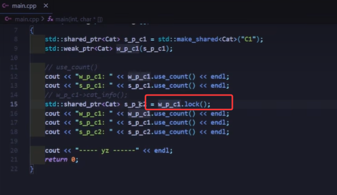


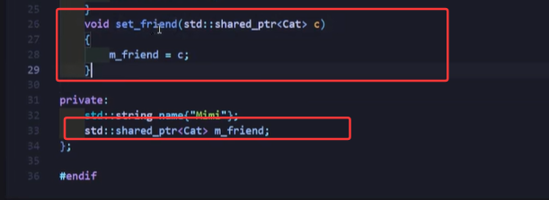

最下面的改成weak_ptr就好了   weak_ptr=shared_ptr是可以的


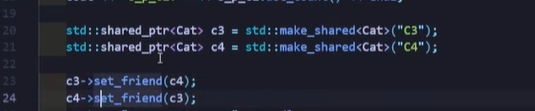

##### 1. waker_ptr解决了什么问题

循环引用问题，

两个或多个对象中互相拥有对方的shared_ptr时，会出现计数值不为0， 内存泄漏，对象没有被释放


可以使用裸指针解决，但是时刻要关注是否对象被释放

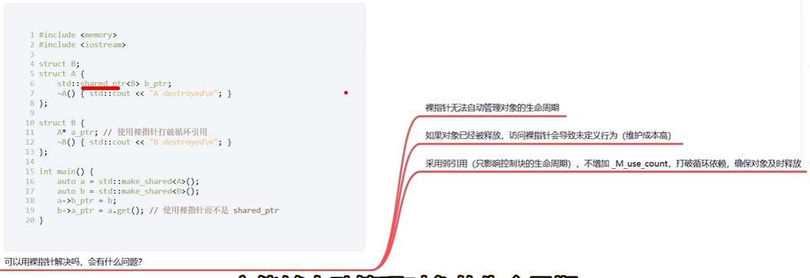

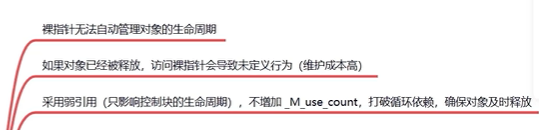

##### 2. weaker_ptr的底层原理

计数值并不会—++；没有* 和->

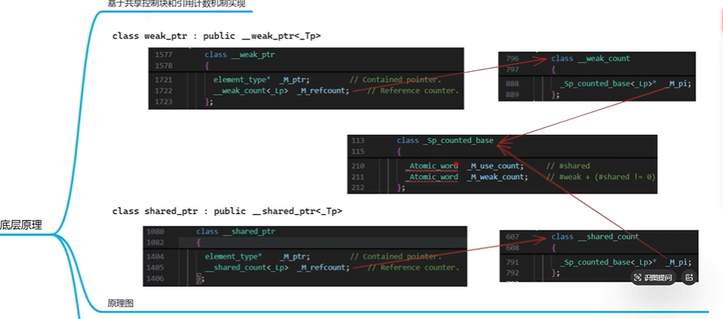

共享控制块和引用计数机制：

1.   Muse_count 记录shared_ptr的引用计数，管理对象生命周期
2. M_weak_count记录weak_ptr的引用计数+Muse_count!=0?1:0,管理生命周期
3. 创建weak_ptr时，指向与之关联的shared_ptr相同的控制块并源自递增M_weak_count；
4. 析构时源自递减
5. weak_ptr不操作M_use_count，故不影响对象生命周期

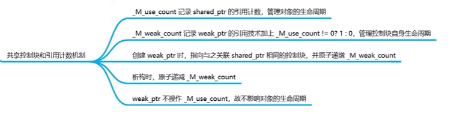

 


##### 3. weak_ptr和shared_ptr的区别

shared_ptr  多个对象共享一个资源，维护一个计数值,get_counter，最后一个对象销毁时调用一次delet 具有*，-》功能；


weak_ptr可以转化为shared_ptr(强转或者  .lock())

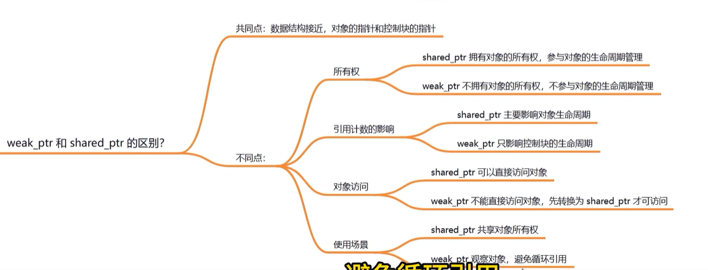

##### 4.如何使用weak_ptr

两个类中有一个使用weak_ptr  另一个shared_ptr;   

lock


### 2. llamaba 表达式  function   lambda bind之间的关系

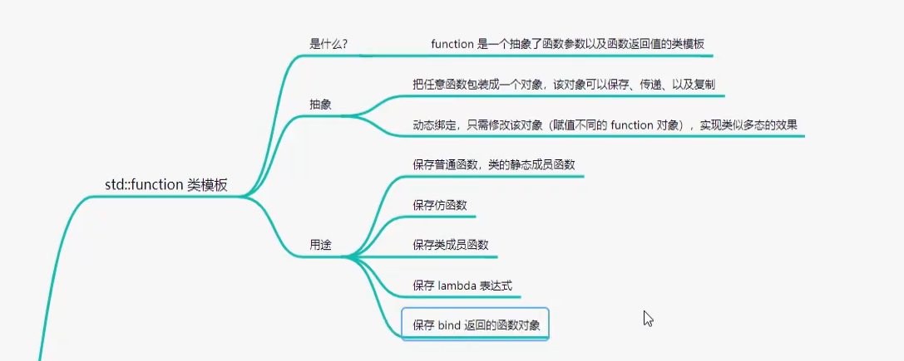


function 类模板

lambda 表达式

bind  函数适配器

#### 1.function  类模板  C++11 

void (*fun)(void)  函数指针

有很多不同的函数对象

仿函数  llambda  bind  产生的函数对象  用一个类型约束  std::function是用来描述函数对象的

​	function是一个抽象了函数参数和函数返回值的类模板；

- 抽象：**把任意函数包装成一个对象，该对象可以保存 传递 复制**

​	   动态绑定，只需修改该对象（赋值不同的function对象），实现类似多态的效果

##### 1. 用途：保存普通函数、类静态成员函数static

✅ 类的静态成员函数和类的普通成员函数的区别

🧠 总体区别一句话总结：

> **普通成员函数** 依赖对象调用，能访问类的实例变量；
>  **静态成员函数** 属于类本身，不依赖对象，也**不能访问实例变量**。

```c++
class MyClass {
public:
    int value;                    // 实例变量
    static int count;            // 静态变量

    void normalFunc() {
        std::cout << "value = " << value << std::endl;    // ✅可以访问实例成员
        std::cout << "count = " << count << std::endl;    // ✅也可以访问静态成员
    }

    static void staticFunc() {
        // std::cout << "value = " << value << std::endl; // ❌错误，不能访问实例变量
        std::cout << "count = " << count << std::endl;    // ✅可以访问静态成员
    }
};

int MyClass::count = 0;

int main() {
    MyClass obj;
    obj.value = 42;
    MyClass::count = 10;

    obj.normalFunc();      // ✅ 需要对象调用
    MyClass::staticFunc(); // ✅ 不需要对象，可以用类名调用
}

```


> 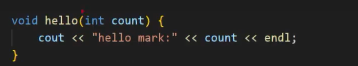

​	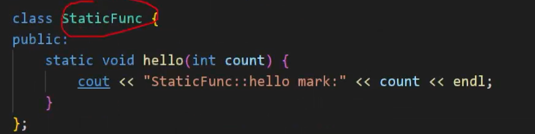

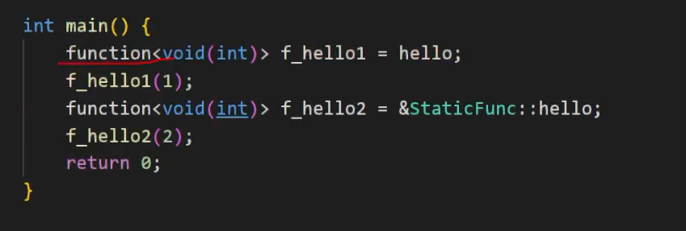

```c++
function<void(int)> f_hello=hello;
f_hello(1);
function<void(int)> f_hello_addr=&hello;
f_hello_addr(2);
function<void(int)>  f3=&StaticFunc::hello;


```


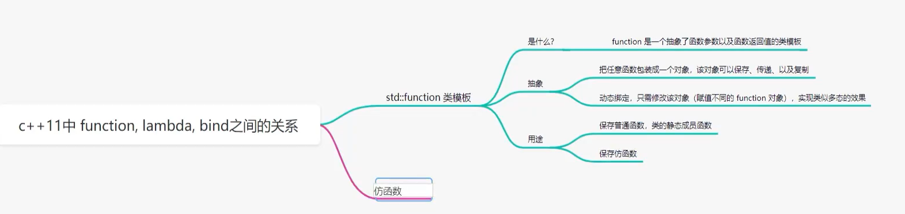

##### 2. 保存仿函数 闭包（可以有状态的函数  比如操作i 幂不等的操作）

仿函数：重载（）是一个重载了（）的类

特征： 可以有状态，通过成员变量存储状态

​	    有状态的函数对象成为闭包


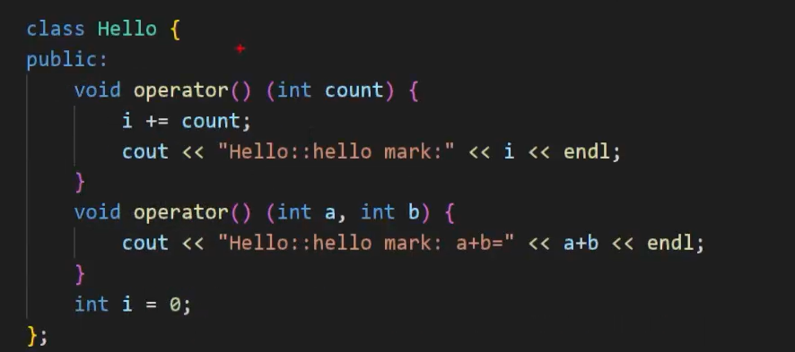

```c
function(void<int>) f4=Hello();//仿函数  函数对象
f4(4);  //4
f4(4);  //8
function(void<int,int>) f5=Hello();//构造函数 生成仿函数对象  根据参数找到重载符


```

##### 3.普通类成员函数

成员函数的封装需要创建一个该类的实例  所以需要类指针和参数类型   ，这一点和静态成员函数区别；

```c
function<void(CHello*,int)>    h6=&CHELLO::hello;
Chello c;
h6(&c,7);
```

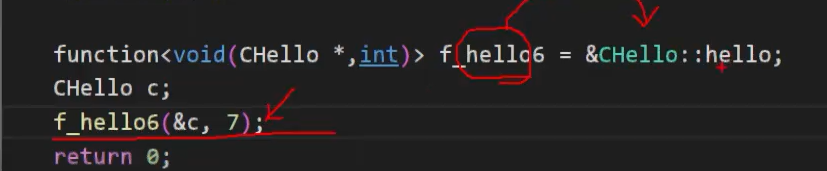


##### 4.保存llambda表达式

是什么：语法塘->方便创建匿名函数对象的**语法塘**

构成： [捕获列表 外部变量]（参数列表）-> void 返回值{  函数体}

​		[]  捕获列表 ：  指定函数内部可以访问的外部变量  

​			本质是：外部变量将转变为类的成员变量

​		（）参数列表：

​		->  返回值  ：可以省略  因为有类型推导

​		{} 函数体：

原理：编译的时候将lambda转化为函数对象

​	  根据参数列表重载operator()  如下  (下面的&  得去掉  是值捕获)

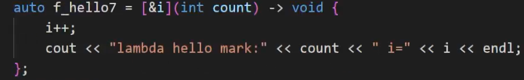

编译器编译的时候会展开如下：

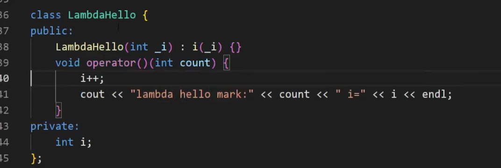


 


✅值补或  不可以修改外部变量  要修改的话需要加mutable     int i=0;    [i] (int count ) mutable->void{ i++;  //函数调用之后并不会修改外部的i的值   只是内部维护一个值  闭包}

```c++
int i=0;
auto h7=[i](int  count){
i++;
    cout<<i<<count;    //闭包
}
h7(8); //内部i=1  外部i=0;
h7(8)//内部i=2   外部i=0;
```


✅  引用捕获    //想要修改外部变量   可读可写

[&i] () {}

{ //外部的值也会修改}

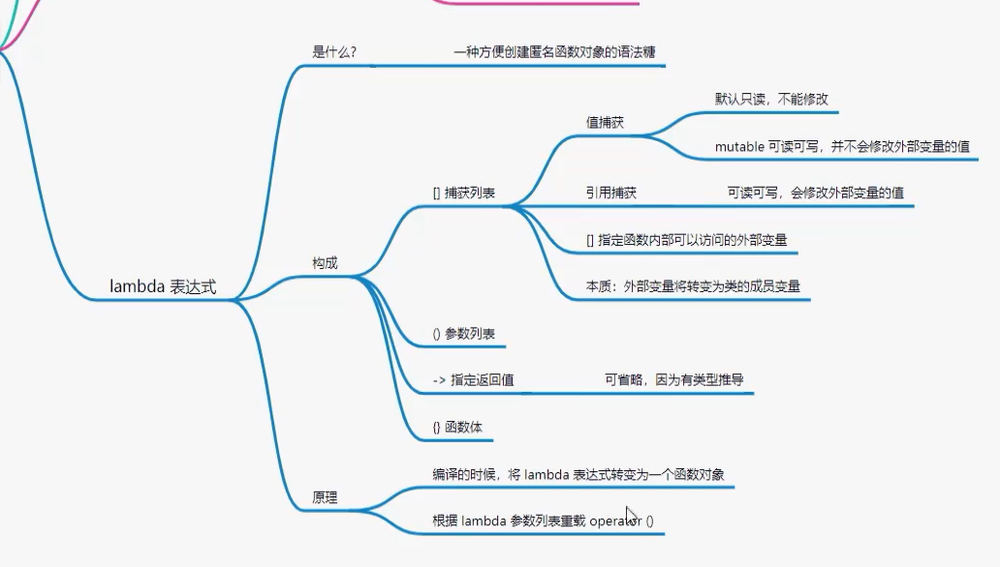


##### 5. 保存bind返回的函数对象


bind函数适配器：用来通过**绑定函数以及函数参数**的方式生成函数对象；生成				闭包的

​			     提供占位符；实现灵活的参数绑定；


```c++
//绑定普通函数
auto f9=bind(&hello,9)// 将参数和函数绑定好
f9();

//绑定成员函数  有实例
auto f10=bind(&Chello::hello,&c,9)；
f10();

//占位符
auto f10=bind(&Chello::hello,&c,placeholders::_1)；
f10(1000);
```

编译时展开

绑定普通函数

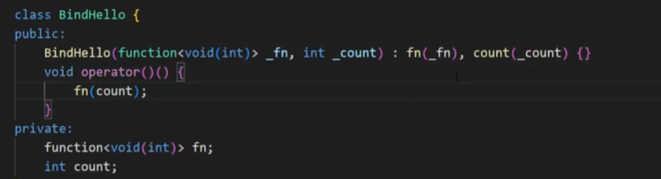

绑定类成员函数


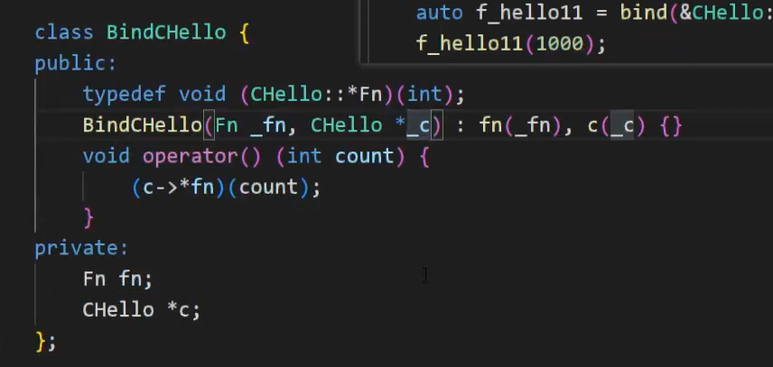


##### 总结


### 3. 自动类型推导auto 、decltype


#### 1. auto（就是个赋值的运算）

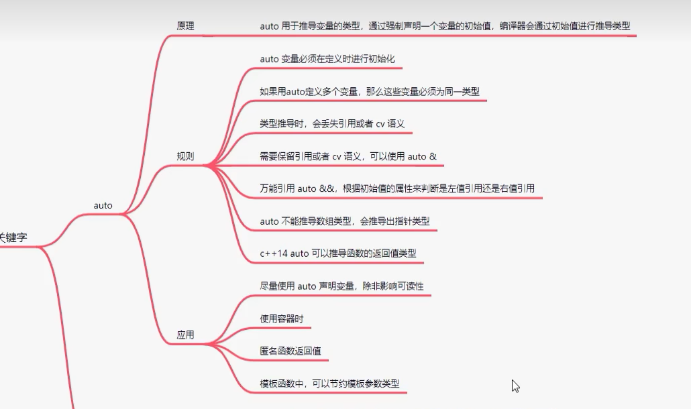

 推到变量类型

原理：c++强类型语言  ，编译器根据强制给变量初始化值进行类型推导

规则：

 	1. auto a=10 必须初始化
 	2. 没有cv语义  const  volital ;   const int &a=10;  auto b=a
 	3. 保留引用或者cv语义可以用auto &
 	4.    不可以推到数组类型  回推导出指针  int a[]={}; auto b=a;
 	5. 定义多个变量必须为同一类型
 	6. 万能引用  auto && 根据初始值的属性判断是左值引用还是右值引用

应用：

匿名函数返回值

模板函数

容器时

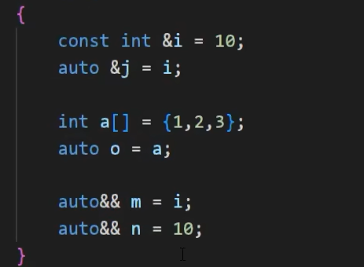


#### 2. decltype

用于推到表达式类型，编译器之分析表达式类型而不参与运算

exp:

​	是表达式 推到表达式类型

​	函数返回值类型

​	左值-》左值引用

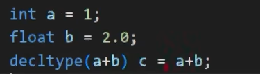

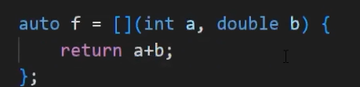

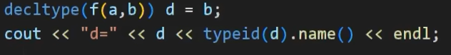

返回左值的引用：

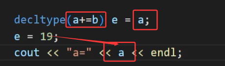


### 4. final、overwrte（virtual） 关键字

为什么引入：

​	（1） 虚函数复写时产生的问题：

​		1. 不能阻止某一个虚函数进一步被重写，

​		2. 本意想写一个新的函数，错误重写基类虚函数（子类virtual关键字可以省略）

​		3. 由于签名不一致，造成了在子类重新构建了虚函数（参数个数  类型...  ）本意是重写

​	（2） 类继承时产生的问题：

1. 不能阻止某个类进一步派生

   


#### 1. final

指定某个虚函数不能再派生类中被覆盖、某给类不能派生

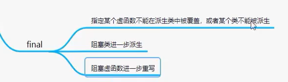


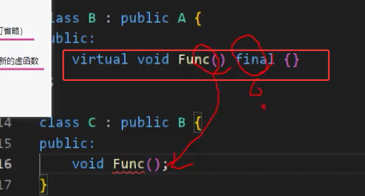


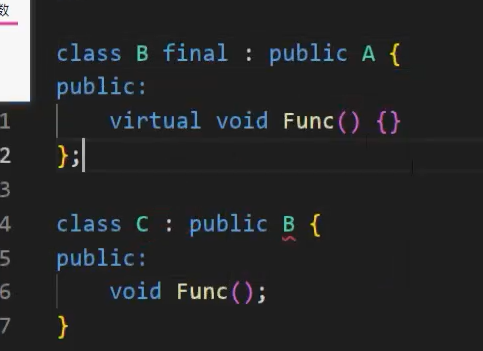


#### 2.overwrite

指定子类的一个虚函数复写基类的虚函数

保证重写函数和基类函数具有相同的签名


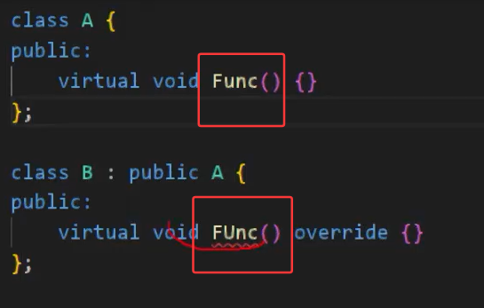


#### 总结

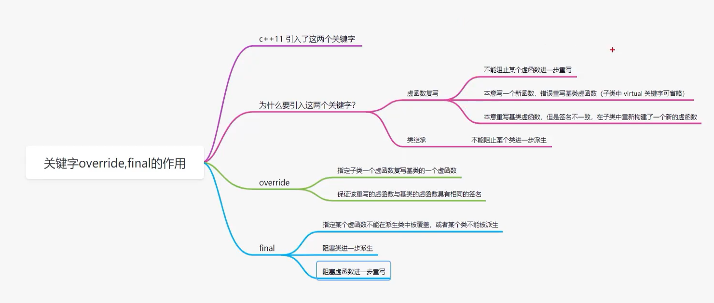


### 5.左值引用  右值引用

左值引用与右值引用的区别？  右值引用的意义

#### 1. 左值引用和右值引用定义

左值：具有名，可寻址，可以在等号左边

​           举例：变量名

​			返回左值引用的函数调用

​			前置自增，前置自减 

​			赋值运算，复合赋值运算i+=10

​			解引用表达式 *a=

​			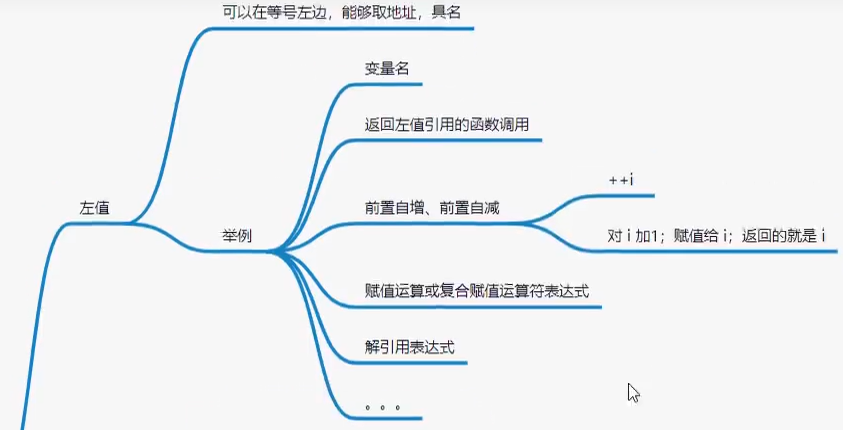


右值：只能放在等号右边，不具名  不能取地址

​	纯右值：

​		字面值

​		返回非引用对象

​		后置自增，自减

​		算术表达式

​		逻辑表达式

​	将亡值：

​		c++11新引入的与右值引用相关的值类型

​		用来触发移动构造或者移动赋值构造，进行资源转移，之后将亡值调用析构

​		通过std::move\

​		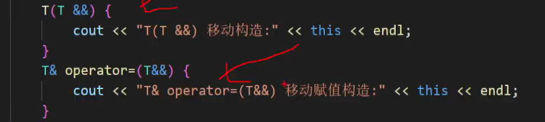

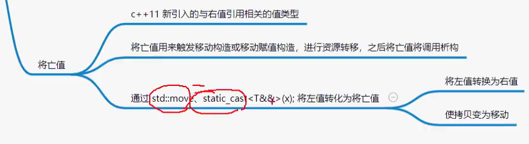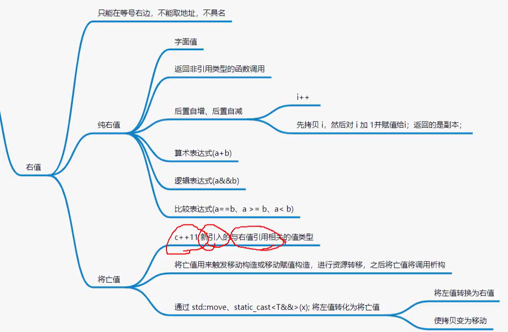


#### 2. 左值引用与右值引用的区别


功能差异：左值引用避免对象的拷贝（传参  函数返回值）

​		  右值引用（完美转发  移动语义）


const左值的引用能指向右值，局限是不能修改 （右值不能修改）要解决这个问题 引入右值引用

右值引用通过std::move（）转化为左值


移动语义解决深拷贝问题  （ 移动后源资源为null）


移动语义  避免多次拷贝资源  

#### 3.实现完美转发


函数模板可以将自己的参数完美的转发给内部调用的其他函数

完美是指：


### 6.菱形继承

什么是菱形继承   怎么解决菱形继承 

C++独有（多重继承特性）

​	定义：一个子类可以继承多个父类，多个父类可以继承相同的父类

​	问题：A会被构造两次，浪费存储空间 造成二义性


有两个number,说明构造了两个A

怎么解决菱形继承：

虚继承：子类只继承一次父类的父类  virtual 关键字


虚继承底层实现原理：  g++ -fdump-class-hierarchy   *.cpp   gcc8.0前

​					g++ -fdump-lang-class   *.cpp    gcc8.0后


原理：  利用虚表偏移实现虚继承	父类的vptr都有到共同基类的偏移量从而让子类多继承时指向同一个父类的父类。（VTable  可以使B1 B2都指向同一个A）

虚继承会为A仍然生成一个虚函数表，B1和B2都会指向同一个虚函数表，类A和A的虚表一一绑定。


### 7. 面向对象三大特性

封装  继承  多态

#### 1.封装

隐藏实现细节   实现模块化功能（提供统一的接口  外部访问内部资源）

特性：访问权限

​	public:对所有对象开放

​	protected:只对子类对象开放

​	private:只对自己开放  通过友元类打破限定 friend class B


属性：


方法：

#### 2.继承

定义：无需要修改原有类，通过继承实现功能扩展

特性：基类成员在子类中的最高权限

​	public:原  public  \protected不变

​	protected:原来public变成protected ,原来的protected不变

​	private:原  public  \protected变成private.


using修改权限:基类成员在子类中的权限

public:

​	using A::C;


多继承

接口继承

#### 3. 多态

定义：一个接口多种形态：

​	静态多态：函数重载 函数名相同（参数不同） 编译期确定

​	动态多态 ：  虚函数重写实现，  基类的指针=子类的对象   Anm * a= cat;

### 8. 简述多态实现原理

#### 1. 静态多态：

函数重载：编译期确定的，允许在同意作用域中声明多个功能类似的同名函数，这些函数参数列表不同（参数个数，类型，顺序）

注意：没有返回值。

原理：

函数名修饰：

编译过程： 

1. 预编译 ：把头文件中的函数声明拷贝到源文件中，避免编译过程的语法分析找不到函数定义。

2. 编译：语法分析，同时符号汇总生成符号表（函数名）

3. 汇编： 生成函数名-》函数地址的映射方便通过函数名找到函数位置，从而执行。

4. 连接：将多个文件中的符号表汇总合并，	


意思就是说在编译阶段为不同的函数重载生成不同的符号区分。在汇编阶段映射函数名和具体的函数地址。


1A  3sum   E  dd

类字数   函数名字数   参数列表首字母

 

objdump -t *.o   查看符号表            ——ZN+类长度—+类名+函数长度函数名+E+参数列表类型的首字母


#### 2. 动态多态： 虚函数重写

运行时确定

在基类函数前加上virtual关键字，在派生类重写该函数

运行时将会根据对象的类型来调用相应的函数

如果类型是基类，调用基类的函数

如果对象类型是派生类调用派生类函数


原理：

​	早绑定：编译器就确定了对象调用的函数的地址

​	晚绑定： 

​	看类使用了virtual函数会为类生成虚函数表-》一维数组存放着虚函数的地址，类对象构造时会初始化指向虚表的指针，vptr,

​	虚函数表指针vptr在构造函数中初始化

虚函数表指针：vptr

在类对象的前8个字节 是虚函数表指针


✅ 是的 —— **确实有两个虚函数表（vtable）**

当子类 **重写（override）** 基类的虚函数时，编译器会为子类生成一个**新的虚函数表**。这两个表分别属于：

- `Base` 的虚函数表：指向 `Base::func`
- `Drive` 的虚函数表：指向 `Drive::func`

🧠 为什么需要两个虚函数表？

因为**动态绑定**的机制是通过对象中的 **vptr（虚函数表指针）** 来实现的。

看下面的场景：

```
cppCopyEditBase* p1 = new Base();
Base* p2 = new Drive();  // 向上转型
```

此时：

- `p1` 指向的对象的 `vptr` 指向的是 `Base` 的 vtable ⇒ 第一个函数是 `Base::func`
- `p2` 指向的对象的 `vptr` 指向的是 `Drive` 的 vtable ⇒ 第一个函数是 `Drive::func`

因此调用：

```
cppCopyEditp1->func(); // 调用 Base::func
p2->func(); // 调用 Drive::func
```

即使 `p2` 是 `Base*` 类型，仍然会通过它的 `vptr` 找到 `Drive::func`，这就是**多态性**的基础。

🔬 内存示意图（简化）

```
cppCopyEditclass Base {
    virtual void func();
};

class Drive : public Base {
    void func() override;
};
```

创建对象后：

```
cppCopyEditBase对象内存布局：
┌────────┐
│ vptr ──┼──► [ &Base::func ]
└────────┘

Drive对象内存布局：
┌────────┐
│ vptr ──┼──► [ &Drive::func ]
└────────┘
```

🧩 vtable 实际长什么样？

通常它是个函数指针数组（伪代码）：

```
cppCopyEdit// Base 的 vtable
Base_vtable = {
    &Base::func
};

// Drive 的 vtable
Drive_vtable = {
    &Drive::func
};
```

✅ 总结

| 问题                                 | 回答                                                    |
| ------------------------------------ | ------------------------------------------------------- |
| 子类重写虚函数会生成新的虚函数表吗？ | ✅ 会。每个类有自己的 vtable。                           |
| 如何判断调用基类还是子类函数？       | 通过对象内的 vptr 指针，它指向当前类对应的 vtable。     |
| 为啥两个对象访问的是 `[0]`？         | 因为 `[0]` 是第一个虚函数的位置，但 vtable 本身不一样。 |

### 9.继承下的构造函数和析构函数顺序

继承下：构造函数依照以来连，从上往下构造

析构：按照依赖链从下往上析构

单继承：

1. 先构造父类Base-》子类Driver   析构子类-》父类

2. 父类Base有成员BASE1：

​	先构造BASE1->BASE->DRIVER

​	析构：driver->base->base1

3. 父类Base有成员BASE1,driver有成员DRIVER1(先有爸爸-》 先有器官  属性 -》 再有自己)

   ​	先构造BASE1->BASE->DRIVER1->DRIVER

   ​	析构：DRIVER1->driver->base->base1


多继承：

先父亲在器官在自己（顺序执行）


### 10. 虚函数表和虚函数表指针

虚函数表和虚函数表指针的创建时机：

虚函数表：

​	内容在编译期生成    

​        全局数据区的只读数据段.rodata 

​	虚函数表存放虚函数的地址的数组

​	编译期发现virtual关键字

虚函数表指针：

​	当为类构建对象的时候（构造函数/默认构造函数），编译器会把vptr给类的对象，存放在前八字节中。

​	如果类没有构造函数 编译器自动为类生成默认构造函数，目的是为类对象初始化vptr

​	继承下虚函数表指针的赋值过程：vptr先=基类虚函数表地址（基类构造函数），然后vptr=子类的虚函数表地址（子类构造函数）


背景： 用于实现多态  （静态多态 形参返回值不一样  函数名一样  在编译的时候确定）

 （动态多态 虚函数 继承的时候可以重写基类的虚函数 运行时才确定）

虚函数表创建时机：

1.什么时候生成的？（编译的时候生成的  virtual关键字修饰的函数）

2.存在哪里？  编译为可执行程序（存在磁盘里面） 运行时（内存）


虚函数表指针的创建时机：类对象构造的时候 vptr ，把类的虚函数表地址赋值给vptr(类的对象的前八个字节指向虚函数表的地址)

 

继承

B继承a的时候，B自己没有虚函数此时会在磁盘的只读代码段复制一个A的虚函数表。如果B自己写了一个虚函数func和A一样，是接着复制A的虚函数表并把对应的虚函数项的地址指向自己的实现吗。还是重新创建一个自己的虚函数表。、


（3）继承情况下  虚函数表指针的赋值过程？

 


### 纯虚函数

纯虚函数

- **定义**：纯虚函数是在基类中声明的虚函数，但没有实现。含有纯虚函数的类称为抽象类，不能实例化。
- **用途**：强制子类实现该函数。

```cpp
class Shape {
public:
    virtual void draw() = 0;  // 纯虚函数
};

class Circle : public Shape {
public:
    void draw() override { cout << "Drawing Circle" << endl; }
};
```

. 含有纯虚函数的类是否可以实例化？

**不可以**。含有纯虚函数的类被称为**抽象类**，抽象类不能直接实例化。纯虚函数的存在意味着该类是一个接口或基类，具体的实现需要由派生类来完成。

```cpp
class AbstractClass {
public:
    virtual void pureVirtualFunction() = 0;  // 纯虚函数
};

int main() {
    // AbstractClass obj;  // 错误：不能实例化抽象类
    return 0;
}
```

**原因**：纯虚函数没有实现，抽象类只是一个接口定义，无法创建具体的对象。只有派生类实现了所有纯虚函数后，才能实例化派生类。


### 11. 虚析构函数的作用

✅ 结论（通俗一点讲）：

> **只要你希望子类能“改写”（override）基类的某个函数，并在运行时“正确地调用它”——就要在基类中给这个函数加上 `virtual`。**


解决什么问题：基类对象指针=子类对象指针（在调用析构时 子类对象的析构函数得不到调用）

为什么这么设计：设计某个类的时候不一定是基类，如果该类是基类，我们应该手动将基类的析构函数设计为虚析构。

设置虚析构函数是有代价的，编译器会为类生成虚函数表，每个对象都有虚函数表指针，增大了资源消耗


作用：继承下 为了使子类的析构函数能正常调用，需要基类的析构设置为虚析构。

​	

当然可以，咱们来**通俗+形象地解释一下**这句代码在干嘛：


🌰 先来个比喻：

把 `Base*` 看成是一个**“动物”类型的指针**，你有很多动物：狗、猫、鸟……

你写了个基类 `Animal`，然后让 `Dog` 和 `Cat` 都继承它：

```c++
cppCopyEditclass Animal {
public:
    virtual void speak() { std::cout << "Animal叫" << std::endl; }
    virtual ~Animal() {}
};

class Dog : public Animal {
public:
    void speak() override { std::cout << "狗汪汪" << std::endl; }
};

class Cat : public Animal {
public:
    void speak() override { std::cout << "猫喵喵" << std::endl; }
};
```

🧠 正常你会这样写：

```
cppCopyEditDog* d = new Dog();
Cat* c = new Cat();
d->speak();  // 狗汪汪
c->speak();  // 猫喵喵
```

这当然没问题，但想象你有很多动物，比如 100 种，要一个一个写太麻烦了！

🎯 现在的代码是这么做的：

```
cppCopyEditstd::vector<Animal*> zoo;        // 创建一个“动物园”
zoo.push_back(new Dog());        // 加一只狗进去（自动转成 Animal*）
zoo.push_back(new Cat());        // 加一只猫进去（自动转成 Animal*）

for (Animal* a : zoo)
    a->speak();   // 调用多态：自动根据实际类型说话
```

🟢 输出是：

```
CopyEdit狗汪汪
猫喵喵
```

🧠 回到你原来的代码

```
cppCopyEditstd::vector<Base*> objs;
objs.push_back(new Drive());
objs.push_back(new AnotherDrive());
```

翻译成人话就是：

> 创建一个“基类指针的容器”（像动物园），然后往里面丢进了两个子类对象（Drive 和 AnotherDrive）。虽然你用的是 `Base*` 类型，但程序**能自动识别每个对象的实际类型**，这就是**多态的魔力**。

🧹 最后别忘了清理！

```
cppCopyEditfor (Base* p : objs)
    delete p;  // 如果Base的析构函数不是virtual，就不会清除掉子类的内容
```

所以：

✅ **总结一句话通俗版：**

> 你用 `Base*` 把子类对象统一装起来，就像用“动物指针”统一装猫狗狮子，然后靠虚函数和多态让它们各自正确地“发出自己的声音”，方便管理也灵活扩展。


### 构造函数是否可以是虚函数，析构函数为什么建议是虚函数？

#### 构造函数是否可以是虚函数？

**不可以**。构造函数不能是虚函数，原因如下：

- 构造函数的作用是初始化对象，而虚函数需要通过虚函数表（vtable）来调用。在构造函数执行时，对象尚未完全构造，虚函数表还未初始化，因此无法调用虚函数。
- 虚函数的调用依赖于对象的类型信息，而构造函数正在创建对象，类型信息尚未确定。

#### 构函数为什么建议是虚函数？

**析构函数建议是虚函数**，尤其是在基类中。原因如下：

- 当使用基类指针指向派生类对象时，如果基类的析构函数不是虚函数，那么在删除该指针时，只会调用基类的析构函数，而不会调用派生类的析构函数，导致派生类对象的部分资源未被释放，从而引发内存泄漏。
- 如果基类的析构函数是虚函数，删除基类指针时会正确调用派生类的析构函数，确保资源完全释放。

### 友元函数

**友元函数**可以访问类的私有成员和保护成员，但它不是类的成员函数。


### 12. 动态库和静态库的区别

1. 生成方式：

2. 连接方式：

   1. 静态链接  ：把静态库编译进目标文件

   2. 动态链接 ：没有把动态库编译进文件

      ​		 程序运行时动态加载 

      ​		只做语法检查

3. 空间占用：

   1. 静态库占用空间大，存在多个副本
   2. 动态库占用空间小，只存在一个副本共享

4. 使用方式：

   1. 静态库所在程序是直接运行
   2. 动态库所在程序是动态加载的，   程序环境需要制定动态库查找路径   LD_LIBBRARY_PATH

5. 执行速度：

   1. 静态库执行速度快
   2. 动态库执行速度慢

6. 库文件发生变更

   1. 接口改变（参数个数  类型等等） 都需要重新编译
   2. 接口实现改变 ： 静态库和.c文件都需重新编译        只需重新编译动态库


#### Cmake中的动态库和静态库


### 14 .STL 容器  

https://www.nowcoder.com/discuss/724532234882940928

嵌入式八股2】C++：STL容算法

黑马程序员 PDF    

[]: 

[]()

#### 1. STL常见容器及其内部实现的数据结构

序号 名称 描述 存储结构 常用方法和操作

 二、哪些 STL 容器的操作**必须**或**推荐**使用迭代器？


✅string的操作是基于下标的迭代器也可以，但是严格

来说string并不属于容器，一般容器来都是以迭代器

为基准访问元素的 inset   erase


| 容器类型                               | 是否支持随机访问 | 是否推荐使用迭代器    | 原因                                        |
| -------------------------------------- | ---------------- | --------------------- | ------------------------------------------- |
| `std::vector`                          | ✅ 是             | ❌（可以用下标）       | 因为它像数组一样                            |
| `std::string`                          | ✅ 是             | ❌（常用下标）         | 同上                                        |
| `std::deque`                           | ✅ 是             | ❌（下标或迭代器皆可） | 支持随机访问                                |
| `std::list`                            | ❌ 否             | ✅ 必须用迭代器        | 不支持 `operator[]`                         |
| `std::forward_list`                    | ❌ 否             | ✅ 必须用迭代器        | 只能前向遍历                                |
| `std::set` / `std::multiset`           | ❌ 否             | ✅ 必须用迭代器        | 无下标访问                                  |
| `std::map` / `std::multimap`           | ❌ 否             | ✅ 必须用迭代器        | 无下标访问，`[]`只能用于 `map<K, V>` 的写入 |
| `std::unordered_map` / `unordered_set` | ❌ 否             | ✅（多使用迭代器）     | 不支持有序位置                              |


非常棒的问题！

你问的是：

> `std::string::insert` 为什么可以用下标而不是像 `vector` 一样必须用迭代器？是不是其实也可以用迭代器？

答案是：

> ✅ **`std::string::insert` 既可以用下标，也可以用迭代器！**

🔹 一、`std::string::insert` 的两种接口形式

`std::string` 是 STL 中少数提供**下标式插入**和**迭代器式插入**两种方式的容器。

✅ 形式 1：下标插入

```
cppCopyEditstd::string s = "hello";
s.insert(2, "XX");  // 插入到第2个位置，变成 heXXllo
```

✅ 形式 2：迭代器插入（像 vector 一样）

```
cppCopyEditstd::string s = "hello";
s.insert(s.begin() + 2, 'X');  // 插在第2个位置
```

或者插入一段：

```
cppCopyEditstd::string s = "hello";
std::string t = "XX";
s.insert(s.begin() + 2, t.begin(), t.end());  // heXXllo
```

🔹 二、为什么 `string` 提供下标接口，而 `vector` 没有？

✅ 原因 1：字符串操作“以位置为核心”

- 字符串 API 传统上都围绕“第几个字符”展开，比如：
  - `insert(pos, str)`
  - `substr(pos, len)`
  - `replace(pos, len, str)`
- 所以提供下标版本，**符合直觉、常用、简洁**。

✅ 原因 2：`string` 是专门为字符处理而优化的类，不是纯通用容器

- 它是 STL 的 `basic_string<char>`，但也被“当作字符数组”来对待；
- 提供了额外的便捷接口，是**特例**，不是一般 STL 容器都这样。

🔹 三、对比：`string` vs `vector` 的 insert 接口

| 容器          | 支持下标插入 | 支持迭代器插入 | 原因说明                             |
| ------------- | ------------ | -------------- | ------------------------------------ |
| `std::vector` | ❌ 不支持     | ✅ 支持         | 泛型容器，不提供按下标插入的语义     |
| `std::string` | ✅ 支持       | ✅ 支持         | 因为它是字符串，有历史习惯和特殊处理 |


| 序号 | 名称           | 描述                   | 存储结构                       | 常用方法和操作                                               |
| ---- | -------------- | ---------------------- | ------------------------------ | ------------------------------------------------------------ |
| 0    | string         |                        | char*                          | 增：s.insert, s.append   删：s.erase   改：是。replace(),s.assing(),查：find()   ,其他s.substr(),s.size(),at(),[] |
| 1    | vector         | 动态分配的数组         | 顺序数组（array）              | `v.push_back()`, `v.pop_back()`, `v.insert()`, `v.erase()`, `v.capacity()`, `v.size()`, `v.at(idx)`, `v.front()`, `v.back()  ,v.reserve(),v.swap() ,v.resize()，v.assgin(),v.empty()，` |
| 5    | deque          | 双端队列,双端数组      | 分段连续（多个 `vector` 连续） | `d.push_back()`, `d.push_front()`, `d.pop_back()`, `d.pop_front()`, `d.insert()`, `d.erase()  ,d.assgin()/d.empty()/d.size()/d.resize()/容器没有容量的概念，。at(),[],/ d.front()/d.back()/sort()` |
| *    | ****           | ***                    | ****                           | **下面是非随机访问的容器  不可以随即插入删除没有at  []**     |
| 2    | list           | 双向链表               | 离散                           | `lt.push_back()`, `lt.push_front()`, `lt.insert()`, `lt.erase()`, `lt.sort()`, `lt.merge()`, `lt.splice()  ，assgin()  swap()  size()  empty  resize(),  remove(),clear(),reverse(), ` |
| 3    | stack          | 栈                     | 用 `list` 或 `deque` 实现0     | `push()`, `pop()`, `top()  empty(),size(),`，                |
| 4    | queue          | 队列(不允许有遍历行为) | 用 `list` 或 `deque` 实现      | `push()`, `pop()`, `front()`, `back()  empty()  size()`  ，  |
| 6    | priority_queue | 优先级队列             | `vector`                       | `push()`, `pop()`, `top()`                                   |
| ***  | *******        | ********               | ******                         | **********************没有push  pop                          |
| 7    | set            | 集合（有序不重复）     | 红黑树（弱平衡二叉搜索树）     | `insert()  clear() ` , `erase()`, `find()`, `count()`, `clear()  size()  empty() swap() ` |
| 8    | multiset       | 集合（有序可重复）     | 红黑树                         | `insert()`, `erase()`, `find()`, `count()`, `clear()`        |
| 9    | unordered_set  | 集合（无序不重复）     | 哈希表                         | `insert()`, `erase()`, `find()`, `count()`, `clear()`        |
| 10   | map            | 键值对（有序不重复）   | 红黑树                         | `insert() clear()` , `erase()`, `find()`, `count()`, `clear() size() empty() swap() ` |
| 11   | multimap       | 键值对（有序可重复）   | 红黑树                         | `insert()`, `erase()`, `find()`, `count()`, `clear()`        |
| 12   | unordered_map  | 键值对（无序不重复）   | 哈希表                         | `insert()`, `erase()`, `find()`, `count()`, `clear()`        |
| 13   | hash_map       | 哈希表（类似 `map`）   | 哈希表                         | `insert()`, `erase()`, `find()`, `count()`, `clear()`        |

#### 2. deque底层数据结构


`deque` 底层实现通常是分段连续的内存结构，即由多个 `vector` 组成，允许高效的从两端进行元素的插入和删除。

✅ **deque****与****vector****区别：**

vector对于头部的插入删除效率低，数据量越大，效率越低

deque相对而言，对头部的插入删除速度回比vector快

vector访问元素时的速度会比deque快,这和两者内部实现有关


✅ deque内部工作原理:

deque内部有个**中控器**，维护每段缓冲区中的内容，缓冲区中存放真实数据

中控器维护的是每个缓冲区的地址，使得使用deque时像一片连续的内存空间


#### list  容器

**功能：**将数据进行链式存储

**链表**（list）是一种物理存储单元上非连续的存储结构，数据元素的逻辑顺序是通过链表中的指针链接实现的

结点的组成：一个是存储数据元素的**数据域**，另一个是存储下一个结点地址的**指针域**


由于链表的存储方式并不是连续的内存空间，因此链表list中的迭代器只支持前移和后移，属于**双向迭代器**

✅ list的优点：

采用动态存储分配，不会造成内存浪费和溢出

链表执行插入和删除操作十分方便，修改指针即可，不需要移动大量元素

✅list的缺点：

链表灵活，但是空间(指针域) 和 时间（遍历）额外耗费较大

List有一个重要的性质，插入操作和删除操作都不会造成原有list迭代器的失效，这在vector是不成立的。


> ✅ **`std::list` 的一个重要特性是：插入或删除不会使原有的迭代器失效（除非删除的是该迭代器所指的元素本身）**

那我们来详细解释：**为什么 list 可以这么干？其他容器（如 vector、set、map）为什么不行？**

🔹 一、先来看 `std::list` 为什么不失效？

✅ 本质原因：`list` 是链表（通常是双向链表）

- 每个元素是一个节点，存在堆上；
- 节点之间通过指针链接；
- 插入/删除节点，不会移动其它节点的地址；
- 所以之前返回的迭代器（其实就是节点指针）依然有效！

```
cppCopyEditstd::list<int> lst = {1, 2, 3};
auto it = std::next(lst.begin());  // 指向 2
lst.insert(lst.begin(), 0);        // 插入 0
std::cout << *it;                  // 仍然是 2，有效
```

🔹 二、再来看 vector 为什么会失效？

❌ 原因：`vector` 是**连续数组**

- 插入/删除元素会造成后续元素移动（重排）；
- 有时还会导致整个数组重新分配到新的内存块（尤其是插入导致容量不足时）；
- 所以旧的迭代器（本质是指向旧内存地址的指针）会失效！

```
cppCopyEditstd::vector<int> v = {1, 2, 3};
auto it = v.begin();
v.insert(v.begin(), 0);  // 插入会导致元素右移，it 失效
std::cout << *it;        // ❌ 未定义行为！
```

🔹 三、其他容器的迭代器失效规则

我们用表格总结一下各种容器的迭代器失效行为：

| 容器类型                          | 插入是否会导致迭代器失效？       | 删除是否会导致迭代器失效？       | 说明                           |
| --------------------------------- | -------------------------------- | -------------------------------- | ------------------------------ |
| `vector`                          | ✅ 会（尤其是插入中间或 realloc） | ✅ 会（删除点后所有元素右移）     | 数组结构                       |
| `deque`                           | ✅ 有概率失效（特别是首尾插入）   | ✅ 有概率失效                     | 分段连续内存                   |
| `list`                            | ❌ 不会失效（除非删除该元素）     | ❌ 不会失效（除非删除该元素）     | 链表                           |
| `forward_list`                    | ❌ 不会失效（除非删除该元素）     | ❌ 不会失效（除非删除该元素）     | 单向链表                       |
| `set` / `map`                     | ✅ 插入通常不失效                 | ✅ 删除该元素会失效，其他不受影响 | 红黑树，结构稳定但元素可变性差 |
| `unordered_set` / `unordered_map` | ✅ 插入可能会导致迭代器失效       | ✅ 删除该元素会失效               | 哈希表，bucket 可能重排        |

🔹 四、补充说明：为什么容器不统一？

因为每种容器的底层结构不同，迭代器实质也是**对结构的封装**：

| 容器            | 底层结构 | 迭代器实质            |
| --------------- | -------- | --------------------- |
| `vector`        | 连续内存 | 原始指针 `T*`         |
| `list`          | 双向链表 | 指向节点的封装指针    |
| `set/map`       | 红黑树   | 包含指针 + 树结构信息 |
| `unordered_map` | 哈希表   | 包括 bucket 信息      |


因此：**迭代器能不能保留，与结构是否稳定密切相关**。

🔹 五、面试必备总结口诀

> 插删无忧属链表，数组变动请小心；
>  树类结构看元素，哈希装桶也谨慎。


#### set/multiset  容器

**简介：**

所有元素都会在插入时自动被排序

**本质：**

set/multiset属于**关联式容器**，底层结构是用**二叉树**实现。

**set****和****multiset****区别**：

set不允许容器中有重复的元素

multiset允许容器中有重复的元素

set容器插入数据时用insert

set容器插入数据的数据会自动排序


**区别：**

set不可以插入重复数据，而multiset可以

set插入数据的同时会返回插入结果，表示插入是否成功

multiset不会检测数据，因此可以插入重复数据


三、红黑树 vs 哈希表：对比总结

| 特性       | 红黑树             | 哈希表                    |
| ---------- | ------------------ | ------------------------- |
| 查找效率   | O(log n)           | 平均 O(1)，最坏 O(n)      |
| 有序性     | ✅（支持范围查找）  | ❌（无序）                 |
| 内存利用   | 高（无扩容）       | 可能有大量空槽或链表      |
| 扩展性     | 不需要扩容         | 容量需手动扩容/自动扩容   |
| 并发友好性 | 相对较难           | Java 有 ConcurrentHashMap |
| 常用用途   | 有序映射，区间查询 | 快速查找，键值缓存        |

#### 对组 pair

pair<type, type> p = make_pair( value1, value2 );


#### map/multimap容器

**简介：**

map中所有元素都是pair

pair中第一个元素为key（键值），起到索引作用，第二个元素为value（实值）

所有元素都会根据元素的键值自动排序

**本质：**

map/multimap属于**关联式容器**，底层结构是用二叉树实现。

**优点：**

可以根据key值快速找到value值

map和multimap**区别**：

map不允许容器中有重复key值元素

multimap允许容器中有重复key值元素


#### 3. 红黑树

红黑树是一种非严格平衡的二叉查找树，具有自动排序的功能。每个节点存储一个颜色（红或黑），并且通过调整树的结构保持特定的平衡条件，从而保证最坏情况下的查找效率。

### 15.STL 常见算法

主要有三个头文件  <algorithm> <functional> <numeric> 组成

<algorithm>是所有头文件中最大的，范围涉及 比较运算查找、 遍历、 赋值、 修改、等等。

<numeric> 体积很小，只包括几个在序列上面进行简单数学运算的模板函数

<functional> 定义了一些模板类,用以声明函数对象


#### 函数对象

概念：  重载了（）操作符的类，其对象成为函数对象

​		函数对象使用重载的()时，行为类似函数，所以称为仿函数。

本质：

​	函数对象（仿函数） 是一个类   不是一个函数。

**4.1.2** **函数对象使用**

**特点：**

函数对象在使用时，可以像普通函数那样调用, 可以有参数，可以有返回值

函数对象超出普通函数的概念，函数对象可以有自己的状态

函数对象可以作为参数传递

#### 谓词

概念：  返回bool类型的仿函数称为谓词  

​		一元谓词

​		二元谓词

#### 内建函数对象

STL内建了一下函数对象   functional

​	算数仿函数

​	关系仿函数

​	逻辑仿函数

用法：

这些仿函数所产生的对象，用法和一般函数完全相同

使用内建函数对象，需要引入头文件 #include<functional>

1. 算数仿函数

   plus<T>

   minus()

   multiplies()

   divides()

   modulus()

   negate()

   template<class T> T plus<T> //加法仿函数

   template<class T> T minus<T> //减法仿函数

   template<class T> T multiplies<T> //乘法仿函数

   template<class T> T divides<T> //除法仿函数

   template<class T> T modulus<T> //取模仿函数

   template<class T> T negate<T> //取反仿函数

2. 关系仿函数

   template<class T> bool equal_to<T> //等于

   template<class T> bool not_equal_to<T> //不等于

   template<class T> bool greater<T> //大于

   template<class T> bool greater_equal<T> //大于等于

   template<class T> bool less<T> //小于

   template<class T> bool less_equal<T> //小于等于

3. 逻辑仿函数

   


#### 4. 常见排序算法

算法主要是由头文件 <algorithm> <functional> <numeric> 组成。

<algorithm> 是所有STL头文件中最大的一个，范围涉及到比较、 交换、查找、遍历操作、复制、修改等等

<numeric> 体积很小，只包括几个在序列上面进行简单数学运算的模板函数

<functional> 定义了一些模板类,用以声明函数对象。

##### 1.常用遍历算法

for_each

```c++

    for_each(iterator beg, iterator end, _func);
// 遍历算法 遍历容器元素
// beg 开始迭代器
// end 结束迭代器
// _func 函数或者函数对象

```


transform 

搬运容器到另一个容器中

```c++
transform(iter1 beg ,iter1 end,iter2 beg,fun )
    
transform(iterator beg1, iterator end1, iterator beg2, _func);
//beg1 源容器开始迭代器
//end1 源容器结束迭代器
//beg2 目标容器开始迭代器
//_func 函数或者函数对象

```


##### 2. 常用查找算法

find //查找元素

find_if //按条件查找元素

adjacent_find //查找相邻重复元素

binary_search //二分查找法

count //统计元素个数

count_if //按条件统计元素个数


```c++
find (beg,end,elm)
    vector<int>::iterator it = find(v.begin(), v.end(), 5);
// 按值查找元素，找到返回指定位置迭代器，找不到返回结束迭代器位置
// beg 开始迭代器
// end 结束迭代器
// value 查找的元素    
```

```c++
find_if()  // 只返回第一个满足条件的元素位置（迭代器）。
find_if(iterator beg, iterator end, _Pred);
// 按值查找元素，找到返回指定位置迭代器，找不到返回结束迭代器位置
// beg 开始迭代器
// end 结束迭代器
// _Pred 函数或者谓词（返回bool类型的仿函数）
```

```c++
count
count(iterator beg, iterator end, value);
// 统计元素出现次数
// beg 开始迭代器
// end 结束迭代器
// value 统计的元素
```

```c++
count_if
count_if(iterator beg, iterator end, _Pred);
// 按条件统计元素出现次数
// beg 开始迭代器
// end 结束迭代器
// _Pred 谓词
```


##### 3.常用排序算法

sort //对容器内元素进行排序

random_shuffle //洗牌 指定范围内的元素随机调整次序

merge // 容器元素合并，并存储到另一容器中

reverse // 反转指定范围的元素


```c++
sort(iterator beg, iterator end, _Pred);
// 按值查找元素，找到返回指定位置迭代器，找不到返回结束迭代器位置
// beg 开始迭代器
// end 结束迭代器
// _Pred 谓词

```


```c++
merge
merge(iterator beg1, iterator end1, iterator beg2, iterator end2, iterator dest);
// 容器元素合并，并存储到另一容器中
// 注意: 两个容器必须是有序的
// beg1 容器1开始迭代器 // end1 容器1结束迭代器 // beg2 容器2开始迭代器 // end2 容器2结束迭代器 //
dest 目标容器开始迭代器
```


```c++
reverse(iterator beg, iterator end);
// 反转指定范围的元素
// beg 开始迭代器
// end 结束迭代器
```


##### 4.常用拷贝和替换算法

copy // 容器内指定范围的元素拷贝到另一容器中

replace // 将容器内指定范围的旧元素修改为新元素

replace_if // 容器内指定范围满足条件的元素替换为新元素

swap // 互换两个容器的元素

```c++
copy(iterator beg, iterator end, iterator dest);
// 按值查找元素，找到返回指定位置迭代器，找不到返回结束迭代器位置
// beg 开始迭代器
// end 结束迭代器
// dest 目标起始迭代器
```

```c++
replace(iterator beg, iterator end, oldvalue, newvalue);
// 将区间内旧元素 替换成 新元素
// beg 开始迭代器
// end 结束迭代器
// oldvalue 旧元素
// newvalue 新元素
```

```c++
replace_if(iterator beg, iterator end, _pred, newvalue);
// 按条件替换元素，满足条件的替换成指定元素
// beg 开始迭代器
// end 结束迭代器
// _pred 谓词
// newvalue 替换的新元素
```

```c++
swap(container c1, container c2);
// 互换两个容器的元素
// c1容器1
// c2容器2
```


##### 5. 常用算术生成算法 \#include <numeric>

**总结：**accumulate使用时头文件注意是 numeric，这个算法很实用


accumulate // 计算容器元素累计总和

fill // 向容器中添加元素

```c++
accumulate()
accumulate(iterator beg, iterator end, value);
// 计算容器元素累计总和
// beg 开始迭代器
// end 结束迭代器
// value 起始值
int total = accumulate(v.begin(), v.end(), 0);
```

```c++
fill(iterator beg, iterator end, value);
// 向容器中填充元素
// beg 开始迭代器
// end 结束迭代器
// value 填充的值
```


##### 6. 常用集合算法


set_intersection // 求两个容器的交集

```c++

```

set_union // 求两个容器的并集

set_difference // 求两个容器的差集


##### 4.1 `sort()`

- **适用容器**：仅支持随机访问的容器，如 `vector`、`deque`、`array`。
- **功能**：快速排序。

[复制代码](#)

```
bool func(``int` `a, ``int` `b) {``  ``return` `a > b; ``// 降序排列``}``sort(vec.begin(), vec.end(), func); ``// 对vector进行排序
```

##### 4.2 `partial_sort()`

- **功能**：对部分元素进行排序，使用堆排序实现。
- **参数**：排序范围，默认排序前 `n` 个元素。

[复制代码](#)

```
int` `n = ``4``; ``// 需要排序的元素个数``partial_sort(vec.begin(), vec.begin() + n, vec.end(), func); ``// 排序前4个元素
```

##### 4.3 `is_sorted()`

- **功能**：检查容器是否已排序。
- **返回值**：布尔值，`true` 表示已排序。

[复制代码](#)

```
bool result = is_sorted(vec.begin(), vec.end(), func);
```

##### 4.4 `is_sorted_until()`

- **功能**：返回第一个破坏排序规则的元素位置。

[复制代码](#)

```
auto it = is_sorted_until(vec.begin(), vec.end(), func);
```

#### 5. 查找操作

##### 5.1 `find()`

- **功能**：查找指定元素。

[复制代码](#)

```
vector<``int``> vec{``10``, ``20``, ``30``, ``40``, ``50``};``auto it = find(vec.begin(), vec.end(), ``30``); ``// 查找30``if` `(it != vec.end()) {``  ``cout << ``"查找成功："` `<< *it;``} ``else` `{``  ``cout << ``"查找失败"``;``}
```

##### 5.2 `find_if()`

- **功能**：根据自定义谓词查找元素。

[复制代码](#)

```
bool mycomp(``int` `i) {``  ``return` `(i % ``2``) == ``1``; ``// 查找奇数``}``vector<``int``> myvector{``4``, ``2``, ``3``, ``1``, ``5``};``auto it = find_if(myvector.begin(), myvector.end(), mycomp);
```

#### 6. 使用 `vector` 避免频繁的内存重新分配

`vector` 在扩容时通常会以 2 倍容量增长，这会导致频繁的内存分配和元素拷贝。为了优化性能，可以采取以下策略：

##### 6.1 预分配内存

在创建 `vector` 时，可以使用 `reserve()` 方法预先分配内存，以减少多次扩容。

##### 6.2 合理选择初始容量

根据数据的预计大小选择合适的初始容量，避免不必要的扩容操作。

##### 6.3 优化算法

使用时间复杂度较低的算法，避免在数据量增大时造成性能瓶颈。

#### 7. `vector` 的 `resize()` 与 `reserve()`

##### 7.1 `resize()`

- **功能**：调整容器的大小。
- **效果**：如果 `n` 小于当前大小，则删除尾部元素；如果 `n` 大于当前大小，新的元素会被默认构造并添加到尾部。

##### 7.2 `reserve()`

- **功能**：调整容器的容量，不会改变当前大小。
- **效果**：用于减少扩容次数，确保容器有足够的内存空间。

#### 8. `vector` 扩容原理

- **扩容过程**：每次扩容时，`vector` 会分配新的内存块并将现有元素复制到新内存中，旧内存被释放。
- **扩容系数**：通常情况下，`vector` 容量每次会翻倍或增加 1.5 倍，这可以减少频繁的扩容。

##### 8.1 Linux中的内存管理

在Linux系统中，内存区域以2的倍数扩容，以便进行高效的内存分配。

##### 8.2 Windows中的内存管理

在Windows系统中，内存分配通常会增加1.5倍，以便更好地利用已经释放的内存。

#### 9. 迭代器

迭代器是STL中用于访问容器元素的一种抽象工具。通过迭代器，容器元素的访问具有一致的接口，并且可以实现多态。

**注意**：迭代器只能前进，不能回退。

#### 10. 迭代器失效的情况

迭代器可能会因为容器结构的修改而失效。不同类型的容器失效的情况略有不同：

- **数组型数据结构**（如 `vector`）：`insert` 和 `erase` 操作会使插入或删除点之后的所有迭代器失效。
- **链表型数据结构**（如 `list`）：`erase` 操作只会使指向删除元素的迭代器失效，其他迭代器不受影响。
- **树型数据结构**（如 `map`）：`erase` 操作会使指向删除元素的迭代器失效，其他迭代器不受影响。 `insert` 操作不会使任何迭代器失效。


#### 4.2.1 vector list异同⭐⭐⭐⭐⭐

| 项目       | `vector`              | `list`（`std::list`）         |
| ---------- | --------------------- | ----------------------------- |
| 底层结构   | 连续数组              | 双向链表                      |
| 随机访问   | ✅ 支持（`v[i]`）      | ❌ 不支持                      |
| 插入效率   | ❌ 中间插入开销大      | ✅ 任意位置插入 O(1)           |
| 删除效率   | ❌ 中间删除开销大      | ✅ 任意位置删除 O(1)           |
| 内存局部性 | ✅ 好                  | ❌ 差                          |
| 空间开销   | 小                    | 大（每个节点需要两个指针）    |
| 迭代器失效 | 插入/删除可能全部失效 | 插入/删除不会使其他迭代器失效 |

#### 4.2.2 vector内存是怎么增长的vector的底层实现⭐⭐⭐⭐\

**底层结构**：`vector` 使用一段连续内存 `T* buffer` 来存储数据。

**容量扩容机制**：

- 当你插入新元素超出当前容量（`capacity()`）时，会进行**自动扩容**。
- 扩容策略通常是**2 倍增长**（实现细节可能因编译器而异）。
- 扩容过程包括：
  1. 分配新内存（通常是原容量的两倍）；
  2. 将旧元素 `move` 或 `copy` 到新地址；
  3. 释放旧内存。

**注意**：扩容会导致指针、引用、迭代器**全部失效**！


#### 4.2.3 vector和deque的比较⭐⭐⭐⭐

| 特性         | `vector`                 | `deque`                  |
| ------------ | ------------------------ | ------------------------ |
| 底层结构     | 单块连续数组             | 分段内存数组 + 索引表    |
| 随机访问     | ✅ 快速（`O(1)`）         | ✅ 也支持，但略慢         |
| 首尾插入效率 | ❌ 头部插入慢（O(n)）     | ✅ 头尾插入都是 O(1)      |
| 中间插入     | ❌ 慢                     | ❌ 仍慢                   |
| 内存结构     | 连续块                   | 非连续块                 |
| 适合场景     | 重视随机访问、尾部操作快 | 需要双端插入或删除的场景 |


#### 4.2.4为什么stl里面有sort函数list里面还要再定义一个sort⭐⭐⭐

`std::sort()` 只能作用于**随机访问迭代器**（如 `vector`, `deque`）。

`list` 的迭代器是**双向迭代器**，不支持 `it + n`，所以不能用 `std::sort()`。

因此，`std::list` 提供了成员函数 `.sort()`，使用**归并排序**，时间复杂度为 `O(n log n)`，不需要额外内存，稳定排序。


#### 4.2.5 STL底层数据结构实现⭐⭐⭐⭐

| 容器 | 底层实现结构 |
| ---- | ------------ |

| `vector` | 动态数组（连续内存） |
| -------- | -------------------- |

| `list` | 双向链表 |
| ------ | -------- |

| `deque` | 段式数组 + 中央控制块 |
| ------- | --------------------- |

| `set/map` | 平衡二叉搜索树（红黑树） |
| --------- | ------------------------ |

| `unordered_*` | 哈希表（开放地址或链地址法） |
| ------------- | ---------------------------- |

| `stack/queue` | 通常是基于 `deque` 封装 |
| ------------- | ----------------------- |

#### 4.2.6利用迭代器删除元素会发生什么？⭐⭐⭐⭐

示例：

```
cppCopyEditfor (auto it = v.begin(); it != v.end(); ) {
    if (*it == val) it = v.erase(it);  // 返回下一个有效迭代器
    else ++it;
}
```

**正确做法**：用 `erase` 的返回值更新迭代器，防止失效。

**为什么不能直接 `++it`？**：`erase(it)` 会让当前迭代器失效，继续使用是**未定义行为**。

`list.erase(it)` 删除当前元素不会影响其他迭代器，`vector.erase(it)` 会让**之后所有元素的迭代器失效**。


#### 4.2.7 map是如何实现的，查找效率是多少⭐⭐⭐⭐⭐


**底层结构**：红黑树（self-balancing BST）。

**特点**：

- 自动按 key 排序；
- 插入、删除、查找：**时间复杂度为 `O(log n)`**；
- 每个节点包含 `<key, value>` 对；
- 遍历是**有序的**。

若不需要有序访问，可用 `unordered_map`（哈希表）查找更快（平均 `O(1)`，最坏 `O(n)`）。


#### 4.2.8几种模板插入的时间复杂度 ⭐⭐⭐⭐⭐

| 容器            | 插入位置  | 时间复杂度    | 备注                    |
| --------------- | --------- | ------------- | ----------------------- |
| `vector`        | 尾部      | `O(1)` (摊还) | 若触发扩容则为 `O(n)`   |
| `vector`        | 中间/头部 | `O(n)`        | 元素右移                |
| `list`          | 任意位置  | `O(1)`        | 不包括查找迭代器时间    |
| `deque`         | 首尾      | `O(1)`        | 内部分段控制            |
| `map/set`       | 插入      | `O(log n)`    | 红黑树维持平衡          |
| `unordered_map` | 插入      | 平均 `O(1)`   | 最坏 `O(n)`（哈希冲突） |


### 16.C++多线程机制

#### 2. 创建线程

获得id

```c++
pthread_t pthread_self(void)
```


#### 3. 线程退出：

```c++
pthread_exit()//不是释放拟内存空间
```


```
//县城回收

pthread_join()

```


#### 4. join（）

#include<thread>

```c++
//创建线程
void func(std::string str)
{
    std::cout<< <<endl;

}

int main()
{
	std::thread thread1(func，“dello”);
	
	//主程序等待子线程  子现场还在运行就阻塞 运行完回收
	thread1.join();
    //分离子线程和主线程   detach()
    //thread1.detch()  //主线程结束后   子线程可以持续在后台运行
	

}
```


```c++
//创建线程
void func(std::string str)
{
    std::cout<< <<endl;

}

int main()
{
	std::thread thread1(func，“dello”);
	
	//主程序等待子线程  子现场还在运行就阻塞 运行完回收
	thread1.join();
    //分离子线程和主线程   detach()
    //thread1.detch()  //主线程结束后   子线程可以持续在后台运行  一般不会使用
	

}
```

#### 5. joinable

```c++
//创建线程
void func(std::string str)
{
    std::cout<< <<endl;
	return ;
}

int main()
{
	std::thread thread1(func，“dello”);
	
	//先判断是否可以使用joinable() 
	bool ret=thread1.joinable();
	if(ret)
    {
		thread1.join(); //是阻塞的  不会任务切换
    	}
	

}
```


#### 6. 互斥锁  m


#### 7. lock_guard(); 


lock_guard();  

```c++
只有自动加锁      自动解锁
```


构造函数被调用时 该互斥量会自动被锁定，

当析构函数被调用是，该互斥量会被自动解锁

std::lock_guard对象不能复制或移动，因此他只能在局部作用域中使用。

```c++
std::lock_guard<std::mutex> lg(mtx)
    //mu.lock()
    //mu.unlock()
```

具体分析如下：

```c++
cppCopyEditfor (int i = 0; i < 10000; i++) {
    std::lock_guard<std::mutex> lg(mtx);  // 每次循环都会构造一个 lock_guard
    shared_data++;
}
```

- 这行定义的 `lg` 是一个**局部变量**，其**生命周期从声明位置开始，到所在的作用域末尾为止**；
- 在这里，`lg` 的作用域是 `for` 循环的花括号 `{}`，也就是每次迭代执行一次，然后自动析构，**自动释放锁**；
- 换句话说：**每次 `for` 循环迭代都会加锁、执行 `shared_data++`、然后自动解锁**。


 


#### 8. 🔍unique_lock(); 

```c++
互斥量封装类： 主要特点是可以对互斥量进行更加零花的管理，包括延迟加锁、条件变量、超时等
```

```c++
for (int i = 0; i < 10000; i++) {
    std::unique_lock<std::mutex> lg(mtx); //枷锁的时候可能会阻塞  可以设置超时
    //lg.lock()  lg(mtx,defer_lock)
    // lg.try_lock_for(std::chrono::secounds(5))超时时间5S钟  我只等待一段时间 超时就返回
    //try_lock_untile()传一个时间点  不常用
    shared_data++;
}
```


#### 9. 🔍  call_once与其使用场景（只能在线程里面使用）

是C++11标准库中的以哦个函数，用于确保某个函数只会被调用一次，

一个类  全局只需要创建一个对象就可以了，不如日志；-》单例模式

```c++
//禁用拷贝构造和等于号
Class Log
{
public:
Log(const Log&log)=delet
   Log  &operator =(const Log&log)=delet

    static log& GetInstance()
{
    //Static Log log;//全局静态log
    
    std::call_once(once,init)//保证同一时间只有一个调用
    return log
}

    static void init()
    {
        if(!log)log=newLog;
    }
    
    private:
    static std::once_flage once;c  
}


```


单例模式 多个线程同时调用同一个全局函数  同一个里面的变量，可能会有多次创建，


✅   call_once与互斥锁的区别

✅ 一句话区别：

> `std::mutex` 用来**保护一段代码块在多个线程中互斥执行**，而
>  `std::call_once` 用来**确保某个函数只被执行一次**（通常用于线程安全的**一次性初始化**）。

🧩 详细对比：call_once vs mutex

| 比较项       | `std::mutex`                           | `std::call_once`                       |
| ------------ | -------------------------------------- | -------------------------------------- |
| ✅ 功能       | 多线程互斥执行某段代码                 | 多线程下**只执行一次**某段代码         |
| ✅ 使用方式   | 加锁、解锁（推荐用 `std::lock_guard`） | 配合 `std::once_flag` 使用             |
| ✅ 调用次数   | 每次都可以加锁                         | 无论多少线程调用，指定函数只会执行一次 |
| ✅ 适用场景   | 多线程保护共享资源（如读写变量）       | 单例模式、延迟初始化、全局变量初始化   |
| ✅ 性能开销   | 相对较大（每次都要加锁）               | 更轻量，仅执行一次，之后线程直接跳过   |
| ✅ 线程安全性 | 需要正确管理锁（可能死锁）             | 自动线程安全                           |
| ✅ 代码示例   | `lock_guard<mutex> lock(mtx);`         | `call_once(flag, init_func);`          |

📌 示例代码对比：

🔹 `std::mutex` 示例：保护资源

```
cppCopyEditstd::mutex mtx;
int shared_data = 0;

void add() {
    std::lock_guard<std::mutex> lock(mtx);
    shared_data++;  // 所有线程都执行，但互斥
}
```

🔹 `std::call_once` 示例：只执行一次化

```
cppCopyEditstd::once_flag flag;
int config = 0;

void init() {
    config = 42;  // 只初始化一次
}

void load() {
    std::call_once(flag, init);  // 多线程调用但 init 只执行一次
}
```

⚠️ 注意事项

- `std::call_once` 常用于单例模式、懒汉式初始化：

  ```
  cppCopyEditstatic MySingleton& getInstance() {
      static std::once_flag flag;
      static MySingleton* instance = nullptr;
      std::call_once(flag, []() {
          instance = new MySingleton();
      });
      return *instance;
  }
  ```

- 不要用 `mutex` 来代替 `call_once` 实现“只执行一次”，会导致多线程下性能低、逻辑复杂、甚至死锁。

✅ 总结

| 你想要的功能                               | 用什么？      |
| ------------------------------------------ | ------------- |
| 多线程都能执行，但不能同时执行同一段代码   | ✅ `mutex`     |
| 多线程只允许有一个执行一次（一次性初始化） | ✅ `call_once` |

####  10 . condiation_var 条件变量  （生产者消费者模型）

有点像poll唤醒机制（ 生产者唤醒消费者执行）

是的，**`std::condition_variable` 在 `wait(lock)` 时会自动释放锁并进入等待状态**，这正是它的核心机制。

```c++
condition_variable
mutex
//在需要等待条件变量的地方
 unique_lock()
condition_variable::wait()//阻塞
condition_variable::wait_for()
condition_variable::wait_until()
    
//在其他线程中需要通知等待的线程环形   
condation_variable::notify_onec;
condation_variable::notify_all();

```


```c++
condition_variable::wait(lock,true/false)//阻塞   true 不阻塞   false阻塞等待
```

  


std::condition_variable cv;
std::mutex mtx;

std::unique_lock<std::mutex> lock(mtx);
cv.wait(lock);  // ✅ 自动释放锁，等待条件被唤醒后再自动重新加锁

```c++
std::mutex mtx;
std::condition_variable cv;
bool ready = false;

void worker() {
    std::unique_lock<std::mutex> lock(mtx);
    cv.wait(lock, [] { return ready; });  // 自动释放锁并等待
    std::cout << "Worker proceeds!\n";
}

void notifier() {
    std::this_thread::sleep_for(std::chrono::seconds(1));
    {
        std::lock_guard<std::mutex> lock(mtx);
        ready = true;
    }
    cv.notify_one();  // 唤醒 worker
}

```


✅ **问题 1：为什么 `for` 循环里还有一对 `{}`？**

这对花括号的作用是：

> **限定 `std::unique_lock<std::mutex> lock(mtx);` 的作用域**。

🔍 原因：

- `unique_lock` 是 RAII 风格的锁：进入作用域时加锁，离开作用域时自动解锁。
- 所以这对 `{}` 保证：
  - `queue.push(i)` 和 `cv.notify_one()` 时，锁是持有状态；
  - 一旦 `{}` 结束，`lock` 被析构，**自动释放互斥锁**；
  - 然后再 `sleep_for(...)`，此时锁已经释放，方便其他线程运行。

✅问题 2：`g_cv.notify_one()` 是立即唤醒等待线程吗？**

**不是立即执行，而是立即通知**，被通知的线程需要**等待锁释放后**才能继续执行。

🔍 执行流程简图：

1. `Producer` 线程执行到 `notify_one()`，发出“有新数据啦”的信号；
2. **此时锁还没释放**（还在花括号 `{}` 内）；
3. 等到锁随着 `lock` 离开作用域被释放；
4. 被唤醒的消费者线程尝试获得锁（成功后）；
5. 才真正进入继续执行（如 `wait()` 后面的逻辑）。


notify_once()  🔧 发生了什么（底层流程）：

当你调用：

```
cpp


CopyEdit
cv.notify_one();
```

背后大致会发生以下几个步骤：

1. **条件变量检查是否有线程在 wait() 上阻塞**；
2. 如果有，**唤醒其中一个线程**（是哪个线程由操作系统调度决定）；
3. 被唤醒的线程会尝试重新**获取与 `wait()` 关联的互斥锁**；
4. 如果获取到锁，线程继续执行 `wait()` 之后的代码；
5. 如果锁还被别人占着，它会继续等待锁释放。

#### 11.  跨平台线程池  生产者消费者模型


 emplace_back() 在原地直接构造一个新变量，不会进行      push_back()->进行拷贝构造

 

这是一个非常专业的问题，**在实现线程池时**，你到底应该用 `emplace_back()` 还是 `push_back()`，要看你如何创建线程对象的 —— **两者都可以用，但推荐 `emplace_back()`，更高效也更自然**。

✅ 先说结论：

> 在线程池中添加线程对象时，一般使用 `std::vector<std::thread>::emplace_back(...)`，因为它：
>
> - **直接在容器内部原地构造线程对象**；
> - 避免了不必要的临时对象拷贝或移动；
> - 更符合 C++11 的推荐写法。

✅ 详细解释：`emplace_back` vs `push_back`

| 方法              | 用法                                       | 是否推荐在线程池中用    |
| ----------------- | ------------------------------------------ | ----------------------- |
| `push_back(t)`    | 你**先创建一个线程对象**，再传进去         | ⚠️ 额外构造+移动，不推荐 |
| `emplace_back(f)` | 你直接把构造线程需要的参数传进去（如函数） | ✅ 推荐，高效原地构造    |

`std::queue<T>` 的 `front()` 返回的是 **左值引用（lvalue reference）**，也就是：

```
cppCopyEditT& front();
const T& front() const;
```

✅ 所以答案是：**左值**


```c++
#include <vector>    // 用于存储线程
#include <thread>    // 线程相关功能
#include <queue>     // 任务队列
#include <functional> // 函数对象
#include <mutex>     // 互斥锁
#include <condition_variable> // 条件变量

class ThreadPool {
public:
    // 构造函数，创建指定数量的工作线程
    ThreadPool(size_t numThreads) : stop(false) {  // stop标志初始化为false
        for (size_t i = 0; i < numThreads; ++i) {  // 创建numThreads个线程
            threads.emplace_back([this] {  // 每个线程执行以下lambda函数
                while (true) {  // 线程持续工作
                    std::function<void()> task;  // 用于存储从队列取出的任务

                    {  // 加锁区域开始
                        std::unique_lock<std::mutex> lock(mtx);  // 获取互斥锁
                        
                        // 等待条件变量通知，当任务队列不为空或线程池停止时继续
                        condition.wait(lock, [this] {
                            return !tasks.empty() || stop;
                        });

                        // 如果线程池已停止且任务队列为空，则线程退出
                        if (stop && tasks.empty()) {
                            return;
                        }

                        // 从任务队列取出第一个任务
                        task = std::move(tasks.front());
                        tasks.pop();
                    }  // 加锁区域结束，自动释放锁

                    task();  // 执行任务
                }
            });
        }
    }

    // 析构函数，停止所有线程
    ~ThreadPool() {
        {  // 加锁区域开始
            std::unique_lock<std::mutex> lock(mtx);
            stop = true;  // 设置停止标志
        }  // 加锁区域结束，自动释放锁
        
        condition.notify_all();  // 通知所有等待的线程
        
        // 等待所有线程完成
        for (auto& thread : threads) {
            thread.join();  // 等待线程结束
        }
    }

    // 向线程池添加任务
    template<class F, class... Args>
    void enqueue(F&& f, Args&&... args) {
        // 使用bind将函数和参数绑定为一个无参函数对象
        std::function<void()> task = std::bind(std::forward<F>(f), std::forward<Args>(args)...);
        
        {  // 加锁区域开始
            std::unique_lock<std::mutex> lock(mtx);
            tasks.emplace(std::move(task));  // 将任务加入队列
        }  // 加锁区域结束，自动释放锁
        
        condition.notify_one();  // 通知一个等待的线程有新任务
    }

private:
    std::vector<std::thread> threads;  // 存储工作线程
    std::queue<std::function<void()>> tasks;  // 任务队列
    std::mutex mtx;  // 保护任务队列的互斥锁
    std::condition_variable condition;  // 用于线程间通信的条件变量
    bool stop;  // 线程池停止标志
};


```


用单例模式和智能指针实现的线程池

下面我将实现一个使用单例模式、智能指针和call_once的线程池，并逐行解释代码，最后给出main函数的使用示例。


```c++

#include <iostream>
#include <thread>  
#include <functional>  //函数模板  bind
#include <vector>
#include <queue>
#include <mutex>
#include <condition_variable>
#include <memory>  //unique_ptr shared_ptr
#include <chrono>  //时间   
using namespace std;
//手撕线程池   
/*
生产者消费者模型    
线程池有多个创建的线程  等待任务队列里有任务就去执行，这个有谁执行是不确定的 
生产者负责向任务队列里添加任务，消费者负责从任务队列里取任务执行


线程池是全局唯一一个unique_ptr    只初始化一次once_call();，后续调用仍然还是同一个线程池 ，所以需要用单例模式  
*/


class ThreadPool { 
public:
    //首先  创建单例模式  （在单例模式中创建线程池 保障只初始化一次  返回创建的线程池对象指针）
    // 获取线程池单例对象（懒汉式单例，线程安全）
    static ThreadPool& getInstance(size_t number_thread=4)  //static保证外部main可以调用
    {
        static once_flag flag;  //once_flag是一个标志位，表示是否已经执行过某个操作
        static unique_ptr<ThreadPool> instance;  //创建一个空的  使用unique_ptr管理ThreadPool的生命周期

        call_once(flag,[number_thread](){
            instance.reset(new ThreadPool(number_thread));  //创建线程池实例 释放当前对象并管理新的对象

        });
        return *instance;  //返回线程池实例的引用
    }

    //禁用拷贝构造
    ThreadPool(const ThreadPool& )=delete;
    //禁用赋值构造
    ThreadPool& operator=(const ThreadPool& )=delete;


    
    //析构函数
    ~ThreadPool()
    {
        {
            unique_lock<mutex> lock(m_mutex);
            stop = true;  //设置停止标志
        }

        cond.notify_all();  //通知所有等待的线程，线程池即将停止
        for(auto &t: threads)  //遍历线程池中的所有线程
        {
            if(t.joinable())  //如果线程可连接
            {
                t.join();  //等待线程结束
            }
        }
        cout << "ThreadPool destroyed" << endl;  //输出线程池销毁信息
    }

    //添加任务队列函数
    template<class T, class ...Args>
    void addtask(T&&task,Args&&...args)
    {
        function<void()> func=bind(forward<T>(task),forward<Args>(args)...);  //使用bind将任务和参数绑定到一个函数对象上
        {
            //加锁区   要修改等待队列了
            unique_lock<mutex> lock(m_mutex);  //使用unique_lock来管理互斥锁的生命周期
            tasks.emplace(move(func));  //将函数对象添加到任务队列中

        }
        cond.notify_one();  //通知一个等待的线程，任务队列中有新任务
    }
    private:

    
    //默认构造函数  explicit 的作用是防止构造函数或转换函数被隐式调用，从而避免意外的隐式类型转换。
    /*
        Test t1(10);  // 正确：显式调用构造函数
       Test t2 = 10;  // 错误：隐式调用被禁止，因为构造函数是 explicit

    */
    explicit ThreadPool(size_t number_thread): stop(false) //在线程池里面创建线程 几个线程
    {
        for(int i=0;i<number_thread;i++)
        {
            threads.emplace_back([this](){
                while(1)
                {
                    //获取锁 
                    unique_lock<std::mutex> lock(m_mutex);  //使用unique_lock来管理互斥锁的生命周期
                    cond.wait(lock,[this](){
                        return !tasks.empty() || stop;  //等待条件变量，直到任务队列不为空或线程池停止
                    });
                    if(stop && tasks.empty())  //如果线程池停止且任务队列为空，退出线程
                    {
                        return;
                    }
                    //从任务队列中取出任务
                    function<void()>  task(move(tasks.front()));  //这里创建了一个新的 std::function<void()> 对象 task，并将 tasks.front() 的内容移动到它中。
                    tasks.pop();
                    lock.unlock();  //解锁互斥锁，允许其他线程访问任务队列
                    //执行任务
                    task();  //执行任务函数对象
                 
                }


            });
        }

    }


    mutex m_mutex;  //互斥锁
    condition_variable cond;  //条件变量
    queue<function<void()>> tasks;  //任务队列，存储函数对象
    vector<thread> threads;  //线程池，存储工作线程
    bool stop;  //标志线程池是否停止
};

// 示例任务函数
void func(int id) {
    std::cout << "任务 " << id << " 开始执行，线程ID: " 
              << std::this_thread::get_id() << std::endl;

    std::this_thread::sleep_for(std::chrono::seconds(1)); // 模拟耗时任务

    std::cout << "任务 " << id << " 完成" << std::endl;
}

int main() {

    ThreadPool &pool=ThreadPool::getInstance(5);//获取线程池单例对象  只有首次会被构建
    std::this_thread::sleep_for(std::chrono::seconds(5));
    for(int i=10;i>0;i--)
    {
        pool.addtask(func,i);  //添加任务到线程池
        std::cout << "已添加任务 " << i << std::endl;
    }

      // 主线程等待部分任务完成（实际情况应使用同步机制）
    std::cout << "主线程等待任务完成..." << std::endl;
    std::this_thread::sleep_for(std::chrono::seconds(10));

  // 再次获取相同的线程池实例（证明单例有效）
    ThreadPool& samePool = ThreadPool::getInstance();

    samePool.addtask([](){
        std::cout << "再次添加任务" << std::endl;
    });

    std::this_thread::sleep_for(std::chrono::seconds(5));
    std::cout << "程序结束" << std::endl;


    return 0;
}


```

行解释

单例模式实现部分

1. `static ThreadPool& getInstance(size_t numThreads = 4)` - 静态方法获取单例实例
2. `static std::once_flag onceFlag` - 保证线程安全的once_flag
3. `static std::unique_ptr<ThreadPool> instance` - 使用智能指针管理单例实例
4. `std::call_once(onceFlag, [numThreads]() {...})` - 保证线程安全地初始化单例

线程池核心部分

1. `std::vector<std::thread> threads` - 存储工作线程的容器
2. `std::queue<std::function<void()>> tasks` - 任务队列
3. `std::mutex mtx` - 保护共享数据的互斥锁
4. `std::condition_variable condition` - 线程间通信的条件变量
5. `bool stop` - 线程池停止标志

任务处理逻辑

1. `threads.emplace_back([this] {...})` - 创建工作线程
2. `condition.wait(lock, [this] {...})` - 等待任务或停止信号
3. `task = std::move(tasks.front())` - 从队列获取任务
4. `task()` - 执行任务

任务添加逻辑

1. `auto task = std::make_shared<std::function<void()>>(...)` - 使用智能指针包装任务
2. `tasks.emplace([task]() { (*task)(); })` - 将任务加入队列
3. `condition.notify_one()` - 通知一个工作线程

Main函数使用说明

1. `ThreadPool& pool = ThreadPool::getInstance(4)` - 获取有4个线程的线程池实例
2. `pool.enqueue(taskFunction, i)` - 添加任务到线程池
3. 多次调用`getInstance()`返回的是同一个实例
4. 程序结束时自动清理线程池资源

✅ 总结：`unique_ptr` + `call_once` 单例模式优势

| 特性       | 说明                                      |
| ---------- | ----------------------------------------- |
| 延迟初始化 | 第一次用到时才创建对象                    |
| 线程安全   | `std::call_once` 保证只初始化一次         |
| 无内存泄漏 | `unique_ptr` 自动释放对象                 |
| 禁止拷贝   | `unique_ptr` 语义匹配单例“不允许复制”设计 |
| 易于维护   | 不需要手动 delete，析构自动完成           |


#### 12  .async future packaged_task  promise  异步并发  获得线程的返回值

`promise` / `future` 一般用于 **一次性** 通信。   

##### 1. async  future


```c++
future<int> future_res=async(launch::asunc,func); //当func传给async时func已经在后台运行可以看成一个线程  不阻塞  在后台运行，返回的结果存在 future_res  。

cout<< future_res.get()<<endl;    //可能早就运行完了  取结果，没运行完就等待结果  也就是说，它会**“死等”**，一直等 func 执行完成。


```

这个例子中，我们使用std:async函数异步执行了一个耗时的计算，这个计算可以在另一个
线程中执行，不会阻塞主线程。同时，我们也避免了手动创建线程和管理线程的麻烦。


```

```


在 C++ 中，`std::async` 和 `std::future` 是用于实现 **异步任务调度与结果获取** 的标准库组件。下面我将具体解释它们的含义、使用方式、底层原理，以及与线程池的对比。


一、基本概念

1. `std::async`

`std::async` 会启动一个异步任务，可能在新线程中运行，也可能在调用线程中延迟运行（lazy evaluation），由策略决定。

```
cppCopyEdit#include <iostream>
#include <future>

int compute(int x) {
    return x * x;
}

int main() {
    std::future<int> fut = std::async(std::launch::async, compute, 10);
    // 可做其他事情
    int result = fut.get();  // 阻塞，直到compute完成并返回结果
    std::cout << "Result: " << result << std::endl;
}
```

2. `std::future`

`std::future<T>` 是一个对象，表示一个 **异步计算操作的结果**。你可以通过 `.get()` 方法来获取结果（如果结果还没出来，它会阻塞）。


##### 2.packaged_task  


packaged_task  生成一个可调用对象

```c++
packaged_task<int()> task(func);   //包装 生成可调用对象  
auto future_res=task.get_future();  //  返回一个future对象
```


##### 3.promise  

是一个类模板  用于在一个线程中产生之，在另一个线程中获取值，promise通常与async一起使用，用于实现异步编程


 

```c++
#include <iostream>
#include <thread>
#include <future>
using namespace std;

/*


1. std::promise 和 std::future
std::promise<T>：用于在一个线程中设置值

std::future<T>：用于在另一个线程中获取该值

它们之间通过一个共享状态通信。
*/
void producer(promise<int> prom)
{
    this_thread::sleep_for(chrono::seconds(1));
    prom.set_value(10);  //设置promise的值  只设置一次  第二次会抛出异常
}

void comsumer(future<int> fu)
{
    int ret=fu.get(); //会阻塞等待promise设置值   这 并不是“只读”操作，而是“取一次就没了”的操作。只能调用一次！ 调第二次就会抛出异常：
    cout<<"ret:"<<ret<<endl;
}

int main()
{
    promise<int> prom;
    future<int> fu=prom.get_future();

    thread t1(producer , std::move(prom));
    thread t2(comsumer, std::move(fu));

    t1.join();
    t2.join();

return 0;

}


```


2. std::async
std::async 创建一个任务，该任务在后台自动创建线程或延迟调用。

返回一个 std::future<T>，通过它可以获取任务的返回值。

```c++

#include <iostream>
#include <future>

int task(int x)
{
    std::this_thread::sleep_for(std::chrono::seconds(1));
    return x * 2;
}

int main()
{
    std::future<int> fut = std::async(std::launch::async, task, 21);
    std::cout << "等待结果...\n";
    std::cout << "结果是: " << fut.get() << std::endl;
}
```

三者结合使用：promise + future + async

我们可以结合使用 `promise` 与 `future`，并通过 `async` 创建异步任务，完成一个线程间数据传递+异步计算的场景：

✅ 示例：main 线程准备数据 -> 异步线程处理 -> 返回处理结果

```c++
#include <iostream>
#include <future>
#include <thread>

// 异步任务，等待主线程传来的值
void worker(std::future<int> fut, std::promise<int> prom)
{
    int x = fut.get(); // 从主线程接收数据  死等
    int result = x * 10;
    prom.set_value(result); // 将结果返回给主线程
}

int main()
{
    std::promise<int> input_prom;
    std::future<int> input_fut = input_prom.get_future();

    std::promise<int> result_prom;
    std::future<int> result_fut = result_prom.get_future();

    // 异步任务（也可以用 std::thread）
    std::thread t(worker, std::move(input_fut), std::move(result_prom));

    
    
    // 主线程向异步线程发送数据
    input_prom.set_value(7);

    // 主线程获取异步线程返回的结果
    int result = result_fut.get();
    std::cout << "处理结果: " << result << std::endl;

    t.join();
}

```

因为这两个类型：

```
cppCopyEditstd::future<int>
std::promise<int>
```

都**不能被拷贝（copy）**，只能被**移动（move）**！

✅ 1. `std::future` 和 `std::promise` 是 **不可拷贝的（deleted copy constructor）**

```
cppCopyEditstd::future<int> f1 = f2;  // ❌ 编译错误！
std::promise<int> p1 = p2; // ❌ 编译错误！
```

它们内部维护着同步状态和共享状态指针，为了避免误用和数据冲突，标准库禁止你拷贝它们。


总结对比：

| 机制           | 用途                         | 特点                          |
| -------------- | ---------------------------- | ----------------------------- |
| `std::promise` | 设置异步结果（由生产者线程） | 与 `future` 一对一绑定        |
| `std::future`  | 获取异步结果（由消费者线程） | `get()` 会阻塞直到有结果      |
| `std::async`   | 自动创建异步任务             | 返回一个 future；线程自动管理 |

####  13.原子操作   atomic

和互斥锁  全局共享变量


std:atomic 是C++11标准库中的一个模板类，用于实现多线程环境下的原子操作。它
提供了一种线程安全的方式来访问和修改共享变量，可以避免多线程环境中的数据竞争问
题。


```c++
#include<atomic>
atomic<int> shared_data=0;


#include <iostream>
#include <thread>
#include <mutex>
#include <atomic>

std::atomic<int> shared_data = 0;
void func() {
    for (int i = 0; i < 100000; ++i) {
   
    shared_data++;
    }
}

int main() {
    std::thread t1(func);
    std::thread t2(func);
    t1.join();
    t2.join();
    std::cout << "shared_data = " << shared_data << std::endl;
    return 0;
}
```


🧱 二、常见操作

✅ 原子读写

```
cppCopyEditstd::atomic<int> x(0);
x = 5;              // 原子写
int y = x.load();   // 原子读
```

✅ 原子加减

```
x++;                // 原子加一
x.fetch_add(2);     // 加2，返回修改前的值
x.fetch_sub(1);     // 减1，返回修改前的值
```

✅ compare_exchange

这是 **无锁编程核心操作**，实现类似乐观锁的机制：

```
int expected = 5;
if (x.compare_exchange_strong(expected, 10)) {
    // 成功：x 原本是 5，现在改成 10
} else {
    // 失败：x 当前不是 5，expected 被更新为 x 的当前值
}
```

🚥 三、memory_order 内存序（可选高级用法）

- `memory_order_relaxed`: 最弱顺序，仅保证原子性。
- `memory_order_acquire / release`: 用于单向同步。
- `memory_order_seq_cst`: 默认，最强顺序，保证所有线程对原子变量的操作具有全序一致性。

```
cppCopyEditx.store(1, std::memory_order_release);
int y = x.load(std::memory_order_acquire);
```

📌 小结

| 操作                 | 方法或语法                     |
| -------------------- | ------------------------------ |
| 原子读写             | `.load()`, `.store()`          |
| 原子加/减            | `.fetch_add()`, `.fetch_sub()` |
| 自增自减             | `++x`, `--x`                   |
| CAS 操作（比较交换） | `.compare_exchange_strong()`   |

#### 14.读写锁

是一种同步机制，与i徐多个读操作同时进行，写操作必须独立访问，通过分离读写操作提高并发性能，是用于读多写少的场景

无读锁时，读写可共享 

无写无读时，才可加写锁

优先级策略优化问题


### 17  `static` 关键字的作用及与 C 的区别

`static` 关键字在 C++ 中主要影响变量或函数的 **生命周期**、**作用域** 和 **存储位置**。其具体影响如下：


✅ 总结对比表

| 用法场景            | C 中支持 | C++ 中支持 | 作用说明                       |
| ------------------- | -------- | ---------- | ------------------------------ |
| 局部变量前加 static | ✅        | ✅          | 静态局部变量，保留值           |
| 全局变量前加 static | ✅        | ✅          | 限定链接性，只在当前文件有效   |
| 函数前加 static     | ✅        | ✅          | 仅当前文件可见                 |
| 类内静态变量        | ❌        | ✅          | 类共享变量，需要类外初始化     |
| 类内静态函数        | ❌        | ✅          | 不依赖对象，不能访问非静态成员 |

### 18 指针和引用的区别

指针：指向一个对象  可以间接操作对象，

引用：对象的一个别名，可以直接操作

主要区别

1. **初始化**：引用必须初始化，而指针不必。
2. **修改**：引用初始化后不可修改所引用的对象，而指针可以修改所指向的对象。（引用一旦初始化便不可以修改，指针可以修改）
3. **递增操作**：指针递增操作是改变地址，引用递增操作是改变值。
4. **`sizeof`**：指针的 `sizeof` 是指针的大小，引用的 `sizeof` 是数据的大小。

### 19 const关键字

`const`关键字用于声明常量，变量一旦被`const`修饰并初始化后，其值就无法再被修改。下面详细介绍`const`在指针中的应用：

#### 1. 常量指针与指针常量

在指针的使用中，`*`（指针）和`const`（常量）的位置决定了指针和指针所指向的值是否可以被修改，遵循“谁在前先读谁”的原则，`*`象征着地址，`const`象征着内容，谁在前面谁就不允许改变。

- **指针常量**：

  ```c
  int * const p; 
  // 这里的 const 修饰指针 p，意味着 p 是一个指向整型数的常指针，
  // 指针指向不可以修改，但指针指向的整型数可以修改
  int a = 10, b = 20;
  p = &a; // 初始化指针指向
  // p = &b;  // 错误，指针指向被限定
  *p = 20; // 指针指向的值可以修改
  ```

- **常量指针**：

  ```c
  const int *p; 
  // const 修饰 *p，表明 p 是一个指向常整型数的指针，
  // 指针指向可以修改，但指针指向的整型数不可修改
  int a = 10, b = 20;
  p = &a;
  // *p = 20;  // 错误，指针指向的值被限定
  p = &b; // 指针指向可以修改
  ```

- **指向常整形数的常指针**：

```c
const int * const a; 
// 这种情况下，指针指向和指针指向的值都不可修改
```

### 20 volatile关键字

#### 1. 作用

`volatile`关键字的作用是告诉编译器，每次对该变量的访问都要从内存或对应外设寄存器中取值放入CPU通用寄存器后再进行操作，防止编译器对代码进行优化。

#### 2. 详解

CPU在读取数据时，会从指定地址处取值并搬运到CPU通用寄存器中进行处理。在不加`volatile`关键字时，对于频繁的操作，编译器可能会对代码的汇编指令进行优化，从而导致一些预期之外的结果。例如：

#### 3. 使用场合

`volatile`关键字通常用于以下场合：

- **寄存器**：在访问硬件寄存器时，由于寄存器的值可能会被硬件随时修改，因此需要使用`volatile`关键字确保每次访问都能获取到最新的值。
- **临界区访问的变量**：在多线程或多任务环境中，临界区的变量可能会被其他线程或任务修改，使用`volatile`可以保证数据的一致性。
- **中断函数访问的全局或static变量**：中断函数可能会在任何时候打断主程序的执行，对全局或静态变量进行修改，使用`volatile`可以确保主程序能够及时感知到这些变化。

#### 4. 与Cache的区别

- `volatile`是对编译器的约束，它可以控制每次从RAM读取数据到通用寄存器，但无法控制从RAM到通用寄存器的过程（从RAM到寄存器要经过cache）。若两次被`volatile`修饰的读取指令过快，即使RAM中的值改变了，但由于读取过快没有更新cache，那么实际上搬运到通用寄存器的值来自于cache，此类情况下需要禁用cache。
- 编译器优化是针对于LDR命令的，从内存中读取数据到寄存器时不允许优化这一过程，而None-cache保护的是对内存数据的访问（`volatile`无法控制LDR命令执行后是否刷新cache）。 


### 21 define 与const区别

名称 编译阶段 安全性 内存占用 调试

|         |                          |                                                |                                 |                                            |
| ------- | ------------------------ | ---------------------------------------------- | ------------------------------- | ------------------------------------------ |
| #define | 编译的预处理阶段展开替换 | 低，只是简单的文本替换，没有类型检查           | 占用代码段空间（`.text`）       | 无法调试，因为在预处理阶段就已经被替换掉了 |
| const   | 编译、运行阶段           | 有数据类型检查，能在编译时发现类型不匹配的错误 | 占用数据段空间（`.data`常量区） | 可调式，可以在调试器中查看常量的值         |

### 22 strcmp 函数

用于比较两个字符串大小

`strcmp` 函数用于比较两个字符串的大小，其返回值反映了两个字符串的大小关系：

- 若字符串 1 等于字符串 2，返回值等于 0；
- 若字符串 1 大于字符串 2，返回值大于 0；
- 若字符串 1 小于字符串 2，返回值小于 0。

该函数的比较规则是按照字符的 ASCII 码值逐个比较两个字符串中的字符，直到遇到不同的字符或者字符串结束符 `'\0'`。示例代码如下

### 23 register 关键字

在早期的 C++ 标准里，`register` 是一个特殊的关键字，其主要用途是向编译器提出建议，希望编译器将所声明的变量存储在寄存器中。寄存器是位于 CPU 内部的高速存储单元，相较于普通的内存，对寄存器中数据的访问速度要快得多，因为访问寄存器无需像访问内存那样经过一系列复杂的寻址操作，从而能够显著提高程序对变量的访问速度，进而提升程序的整体性能。

以下是一个简单示例：

```c
#include <iostream>
int main() {
    register int num = 10;
    std::cout << num << std::endl;
    return 0;
}
```

自 C++11 标准开始，`register` 关键字已被弃用。这是因为现代的编译器已经具备了非常强大的智能化优化能力，它们能够基于自身先进的优化算法以及对代码的深入分析，自动且精准地决定何时将变量存储在寄存器中，而无需开发人员再使用 `register` 关键字进行手动提示。所以，即便在代码中使用了 `register` 关键字，编译器也会直接忽略它，而是依据自身的优化策略来选择最佳的存储方式。


### 24 sizeof()

`sizeof` 运算符是 C 和 C++ 中一个非常实用的操作符，它主要用于计算数据类型或表达式所占用的字节数。其工作机制是在编译阶段，编译器会查找符号表，判断数据的类型，然后根据基础类型来确定并返回对应的字节数。

示例如下：

```cpp
#include <iostream>
int main() {
    int num;
    std::cout << "int 类型占用字节数: " << sizeof(num) << std::endl;
    return 0;
}
```

然而，如果 `sizeof` 运算符的参数是一个不定长数组，情况就有所不同了。此时，编译器无法在编译时确定数组的长度，因此需要在运行时进行计算。

### 25.exterc "c"的作用

c++中使用c编写的模块  函数，不包含在编译时会报错（由于c++会为其函数生成唯一的符号，而C不会）就会出现链接错误


在 C++ 编程中，`extern "C"` 是一个非常重要的特性，其主要作用是实现 C++ 代码对 C 编写的模块的正确调用。

由于 C++ 支持函数重载和命名空间等特性，编译器在编译 C++ 代码时会对函数名进行修饰（Name Mangling），以保证函数名的唯一性。而 C 语言不支持这些特性，其函数名不会被修饰。因此，当 C++ 代码需要调用 C 编写的函数时，如果不使用 `extern "C"`，就会出现链接错误。

示例如下：

```c
// C 代码，test.c
#include <stdio.h>
void hello() {
    printf("Hello from C!\n");
}

// C++ 代码，test.cpp
#include <iostream>
extern "C" {
    void hello();
}
int main() {
    hello();
    return 0;
}
```

 ### 26  32位与64位系统的区别

主要体现在寻址范围和寄存器数据宽度

#### CPU 通用寄存器的数据宽度

CPU 通用寄存器的数据宽度决定了 CPU 一次能够并行处理的二进制位数。32 位系统的 CPU 通用寄存器宽度为 32 位，即一次能够处理 32 位（4 字节）的数据；而 64 位系统的 CPU 通用寄存器宽度为 64 位，一次能够处理 64 位（8 字节）的数据。这使得 64 位系统在处理大规模数据和复杂计算时具有更高的效率。

#### 寻址能力

寻址能力是指系统能够访问的内存地址范围。32 位系统的寻址能力有限，仅支持最大 4GB 的内存寻址。这是因为 32 位系统使用 32 位二进制数来表示内存地址，其最大可表示的地址数为 ，即 4GB。而 64 位系统的寻址能力则要强大得多，理论上可以支持高达  字节的内存寻址，这在处理大规模数据和运行复杂应用程序时具有明显的优势。

下是不同数据类型在 32 位机和 64 位机上所占字节数的对比：

数据类型 32 位机（字节） 64 位机（字节）

| `char`        | 1     | 1     |
| ------------- | ----- | ----- |
| `short`       | 2     | 2     |
| `int`         | 4     | 4     |
| `long`        | 4     | 8     |
| `float`       | 4     | 4     |
| `char *`      | 4     | 8     |
| `long long`   | 8     | 8     |
| `double`      | 8     | 8     |
| `long double` | 10/12 | 10/16 |

### 27 大小端模式（no）

在计算机系统中，数据的存储方式存在大端模式和小端模式两种。


#### 大小端模式的定义

- **大端模式**：在大端模式下，数据的高位字节存储在低地址，低位字节存储在高地址。也就是说，数据的存储顺序与人们通常的书写顺序一致。
- **小端模式**：小端模式则相反，数据的低位字节存储在低地址，高位字节存储在高地址。

例如，对于十六进制数 `0x12345678`，在大端模式和小端模式下的内存排布如下：

大端 小端

|                       |                                |                                |
| --------------------- | ------------------------------ | ------------------------------ |
| 存储方式              | 高位存在低地址                 | 高位存在高地址                 |
| 内存排布 `0x12345678` | 低地址 - 高地址：`12 34 56 78` | 低地址 - 高地址：`78 56 34 12` |


### 28 段错误

在 Linux 下的 C/C++ 编程中，段错误（Segmentation Fault）是一种常见且较为严重的错误，它通常是由于访问内存管理单元（MMU）异常所导致的。当程序试图访问一个不属于当前进程地址空间中的地址时，操作系统会进行干涉，引发 `SIGSEGV` 信号，从而产生段错误。

#### 常见的段错误原因

- **空指针**：程序尝试操作地址为 0 的内存区域。例如，对一个未初始化的指针进行解引用操作，就会导致空指针异常。
- **野指针**：野指针是指指向一个已被释放或未分配内存的指针。访问野指针所指向的内存是不合法的，可能会导致数据被破坏或程序崩溃。
- **堆栈越界**：当程序访问数组或其他数据结构时，如果超出了其合法的边界范围，就会导致堆栈越界错误。这可能会破坏相邻的内存数据，从而引发段错误。
- **修改只读数据**：如果程序试图修改只读数据（如字符串常量），也会引发段错误。

### 29、局部变量未定义时初始化结果不确定的原因

（栈中数据不会清理）

在 C 和 C++ 中，当定义局部变量时，实际上是在栈中通过移动栈指针，为程序提供一个内存空间，并将这个空间与局部变量名进行绑定。

由于栈内存是被反复使用的，每次使用完后并不会进行清零操作，所以这块内存空间可能还保留着上次使用时的数据，也就是所谓的“脏数据”。

因此，如果在定义局部变量时不进行初始化，那么该变量所占用的内存空间中的值就是一个随机的垃圾值，每次运行程序时这个值可能都不一样，这就导致了局部变量未定义时初始化结果的不确定性。

### 30 、 printf 函数的返回值

`printf` 函数是 C 语言中常用的输出函数，它的返回值是实际输出的字符数量。这个返回值可以用来检查输出是否成功或者统计输出的字符数。

### 31. new与delete的实现

`new` 和 `delete` 实际上是对 `malloc` 和 `free` 的封装。区别如下：

- 申请失败时，`new` 会抛出 `bad_alloc` 异常，而 `malloc` 返回 `NULL`。
- 对于内置数据类型，二者行为相同。对于类类型，`new` 会调用构造函数，`delete` 会调用析构函数。
- `new` 通常调用系统调用 `brk()` 和 `mmap()`。

### 32. std：：forward的优势

1. **避免多余的拷贝**：对于左值，`std::forward` 保证其以左值引用传递，避免拷贝；而对于右值，`std::forward` 则会触发移动操作。
2. **精确匹配重载函数**：`std::forward` 可以帮助我们精确地选择左值或右值版本的重载函数。
3. **消除重载冗余**：通过引用折叠规则，`std::forward` 可以减少代码冗余，避免为左值和右值分别定义不同的重载。

总结来说，`std::forward` 可以帮助我们高效地转发函数参数，减少不必要的拷贝和创建冗余的重载。

### 33.模板类

模板类是C++中的一个强大特性，允许我们创建类型安全且灵活的类。


```c
// XX.h
template <typename T>
class MyTemplateClass {
private:
    T data;
public:
    MyTemplateClass(T value) : data(value) {}  // 构造函数

    void printData() const {
        std::cout << "Data: " << data << std::endl;  // 模板类方法
    }
};

// XX.cpp
MyTemplateClass<int> obj1(10);  // 实例化为处理int类型的对象
MyTemplateClass<double> obj2(3.14);  // 实例化为处理double类型的对象

obj1.printData();  // 输出: Data: 10
obj2.printData();  // 输出: Data: 3.14
```

为什么模板类通常放在头文件中

模板类的实例化发生在编译阶段，因此编译器需要访问模板类的完整定义才能为特定类型生成代码。如果将模板定义和实现分开，编译器将无法实例化模板类，因此模板通常需要放在头文件中。这样做可以确保每个使用模板的翻译单元都能够获得模板的完整定义。


### 3.C++11用过哪些新特性


> [!IMPORTANT]
>
> 语法塘：
>
> ​	关键字：auto 、decltype
>
> ​		      final、overwrte
>
> ​	语法： function 函数对象
>
> ​		     bind
>
> ​		     lambda
>
> STL容器:
>
> ​	array
>
> ​	forward_list
>
> ​	unordered_map
>
> ​	unordered_set
>
> 智能指针：
>
> ​	shared_ptr/weak_ptr
>
> ​	unique_ptr
>
> 多线程：
>
> ​	thread
>
> ​	mutex、lock_ground
>
> ​	condition_variable
>
> ​	atomic
>
> 右值引用
>
> ​	T&&：
>
> ​	将亡值：
>
> ​			移动构造
>
> ​			移动拷贝构造

​	    实现移动语义：std::move()

​            实现完美转发：万能引用 T&&

​					forward


​	


# 2.C基础

https://blog.csdn.net/weixin_50591371/article/details/141286333

## 1.const关键字的作用

1）const修饰的变量不可以被修改


 ### const 和define的区别

​	#define 是宏定义，在编译阶段进行替换，不进行语法检查

​	const 会进行语法检查，

|         |                          |                                                |                                 |                                            |
| ------- | ------------------------ | ---------------------------------------------- | ------------------------------- | ------------------------------------------ |
| #define | 编译的预处理阶段展开替换 | 低，只是简单的文本替换，没有类型检查           | 占用代码段空间（`.text`）       | 无法调试，因为在预处理阶段就已经被替换掉了 |
| const   | 编译、运行阶段           | 有数据类型检查，能在编译时发现类型不匹配的错误 | 占用数据段空间（`.data`常量区） | 可调式，可以在调试器中查看常量的值         |

## 2.const关键字的用法

常量指针 const int *a  ->指向的内容不可以改变

指针常量 int const* a   ->指针的指向不可以改变

 指向常量的常指针 const int * const a   ->地址和指向的值都不可以改变

## 3.static关键字的作用

*********改变存储区  和   生命周期************


静态存储区分为data段  和 bss段

静态区并非一个正式的段名，它通常泛指以下两段：

| 段名       | 存放内容                                         | 举例            | 所属区域 |
| ---------- | ------------------------------------------------ | --------------- | -------- |
| `.data` 段 | **已初始化**的全局变量和静态变量                 | `int a = 10;`   | 静态区   |
| `.bss` 段  | **未初始化**（或初始化为 0）的全局变量和静态变量 | `static int b;` | 静态区   |


也就是说，无论变量是 `static` 还是非 `static`，只要是**全局作用域的或具有静态生命周期**的（包括 `static` 局部变量），就会进入这两个段之一：

- 初始化了 → `.data`
- 没初始化或初始化为0 → `.bss`


1）修饰局部变量 ：将栈区变为静态区存储，静态变量生命周期和程序相同，函数第一次调用时初始化，程序结束时销毁

2）修饰全局变量：会将其外部连接属性（可能用extern修饰）变成内部属性，只能在当前源文件中使用，其他源文件无法使用。

3）修饰函数：static修饰函数时，会将其外部链接属性改变为内部链接属性，此函数只能在当前源文件内使用，其他源文件中无法使用。（static修饰的函数是不是只能使用static修饰的变量）

🔹 **static 修饰的函数可以访问所有作用域内合法的变量，并不局限于 static 修饰的变量。**
 它的作用是限制函数的可见性，不是限制访问权限。

### extern和static的区别

一图对比：`static` vs `extern`（作用于全局变量时）

| 关键点           | `static`（修饰全局变量）             | `extern`（声明外部变量）                   |
| ---------------- | ------------------------------------ | ------------------------------------------ |
| **本质**         | 定义一个只在当前源文件可见的全局变量 | 引用另一个源文件中定义的变量               |
| **作用域**       | 文件作用域（仅限当前 `.c` 文件）     | 没有限制（用于跨文件访问）                 |
| **链接属性**     | 内部链接（internal linkage）         | 外部链接（external linkage）               |
| **是否分配空间** | ✅ 分配（真正定义）                   | ❌ 不分配（只是声明）不是定义，不能初始化。 |
| **用途**         | 限制变量/函数只在当前文件使用        | 让变量/函数可以跨文件共享                  |


## 4.volatile作用


防止编译器优化的，直接从变量内存中读取数据到CPU寄存器；


内存中的值会变化，而程序一直使用寄存器的值从而导致异常。

### 什么情况用到volatial

1）并行设备的硬件寄存器（如状态寄存器） ？（不理解）

 在嵌入式系统中，**硬件寄存器**（如状态寄存器、数据寄存器等）是CPU与外部设备（如GPIO、UART、ADC等）交互的桥梁。这些寄存器的值可能随时**被硬件自动修改**（例如：串口接收到数据时状态寄存器会变化），而编译器无法通过静态分析预知这种变化。因此，必须用 `volatile` 修饰对这些寄存器的访问，否则编译器优化会导致程序行为异常。

```cobol
：如果编译器认为 UART_STATUS 的值不会被程序修改，可能会优化为只读取一次并缓存到寄存器中，后续直接使用缓存值，导致程序无法检测到硬件的真实状态。
```

如果不使用volatile修饰寄存器地址，那么编译器优化后的程序只对该寄存器进行了一次配置操作，对此地址只做了一次读操作，如下所示：

2） 中断服务程序中修改的供其他程序检测的变量

中断服务函数中对某变量进行修改时，若主程序中没有修改该变量，则编译器优化后可能只从内存中读取到寄存器中一次，之后每次只从寄存器中读取变量的副本，导致中断服务程序的操作短路，所以需要使用volatile对变量进行修饰，告诉编译器不对其优化。（意思是说  主程序第一次从内存取到寄存器，后续一直使用寄存器中的副本，会造成中断修改保存到内存不会真正被检测到）

```c
int flag = 0; // 无 volatile 修饰
void main() {
    while (1) {
        if (flag == 1) { // 第一次从内存读取 flag 到寄存器
            do_something();
        }
        // 后续循环中，编译器可能直接复用寄存器的副本（flag=0），不再读取内存！
    }
}
void ISR() {
    flag = 1; // 实际写入内存
}
```

- 虽然中断修改了内存中的 `flag`，但主程序的 `if` 条件可能永远看不到这个变化，因为它一直使用寄存器中的旧副本（0）。

3)多任务环境下任务间共享标志，应该加。

多个任务都可以修改共享标志的值，编译器优化后会把变量读取到寄存器中，之后再取变量值时都是从寄存器读取，当内存变量或寄存器变量因别的线程而改变了值时，该寄存器的值不会改变，若不使用volatile修饰，会导致应用程序读取的值与实际的变量值不一致。

### 关于volatile面试题

#### 1）一个参数可以既是const又是volatile吗

可以，比如只读状态寄存器，volatile因为他可能被意象不道的被改变,const是因为他不希望被改变

#### 2)一个指针可以是volatile吗

可以，中断程序中修改指向buffer的指针

#### 3）下面代码有什么错误

```c
int square(volatile int* ptr)
{
    return *ptr * *ptr;    
}

```

```c
a=*ptr
b=*ptr
    //ptr指向可能会变  a可能！=b
正确的代码如下所示：
    
 long square(volatile int* ptr)
{
    int a;
 
    a = *ptr;
    return a * a;
}   
```

## 6.typedef和define的区别

`typedef` 是 C 和 C++ 中的关键字，作用是给已有类型**定义一个新的名字**，可以让类型使用更简洁、更清晰，尤其在结构体、指针、函数指针等复杂类型中非常常见。

typedef 原类型 新类型名;

相当于给原类型名 起了个别名叫 新类型名

```c
typedef unsigend int uint;
```

1）原理不同

#define时预处理指令，预处理值进行简单的字符替换，不进行语法检查；

typedef是关键字，在编译阶段做语法正确性检查，给已有类型起个别名。

2）功能不同

typedef用来定义**类型**的别名，起到类型易于记忆的功能。

#define不只可以为类型取别名，还可以定义常量、变量、编译开关等。

3）作用域不同

 \#define没有作用域的限制，只要是之前预定义过的宏，在以后的程序中都可以使用，而typedef有自己的作用域。（`typedef` 定义的**类型别名**，只在它所在的**作用域范围内有效**，和变量的作用域类似。）

4）对指针的操作不同

5)被const修饰是的含义不同

```c
#define INTPTR1 int*
typedef int* INTPTR2;
 
int main(void)
{
    int a = 1;    
    int b = 2;
    int c = 3;
    const INTPTR1 p1 = &a;     /* 定义一个常量指针p1，不能通过p1改变其指向的内容，但p1可以指向其他位置 */  
    const INTPTR2 P2 = &b;     /* 定义一个指针常量p2，即p2不能再指向其他位置 */
    INTPTR2 const p3 = &c;     /* 定义一个指针常量p3 */
 
    return 0；
}
 
```

当 const修饰 typedef定义的int*时，const  修饰的是整个整体int*  是修饰指针说意识  指针常量

```c
//等价于：
int* const p2 = &b;

```

对指针的操作不同

```c
#define INTPTR1 int*
typedef int* INTPTR2;
INTPTR1 p1, p2;  // 实际是：int* p1, p2;
INTPTR2 p3, p4;  // 实际是：int* p3; int* p4;


```

🔹 `#define` 是**纯文本替换**

编译前会被预处理成：

```c
int* p1, p2;

```

这实际上声明了：

- `p1` 是一个 `int*`
- `p2` 是一个 `int`

因为只有 `p1` 带 `*`，`p2` 没有！

> 🧨 **结果：p1 是指针，p2 是普通整型变量！**
>
> 

🔹 `typedef` 是**真正的类型别名**

```c
int* p3;
int* p4;
```

✅ **p3 和 p4 都是指针变量**，这是我们期望的结果。


一、什么是 typedef 的作用域？

`typedef` 并不会在全局“自动生效”，它的别名**只能在它被定义的作用域中使用**，包括以下几种情况：

| 场景           | 作用域说明                                   |
| -------------- | -------------------------------------------- |
| 在全局定义     | 在整个 `.c` 文件（从定义开始）都可以使用     |
| 在函数内定义   | 只能在该函数内部使用，函数外部无法访问该别名 |
| 在头文件中定义 | 只对 `#include` 该头文件的源文件生效         |

## 7.找出下面中断处理程序（ISR）的错误

```c
__interrupt double compute_area(double radius)
{
    double area PI * radius * radius;
    printf("Area = %f\n", area);
    return area;
}
```

1) printf()是不可重入函数，不能在ISR中使用。printf()函数采用的缓冲机制，这个缓冲区是共享的，相当于一个 全局变量，第一层中断来时，它向缓冲里面写入一些部分内容，恰好这时来了个优先级更高的中断，它同样调用了printf()函数， 也向缓冲里面写入一些内容，这样缓冲区的内容就错乱了。

2. 中断不能有返回值，不能传参

3.  **ISR应该快进快出**，所以不推荐进行浮点运算，并且在许多编译器中浮点一般都是不可重入的，不允许在ISR中进行浮点运算。


✅ 什么叫“不可重入”（non-reentrant）？

👉 定义：

> **一个函数如果在执行过程中被中断（例如发生中断 ISR），而该中断中又再次调用了这个函数，**那么该函数能否“安全”地工作，**不会破坏内部数据或导致逻辑错误**，这决定了它是否是“可重入”的。

- ✅ **可重入函数**：被中断后重新进入仍能正常工作
- ❌ **不可重入函数**：被中断再调用会出错，或破坏状态


## 8.C语言编译的四个步骤

1. 预处理： 展开宏和包含头文件，生成-i

2) 编译:编译器对预处理后的源代码进行词法分析，语法分析，最后翻译成汇编文件 -s
3) 汇编：-s转为机器码  生成-o
4) 链接： 将多个目标文件和库文件组合在一起，并解决外部引用，最终生成可执行文件

## 9. ***\*自己实现MyStrcpy函数和MyStrlen()函数\****（没看）


## 10.无符号整型与有符号整型进行运算

```c
void foo(void)
{
    unsigned int a = 6;
    int b = -20;
    (a + b > 6) ? puts(">6") : puts("<6");
}
```

答案输出为：“>6”，当表达式中存在有符号类型和无符号类型时，所有的操作数都自动转换为**无符号类型**。因此-20变成了一个非常大的正整数，所以该表达式计算出的结果大于6。嵌入式系统中频繁用到无符号整形的数据，务必注意。

## 11.C语言内存分配方式有几种

三种 ：静态存储区分配，堆上分配，栈上分配

1. 静态存储区分配：编译阶段分配好，这块内存在程序运行的期间都存在，比如全局变量，静态变量。
2. 栈上分配： 在执行函数时，函数内局部变量的存储单元都可以在栈上创建，栈空间充足的话则正常分配，栈空间不足则提示栈溢出错误；函数执行结束时这些存储单元自动被释放;

3. 堆上分配：也叫做动态内存分配，程序运行时使用malloc()或new()函数申请的内存就是从堆上分配的，程序员可以自定义申请内存的大小，并且要自己负责在何时调用free()或者delete()函数释放内存，要注意内存泄露的问题。

## 12.堆和栈的区别


1）申请方式不同： 栈由系统分配和释放（存放函数的参数值、局部变量等）

​				堆由用户手动申请和释放

2）申请大小限制：

​	栈空间有限，**栈是向下生长的一块连续的内存区域，栈顶的地址和栈的容量已经设定好了，**若申请的空间大于栈的剩余空间，则会报栈溢出错误

​	堆通常是向高地址方向动态增长的非连续内存区域。操作系统或运行时使用链表等数据结构管理空闲内存块。内存分配时，管理器从空闲链表头开始遍历，采用首次适配策略，寻找第一个满足大小要求的空闲块，分配给程序。若空闲块较大，则拆分；否则直接从链表移除。堆的最大可用空间受限于系统的虚拟内存大小。


3）申请效率

​	栈由系统分配，效率较高，但程序员无法控制；

​	堆由用户分配，效率低，容易产生内存碎片，用起来方便；

## 13 、栈的作用

栈的作用有：函数调用、中断处理、程序调试、操作系统中的任务调度，介绍如下：

1） 函数调用：当一个函数被调用时，程序会把该函数的参数、返回地址、局部变量等信息存入栈中，当函数执行完成后，栈会依次弹出这些信息，并恢复调用函数前的状态（栈先进后出）；

2） 中断处理：系统发生硬中断或软中断时，操作系统会自动保存当前进程的执行现场（包括CPU状态、程序计数器、寄存器等信息）到栈中，然后将CPU控制权转交给中断处理函数，中断处理函数执行完成后，栈会弹出之前保存的执行现场信息，恢复到中断前的状态；

3） 程序调试：调试程序时，程序员可根据栈中的内容（如变量的值、函数调用栈、异常处理等）来查看当前程序的执行状态；

4） 线程调度：栈是多线程编程的基石，每个线程都必须有一个自己的栈，用来存放本线程运行时各个函数的临时变量，和维护线程中函数调用和函数返回时的函数调用关系以及保存函数运行现场

## 14.局部变量和全局变量的作用域和生命周期，是否可以同名


作用域：局部变量的作用域是其所在的局部范围；全局变量的作用域是整个工程。如果想在当前源文件中使用工程内其他文件定义的变量，需在当前源文件中使用extern关键字进行声明。

生命周期：局部变量的生命周期是进入作用域时生命周期开始，出作用域时生命周期结束；全局变量的生命周期是整个程序的生命周期。

 局部变量和全局变量可以同名（不建议），局部变量会屏蔽全局变量。


## 15. 为什么static变量只初始化一次


因为这些变量都存在静态存储区，具有记忆功能，

静态局部变量、静态全局变量和全局变量都保存在静态存储区中，所以这些变量都具有“记忆”功能，初始化一次后不会被销毁，生命周期和程序相同，所以只需要初始化一次。

## 16.sizeof 和strlen的区别

1）数据类型不同

​	sizeof是操作符（sizeof既是关键字，也是操作符），strlen是库函数

2）操作的参数类型不同**：**

​	sizeof 只关注占⽤内存空间的⼤⼩**，不关注内存中存放什么数据，*

​	strlen()只能用char*类型变量做参数，计算以“ \0 ”结尾的字符串长度，、

​	而sizeof后可接变量名、数据类型、函数等，sizeof后接变量名时可以不加括号，示例如

```c
int fun(void)
{
    return 10;
}
 
int main(void)
{
    int num = 100;
 
    printf("%d\n", sizeof(num));			/* 结果为：4 */
    printf("%d\n", sizeof(int));			/* 结果为：4 */
    printf("%d\n", sizeof num);				/* 结果为：4 */
    printf("%d\n", sizeof(fun()));          /* 结果为：4，结果取决于函数返回值的类型*/
 
    printf("%d\n", sizeof("abcdef"));       /* 结果为：7，包含字符串最后的'/0' */
    printf("%d\n", strlen("abcdef"));		/* 结果为：6，不包含字符串结尾的'/0' */
 
    printf("%d\n", sizeof("\0"));           /* 结果为：2，字符串"\0"还有一个字符串结束符'\0' */
    printf("%d\n",strlen("\0"));            /* 结果为：0，strlen用来计算以"\0"作为结束符的字符串长度 */
    printf("%d\n", sizeof('\0'));           /* 结果为：4，'\0'的ASCLL代码值为0，等价于数字0 */
    
    return 0;
}
 
```

3)执行时间不同

​	sizeof是在编译程序时进行计算的，strlen是程序运行时计算的

```c
int main(void)
{
    char str[20] = "0123456789";
    char* str2 = "abcdef";
 
    printf("strlen(str) = %d\n", strlen(str));          /* 结果为字符串的长度：       10 */
    printf("sizeof(str) = %d\n", sizeof(str));          /* 结果为数组的大小：         20 */
    printf("strlen(str2) = %d\n", strlen(str2));        /* 结果为字符串的长度：        6 */
    printf("sizeof(str2) = %d\n", sizeof(str2));        /* 结果为指针的大小(64为系统)：8 */
 
    return 0;
}
```

## 17 、不使用sizeof(),求变量占用字节数

 如下所示：(char* ） &value是value的地址，(char*)(&value + 1)是value的下一个地址，二者之差就是value类型数据的大小。

```c
#define MySizeof(value) (char*)(&value + 1) - (char*)&value
 
int main(void)
{
	int i;
	double f;
	double* q;
	
	printf("%d\n", MySizeof(i));	/* 结果为：4 */
	printf("%d\n", MySizeof(f));	/* 结果为：8 */
	printf("%d\n", MySizeof(q));	/* 结果为：8 */
	return 0;
}
```


### 🔍 为什么用 `char*` 而不是其他类型？

C 语言中，指针的算术操作是**基于其指向类型的大小**的。例如：

- 若 `int* p`，则 `p + 1` 表示向后移动 `sizeof(int)` 字节。
- 若 `double* p`，则 `p + 1` 表示向后移动 `sizeof(double)` 字节。
- 但是：`char` 是 C 中**最小单位类型**，`sizeof(char) == 1` 字节。

所以，**将任意地址强转为 `char\*` 后再参与指针运算，地址移动单位就是字节，结果才是真实的地址差值（单位为 byte）**。


## 18 、短路求值

```c
#include <stdio.h>
 
int main(void)
{
    int i = 6;
    int j = 1;
 
    if((i > 0) || ((j++) > 0))
    printf("%d\n", j);        /* 结果为1，i>0条件成立后直接往下执行，右边的((j++) > 0)被短路，&&同理 */
    return 0;  
}
```

## 19、结构体和联合体的区别


结构体：结构体中各个成员拥有自己的内存，各自互不干涉，结构体的总厂苏为所有结构体成员长度之和，遵循内存对齐原则。


联合体：联合体内各成员共用一块内存，公用一个内存首地址，并且同时只有一个成员可以得到这块内存的使用权，联合体的大小至少能容纳最大的成员变量，并且为所有成员变量类型大小的整数倍。

**区别**：内存利用方式不同，结构体中各成员拥有自己的内存，互不干涉；联合体中各成员共用一块内存；对结构体的成员赋值时，各变量互不影响，对联合体的变量赋值时，其他成员的值也将被改写。


**型**，但它们的**内存布局方式**不同：

🧩 一句话区别

| 特性     | `struct` 结构体                         | `union` 联合体                   |
| -------- | --------------------------------------- | -------------------------------- |
| 内存布局 | 所有成员**各占一块独立空间**            | 所有成员**共享同一块内存**       |
| 占用空间 | **总大小 ≥ 所有成员大小之和**（含对齐） | **总大小 = 最大成员的大小**      |
| 同时访问 | **可以同时使用多个成员**                | **同一时间只能正确使用一个成员** |
| 应用场景 | 描述一个对象的多个属性                  | 实现内存复用、节省空间           |


🍊 举个栗子（以水果为例）

✅ 结构体 struct：每种信息独立保存

```c
cCopy code#include <stdio.h>

struct Fruit {
    char name[10];   // 名字
    float weight;    // 重量（kg）
    float price;     // 单价（元）
};

int main() {
    struct Fruit apple = { "apple", 0.5, 3.2 };
    printf("Name: %s, Weight: %.1fkg, Price: %.2f元\n",
           apple.name, apple.weight, apple.price);
    return 0;
}
```

> 输出：

```c
yaml


Copy code
Name: apple, Weight: 0.5kg, Price: 3.20元
```

🔍 内存布局如下（假设 `char[10]` + `float` + `float`）：

```c
less


Copy code
| name[10] | weight | price |   共约18字节（含对齐）
```

✅ 联合体 union：多个信息共享同一内存

```c
cCopy code#include <stdio.h>

union Data {
    int i;
    float f;
    char str[4];
};

int main() {
    union Data d;
    d.i = 1234;    // 写入 int
    printf("d.i = %d\n", d.i);

    d.f = 3.14;    // 覆盖成 float
    printf("d.f = %f\n", d.f);

    d.str[0] = 'A'; d.str[1] = 'B'; d.str[2] = '\0';
    printf("d.str = %s\n", d.str);

    return 0;
}
```

> 输出可能是：

```c
iniCopy coded.i = 1234
d.f = 3.140000
d.str = AB
```

🔍 但注意：这些值会**相互覆盖**，因为它们都占用**同一块内存区域**。内存布局如下：

```c
Copy code
| 共享的最大空间（4字节） |
```


“内存对齐”是指**变量在内存中按其数据类型的对齐规则进行存储**，以提高访问效率。结构体中为了满足每个成员的对齐要求，**编译器会在成员之间插入填充字节（padding）**，使得整体结构体的大小满足最大成员对齐的倍数。

### 🔹 一、内存对齐规则简述：

1. 每个成员的地址必须是该成员大小（或编译器指定的对齐值，通常是4或8）的整数倍。
2. 结构体总大小必须是最大成员大小的整数倍。

🔹 二、例子对比说明结构体和联合体 + 对齐行为：

结构体示例：

```c
cCopy code#include <stdio.h>

struct S {
    char a;    // 1 字节
    int b;     // 4 字节
    short c;   // 2 字节
};

int main() {
    struct S s;
    printf("sizeof(S) = %zu\n", sizeof(s));
    return 0;
}
```

内存布局分析（假设int对齐为4，short为2）：

```c
rCopy code地址：| a | pad(3字节) | b(4字节) | c(2字节) | pad(2字节) |
大小：总共 12 字节（不是 1+4+2=7，是经过对齐后的）
```

联合体示例：

```c
cCopy codeunion U {
    char a;    // 1 字节
    int b;     // 4 字节
    short c;   // 2 字节
};

int main() {
    union U u;
    printf("sizeof(U) = %zu\n", sizeof(u));
    return 0;
}
```

c内存布局分析：

- 联合体所有成员**共用同一段内存**，大小取决于**最大成员的大小**。
- 所以此处 `sizeof(U)` 为 4。


### 🔹 三、结构体 vs 联合体 区别总结：

| 项目         | 结构体（struct）                              | 联合体（union）                                  |
| ------------ | --------------------------------------------- | ------------------------------------------------ |
| 内存分配     | 所有成员都有独立空间，大小为所有成员大小+填充 | 所有成员共用一块空间，大小为最大成员大小         |
| 访问方式     | 可以同时访问多个成员                          | 任何时刻只能安全访问一个成员                     |
| 使用场景     | 存储多个不同属性值                            | 节省空间、用于实现类型复用，如变长类型、协议帧等 |
| 内存对齐影响 | 结构体中常有填充字节                          | 联合体通常无填充，只对齐最大成员要求             |


## 20 什么是内存泄露


 内存泄漏是指程序中已经分配的内存未能成功释放，导致可用内存逐渐减少的现象。在程序运行过程中，如果反复发生内存泄漏，最终可能会导致系统可用内存耗尽，从而影响程序的性能或导致程序崩溃。 


## 21 内存泄露的原因

1）未释放动态分配的内存： 如使用malloc calloc,new等幻术分配内存后，未使用对应的free或delete函数来释放内存


2）资源占用：除了内存外，程序可能申请其他系统资源（文件句柄、数据连接），未正确释放这些资源也会导致类似内存泄露的问题。


3）数据结构错误：链表、树等数据结构未正确处理元素的删除操作，可能导致部分节点成为不可达的，从而造成内存泄漏。


## 22 如何判断内存泄漏

1）程序检查：通过检查程序来寻找可能未释放内存的地方，特别关注那些有动态内存分配的函数或模块。所以我们要养成良好的编程习惯，定期检查代码，使用内存分配函数后，一定要记得使用相应的函数释放掉。如果程序运行后再反过头检查内存泄漏是很麻烦的，难度很大。也可以在代码中添加日志输出，特别是在分配和释放资源的地方，可以帮助追踪内存的使用和释放。

2）第三方工具：Linux下可以使用Valgrind等编程工具帮忙检查内存泄漏，**在Windows下**，Visual Studio提供了内置的内粗泄露检测工具。除此之外，还有一些常见的工具插件，如ccmalloc、Dmalloc、Leaky等。

3）链表管理：将分配的内存指针以链表的形式进行管理，使用完毕之后从链表中将其删除，程序运行结束时可检查该链表，判断是否将申请的内存全部释放完成。 


### 值传递指针  、 指针的指针（二级指针）


```c
void my_malloc(char **p, int size)
{
    *p = (char *)malloc(size * sizeof(char));
}

int main(void)
{
    char *str = NULL;
    my_malloc(&str, 10);           // 传入 str 的地址
    strcpy(str, "abcdefg");        // 正常strcpy 的参数是指针，而且是两个指针： char *strcpy(char *dest, const char *src);
    printf("%s\n", str);           // 输出：abcdefg
    free(str);                     // 正确释放
    str = NULL;   /* 释放内存后建议立即设置为NULL，避免野指针 */ 
    return 0;
```

🔁 总结：

| 传参方式   | 结果                                           |
| ---------- | ---------------------------------------------- |
| `char *p`  | 函数内部修改的是 `p` 的副本，不影响外部变量    |
| `char **p` | 函数内部通过 `*p` 修改的是原指针变量，才能生效 |


🧠 1. 概念先扫盲

🔹值传递指针（`char *p`）

- **本质上是传了个副本（拷贝）**。
- 函数收到的是**指针变量的一个复制品**。
- 所以你在函数里改变了这个副本指针的指向，**对原指针没有任何影响**。

🔹指针的指针（`char **p`）

- 本质上传递了“指针变量的地址”，函数能**通过解引用 `\*p` 来修改原指针的值**。
- 所以你能从函数内改变原指针，让它指向新的内存地址。


## 23.什么是大端模式、什么是小端模式

计算机系统中以字节（8bit）为存储单位，每个地址对应一个字节，C语言中int short等数据类型的大小大于亿字节，所以要考虑到多字节类型数据在内存中的字节排序问题，也就是大端和小端问题，

小端模式： 数据的低地址存在低地址中，数据的高地址存在高地址中，如存储**0x12 34 56 78**，小端存储时情况如下：

```
低地址 --------------------> 高地址
                                                                        0x78  |  0x56  |  0x34  |  0x12
```

大端模式：数据的高位存放在地址中，低位地址存放在高地址中，如存储**0x12 34 56 78**，大端存储时情况如下：

```
 低地址 --------------------> 高地址
                                                                        0x12  |  0x34  |  0x56  |  0x78
```

## 24.如何判断当前系统的大小端模式

无论是大端存储还是小端存储，读取数据时都是从低地址开始读取的，下面程序中的&i是i的低位地址

```c

int i=12; //0x 00 00 00 0C
int *p=&i  //p存放i的低地址
char a;
a= *((char*)p)//取出低地址的一字节内容


```

```c
void judge_bigend_littleend()
{
    int i = 12;                        /* 16进制为:0x 00 00 00 0C */
    int* p = &i;                       /* p中存储i的地址，也就是i的低地址 */
    char c = 0;
    c = *((char*)p);                   /* c等于i低地址处保存的一字节数据 */
 
    if (c == 0XC)                      /* i的低位数据为0XC */
        printf("系统为小端模式\n");
    else
        printf("系统为大端模式\n");
}
```

问：**为什么要把 `p`（类型是 `int\*`）强制转换成 `char\*`？**

指针类型决定了解引用时**取多少个字节**

🔍 不转换时：

```
cCopyEdit*p            // p 是 int*，所以 *p 取 4 个字节
*((int*)p)    // 也是取 4 个字节
```

➡️ 如果你直接 `*p`，取出的是 `0x0000000C`，完整的 `int`

✅ 转换成 `char*` 的意义：

```
cCopyEdit(char*)p      // 指针仍指向地址 0x1000，但类型变成了 char*
*((char*)p)   // 取 1 个字节（char 类型占 1 字节）
```

也就是只取出 `0x1000` 地址处的一个字节（即 `0C`）

## 25、指针数组和数组指针的区别

**指针数组**：**它是一个数组，数组元素为指针类型**。比如**int \*p[3]**声明了一个指针数组（[]的优先级高，先与p结合，所以p是一个数组），p+1时指向下一个数组元素。

```c
int main(void)
{
    int i;
    int *p[4];                     /* 定义一个指针数组，该数组有4个元素，每个元素为int*类型 */
    int a[4] = {1,2,3,4};
    
    p[0] = &a[0];//保存地址
    p[1] = &a[1];
    p[2] = &a[2];
    p[3] = &a[3];
    for(i = 0; i < 4; i++)
        printf("%d",*p[i]);        /* 最终的输出结果为1234 */
    printf("\n");
 
    return 0;
}
```

数组指针：数组的指针，指向数组，比如 **int (\*p)[4]**声明了一个数组指针（()的优先级高，先与p结合，所以p是一个指针），p+1时要跨越4个整型数据的长度。


```c
int main(void)
{
   int b[12] = {1,2,3,4,5,6,7,8,9,10,11,12};
    int (*p)[4];                /* 定义一个数组指针，指向的数组大小为4个int类型数据的大小 */
    p = (int (*)[4])b;                      
    printf("%d\n", **(++p));    /* ++p跨越的长度为4个int类型数据的大小，结果为第5个元素的值 */
 
    return 0;
}
```

 将上面程序中，将数组b的地址赋值给p，因为p是一个指向包含有4个int类型数据的数组的指针，所以可以理解为p是指向二维数组的指针，该二维数组为：{1，2，3，4}，{5，6，7，8}，{9，10，11，12} ，p指向的是 {1，2，3，4}的地址，所以++p指向的是{5，6，7，8}的地址，*(++p)就是二维数组元素{5，6，7，8}，**(++p) 则是该数组的第一个元素，所以结果为5。

```c
int (*p)[N];
```

含义：

p 是一个指针，指向一个含有 N 个 int 元素的数组。

注意：括号必须加，*p 表示“p 是指针”，整个 (*p)[N] 是“一个指向大小为 N 的数组的指针”。

```c
int a[4] = {1, 2, 3, 4};
int (*p)[4] = &a;  // p 是数组指针，指向 a 整个数组

printf("%d\n", (*p)[2]);  // 输出 3

```

你也可以用 `(*p)[i]` 访问数组元素。

## 26、指针函数和函数指针的区别

指针函数：他是一个函数，函数的返回值是一个地址，int * pfun(int.int )声明了一个指针函数；

函数指针：他是一个指针，指向函数的地址，程序定义一个函数后，在编译程序时会为这个函数分配一段内存空间，内存空间的首地址就是函数地址，函数名表示的就是这个函数的地址，函数指针指向的就是这个地址，  int (*p)(int,int) 声明了一个函数指针


```c
# include <stdio.h>
 
int Max(int，int);                         /* 函数声明 */
 
int main(void)
{
    int(*p)(int，int);                     /* 定义一个函数指针 */
    int a, b，c;
    p = Max;                               /* 把函数Max赋给指针变量p，使p指向Max函数 */
    printf("please enter a and b:");
    scanf("%d%d"，&a，&b);
    c=(*p)(a，b);                          /* 通过函数指针调用Max函数 */
    printf("a=%d\nb =%d\nmax=%d\n",a,b,c);
 
    return 0; 
}
 
int Max(int x，int y)                      /* 定义Max函数 */
{
    int z;
    if(x> y)
        z = x;
    else
        z = y;
    return z;
}     
 
 
补充：函数指针数组：
int (*a[4])(int)                           /* 定义一个数组函数指针数组，数组中的元素为参数和返回值都为int类型的函数 */
```

上面的例子中使用 ***\*int(\*p)(int，int);\****的形式声明了一个函数指针变量，若想定义一个或多个函数指针，可使用下面这种方式。

```c
typedef int (*funcptr)(int, int);
funcptr fp1, fp2;
```


## 27.数组和指针的区别

1）保存数据：

​	指针保存的是数据的地址，内存访问偏移量为4个字节(32位处理器)，无论指向的数据类型如何，都以地址类型进行解析。

​	数组保存a[4]的是数据，数组名a表示第一个数组元素的地址，内存偏移量取决于数据类型，对数组名取地址时（&a）时表示整个数组，此时内存偏移量为整个数组的大小（sizeof(a)）

```c
int main(void)
{
    char str[5] = {'a','b','c','d','e'};
    char *p = (char *)(&str + 1);
 
    printf("%c,%c",*(str+1),*(p-1));    /* 输出结果为b,e */
 
    return 0;
}
```

📌 总结知识点

| 表达式               | 说明                                         |
| -------------------- | -------------------------------------------- |
| `&str`               | 指向整个数组（类型为 `char (*)[5]`）         |
| `&str + 1`           | 跳过整个数组，相当于 `str + 5`               |
| `(char *)(&str + 1)` | 强制类型转换为 `char*`，可以进行字节级别访问 |
| `*(p - 1)`           | 访问数组最后一个元素                         |


2）数据访问：

指针对数据的间接访问，需要使用解引用好*，数组是直接访问，可以通过数组名[下标]的方式访问

3）使用环境：

指针多用于动态数据结构（如链表等）和动态内存开辟；数组多用于存储固定个数且数据类型统一的数据结构（如线性表等）和隐式分配。


## 28、什么是野指针，如何避免野指针


野指针：

不可用内存的指针，当指针被free或delete释放时，此时只是释放掉了指针指向的内存，如果没有将指针置空NULL，会被当成野指针；

当指针访问越界时也会产生野指针

当函数内定义了一个数组，通过return返回指向该数组的指针时，会产生野指针，因为函数返回后数组的内存就被释放了。


避免野指针的方法：

1） 创建指针时，对其设置一个初始值或NULL

2） 指针用完后释放内存，并记得将其赋值为NULL

3）避免指针访问越界

4）避免返回函数中变量的指针


```c
struct student
{
	char *name;
	int score;
}stu, *pstu;
 
int main()
{
   strcpy(stu.name,"XiaoMing");
   stu.score = 99;
   return 0;
}
```

上述代码中，stu是一个全局变量，name成员会被编译器自动初始化为NULL，但在main函数中并没有将name指针指向合法的地址，使其称为一个野指针。

```c
struct student
{
	char *name;
	int score;
}stu, *pstu;
 
int main()
{
    pstu = (struct student*)malloc(sizeof(struct student));
    strcpy(pstu->name,"XiaoMing");
    pstu->score = 99;
    free(pstu);
    pstu = NULL;
    return 0;
}
```

上面的程序对示例1进行了改进，使用malloc分配了一块内存，但该块内存是为结构体分配的，并没有为结构体中的指针变量name分配内存，所以此时name仍为野指针。

```c
struct student {
    char *name;
    int score;
} stu, *pstu;
 
int main(void) 
{
    stu.name = (char*)malloc(strlen("XiaoMing") + 1);    /* 分配足够内存并初始化指针 */ 
    if (stu.name == NULL) {
        return 1;                                        /* 处理内存分配失败 */
    }
    strcpy(stu.name, "XiaoMing");  
    stu.score = 99;
    free(stu.name);  
    stu.name = NULL; 
    return 0;
}
```

面为name指针分配了一块内存并进行了初始化，避免了野指针。此外，为了进一步确保不会出现野指针，分配内存后最好对指针进行判断，若指针不等于NULL表明内存分配成功。使用free()释放内存后记得立即将其设置为NULL，避免野指针。还有一种修改方式就是不使用指针来存储name，将char* name修改为char name[10]，避免动态内存管理，从根本上减少野指针的风险。 


## 29.头文件中是否可以定义静态变量


不可以，在头文件中定义静态变量会造成资源浪费，因为这样会导致每个包含该头文件的源文件都有一个独立的静态变量，甚至会导致程序出现错误（**static 会让每个include该.h的源文件都产生一个变量副本，这些副本具有内部链接属性，外部访问不到，非共享的。**），所以不推荐在头文件中定义任何变量，当然也包含静态变量。

推荐在源文件中定义静态变量，然后在头文件中使用extern关键字进行声明。extern 关键字表示该变量在其他地方有定义，而在当前头文件中不进行实际定义，这样就只会在源文件中进行一次内存分配，使其成为全局唯一实例。


| 位置      | 代码例子               | 含义                                       |
| --------- | ---------------------- | ------------------------------------------ |
| `.c` 文件 | `int x = 10;`          | 定义并分配内存，全局变量                   |
| `.h` 文件 | `extern int x;`        | 声明但不分配内存，告诉编译器变量在别处定义 |
| `.h` 文件 | `static int x = 10;` ❌ | 每个 `.c` 文件都分配一个副本（容易出错）   |


## 30.C语言中函数时如何调用的

栈被用来传递函数的参数，返回值，局部变量，（寄存器记录 函数返回值地址LR,）

大多数CPU上的程序使用栈来实现函数调用，调用函数时，栈被用来传递函数的参数、存储返回值信息和存储局部变量等，函数调用所使用的栈叫做栈帧，每个函数调用都有自己的栈帧结构。栈帧结构由两个指针来指定，分别为：帧指针（指向起始位置）、栈指针（指向栈顶）。函数执行的过程中，栈指针esp会数据的入栈和出栈而移动，多以函数大多数时间都是基于帧指针来访问数据，示意图如下：


## 31、调用函数时的入栈顺序


1） 第一个入栈的是主函数中调用函数处的下一条执行语句的地址，也就是函数的返回地址；

2） 接着入栈的是函数的各个参数，入栈顺序为从右向左（为了适应可变参函数的参数个数不确定的情况）依次将参数入栈；

3） 然后是函数内部的局部变量（注意，static变量是不入栈的）；

4） 函数执行完成后按照先进后出的顺序依次出栈。

## 32、程序分为几个段

C语言程序

 程序通常被分为四个段，分别为：代码段、数据段、堆栈段、bss段

代码段：用于存储程序的可执行指令，通常是只读的，且位于地地址的区域；

数据段：存储程序中已经初始化的全局变量和静态变量，通常位于代码段的后面；

堆栈段：栈中保存局部变量、函数调用的参数及返回值等，堆中保存由malloc()等申请的动态内存；

bss段：保存已经定义，但还未被初始化的全局变量和静态变量。


文件映射区（Memory Mapped File Area）是 Linux 和其他现代操作系统（如 UNIX、Windows NT 系列等）支持的一种操作系统机制，但在 C 语言标准中并没有定义，它属于操作系统提供的能力，不是语言层面原生的东西。


是的，**文件映射区属于进程虚拟内存的一部分**，它和代码段、数据段、堆、栈、BSS 等一样，都是通过虚拟地址映射管理的。区别在于：

## 33、数组下标可以为负数吗


可以，数组下标只是与当前位置的偏移量，示例如下：(可以是负数，但是不能直接a[-1], 可以用个变量a[i] )

```c
#include <stdio.h>
 
int main(void)
{
    int i;
    int a[5] = {0, 1, 2, 3, 4};
    int *p = &a[4];
    for(i = -4; i <= 0; i++)
        printf("%d %x\n", p[i], &p[i]);
    return 0;
}
 
/* 运行结果 */
0 bd5b5f00
1 bd5b5f04
2 bd5b5f08
3 bd5b5f0c
4 bd5b5f10
```

## 34、strcpy与memcpy的区别


 这两个都是标准C库函数，介绍如下：

strcpy：用于字符串拷贝，将源字符串中的内容复制到目标字符串中，直到遇到字符串结束符 ‘\0’，需要注意的是，目标字符串必须有足够的空间来存储被复制的内容，否则可能导致缓冲区溢出。

memcpy：用于字节级的内存拷贝，memcpy对拷贝的内容没有限制，不仅限于字符串，还可以拷贝结构体、数组等数据。需要注意的是，使用memcpy函数拷贝字符串时不会检查字符串结束符，就是根据指定的字节数来进行拷贝。


区别介绍如下：

1） 复制的内容不同：strcpy只能复制字符串，而memcpy可以复制任意内容，例如字符数组、整型、结构体、类等；

2） 复制的方法不同：strcpy不需要指定长度，它遇到被复制字符的串结束符"\0"才结束，所以容易溢出。memcpy可通过第3个参数指定复制的长度，但要注意源区域和目标区域不要发生重叠，否则可能会导致数据损坏；

3） 应用场景不同：复制字符串时通常使用strcpy函数，复制其他类型数据时通常使用memcpy函数。

## 35、如何使用两个栈实现一个队列

 栈先进后出，队列先进先出，所以可以使用一个栈实现入队操作，另一个栈实现出队操作。


## 36、什么是位域，有什么作用


只有0和1两个状态，只是使用1个二进制位表示。节省字节空间；


在存储一些信息时，有时不需要存储一个完整的字节，可能只需要使用一个或几个二进制位，比如定义一个开关变量，只有0和1两种状态，也就是只使用1个二进制位即可

。这时就可以使用位域来进行处理，用来节省存储空间。位域是C语言提供的一种数据结构，也叫做位段，位域就是把一个字节中的二进制位划分为不同的区域，并指定每个区域的二进制位数和域名，在程序中就可通过域名来操作对应的区域。位域的定义方式与结构体类似，示例如下


```c
int main(void){
    struct bs{
        unsigned char a:1;      /* 域名为a，占用1个二进制位 */
        unsigned char b:3;
        unsigned char  :4;      /* 无名位域，不能使用，一般用来作填充或者调整成员位置 */
        unsigned char c:4;
    }bit;
    
    bit.a=1;           /* 位域赋值方式和结构体一样，注意赋值不能超过该位域的允许范围 */
    bit.b=5;
    bit.c=9;
    printf("%d\n", sizeof(struct bs));          /* 输出结果为：2 */
    printf("%d,%d,%d\n", bit.a,bit.b,bit.c);    /* 输出结果为：1,5,9 */
	return 0;
}
```

在大多数编译器（如 GCC）中，**位域是以字节为基本单位分配的，并且每个位域都从其类型对应的起始位置开始计算。**

假设以 `unsigned char` 为基础单位（1 字节 = 8 bit）：

- `a:1` + `b:3` 共占 4 bit，在第一个字节中。
- 接着是 `:4` 无名位域，它会**强制接下来内容从下一个字节重新开始对齐**。
- `c:4` 占据新的字节的前 4 bit（下半字节）。

> 所以整个结构体实际用到了两个 `unsigned char`（2 字节）来满足对齐和存储需求。
>
> 

位域赋值和普通结构体成员类似。

但要注意：赋值不能超过其能容纳的最大值。

- `a:1` → 最大为 1（2^1 - 1）
- `b:3` → 最大为 7（2^3 - 1）
- `c:4` → 最大为 15（2^4 - 1）


结构体大小是 2 字节，因为：

- 第 1 字节：a(1) + b(3) + 无名填充(4)

- 第 2 字节：c(4) + 填充(4)

  

**位域有两个特征：位域不能跨字节存储，位域不能跨类型存储，示例如下：**

```c
/* 位域不能跨字节存储 */
int main(void)
{
    struct bs {
        unsigned char a : 3;        
        unsigned char b : 4;        
        unsigned char c : 2;       /* a和b已经占用了7个二进制位，本字节还剩1个二进制位，存不下成员c，所以成员c直接从下个字节开始存储，跳过当前字节的bit8 */
      //unsigned char d : 9;       /* 错误，位域的宽度不能大于当前数据类型的宽度，unsigned char为8位数据，所以d的位宽不能大于8 */
 
    return 0;
}
```


```c
/* 位域不能跨类型存储 */
int main(void)
{
    struct bs {
        char a : 1;        /* 内存对齐，所以预留3个字节，即占1+3个字节 */
        int b : 1;         /* 占4个字节 */
    };
 
    printf("%d\n", sizeof(struct bs));    /* 输出结果为：8 */
    return 0;
}
 
```


## 37.什么是内联函数，有什么作用

程序中，如果某些函数会被频繁的调用，会导致频繁的函数入栈出栈，造成栈空间的大量消耗，甚至导致栈空间枯竭。为了解决这个问题，引入了inline修饰符，用来修饰内联函数。inline 关键字可以提示编译器将被修饰的内联函数的代码直接复制到调用处，而不是使用正常的函数调用机制。从而减少函数调用的开销，并提高程序的执行效率。示例如下：


```c
inline int add(int a, int b) {
    return a + b;
}
```


下面介绍几个内联函数的注意事项：

1） 程序中每一处内联函数的调用都会复制函数代码，所以如果函数代码量太大的话，将其修饰为内联函数会导致程序的总代码量增大，消耗更多的内存空间，所以推荐只有当函数的代码量在10行之内才将其修饰为内联函数；

2） inline只是一种请求，编译器有可能不允许这种请求，并且只在release版本起作用，在debug版本不起作用；

3）如果函数中出现while、switch等复杂的控制语句，或者该函数是递归函数时，就不适合将其修饰为内联函数。

## 38、const与define的区别

1） const是一种编译器关键字，而#define是预处理器指令；

2） const在编译阶段进行处理，而#define在预处理阶段进行处理；

3） #define只是简单的字符串替换，没有类型检查，而const有对应的数据类型，编译器会进行类型检查；

4） 若有多个地方使用#define时， 会在内存中产生多个备份，而const定义的只读变量在程序运行过程中只有一份备份；

5） const常量可以进行调试的而#define不能进行调试，因为在预编译阶段就已经替换掉了。


## 39、防止头文件被多次包含


```c
#ifndef  TEST_H
#define  TEST_H
 
/* 头文件内容 */
 
#endif
```

## 40 float x 与“零值”比较的if语句


计算机中的浮点数通常不能表示所有数，存储的通常是实际的的近似值，比如1.0可能被存储为0.99999。无论是float还是double类型的变量，都不能保证可以精确的存储一个小数，只是近似值，所以一定要避免将浮点变量用“==”或“！=”与数字比较，应该设法转化成“>=”或“<=”形式。

```c

if (x == 0.0)                         /* 错误 */
if ((x>=-EPSINON) && (x<=EPSINON))    /* 正确，其中EPSINON是一个很小的值，也就是允许的误差（即精度），比如0.00001 */
```

## 41、给绝对地址ox10000赋值，并跳转执行

```c
(unsigned int*)0x100000 = 1234;    /* 给绝对地址0x100000赋值 */
*(void(*)()0x100000)();            /* 跳转到地址0x100000处执行 */       
```

这里再解释下跳转的原理，其实就是将地址0x100000强制转换成函数指针类型，也就是***\*(void(\*)())0x100000\****，再调用该函数***((void(\*)())0x100000)()**，STM32进行IAP时就是使用这个方法跳转的，相关程序如下：（参考正点原子）


## 42、数据在内存中的存储形式是什么


数据在内存中以补码的形式存储，

**数据在内存中以补码的形式存储**。正数的原码、反码、补码相同；负数最高位表示符号位（1表示负数，0表示正数），其余位取反后加一即为该负数的绝对值，下面举个例子：

```c
int a = 0;
int b = ~a;
 
printf("%d", b);    /* 输出结果为-1 */
```

a在内存中为：00000000/00000000/00000000/00000000

b在内存中为：11111111/11111111/11111111/11111111

printf()函数在打印时打印的是原码，b的最高位为1，表示负数，其余位取反加1得到原码：

b的原码：10000000/00000000/00000000/00000001（转换为十进制就是-1）

所以最终输出结果为-1，下面再举一个例子。


## 43、一道转义字符的面试题

```c
int main()
{
    char arr[] = "\test\658\x03az";
 
    printf("%d\n",strlen(arr));		/* 输出结果为8 */
 
    return 0;
}
```

字符串"\test\128\x03az"中共包含8个字符，这里介绍下不常用的转义字符\ddd和\xddd：

\ddd：ddd表示1-3个八进制数字，最大值为：\177

\xdd：dd表示1-2个十六进制数字，最大值为：\x7f

转义字符对应ASCII编码，因此对应的十进制数值不能超过127，所以字符串中包含如下8个字符：

‘\t’、'e'、's'、't'、'\65'、'8'、'\x03a'、'z'

注：‘\65’表示一个字符，等价于'\065'。‘\x03a’表示一个字符，等价于'\x3a'，其中的0可以忽略，也可以加任意多个0，如'\x000003a'也表示1个字符，而'\065'中最多包含三个数字，如"\0065"中包含两个字符：‘\006’和'5'。


## 44、什么是寄存器变量，有什么用


寄存器变量是关键字register修饰的变量（仅限局部变量），用于建议编译器将该变量存储在CPU寄存器中，而不是常规的内存中，以提高对变量的访问效率，进而提高程序的执行速度。常用于嵌入式系统和实时操作系统等对响应速度要求极高的场景中。然而，目前的编译器已经足够智能，能够自动优化变量的存储位置，因此通常无需使用关键字register手动指定寄存器变量。

注意：

（1）寄存器数量有限，编译器不一定会把变量存到寄存器中，会根据寄存器的使用情况和变量的使用频率等决定。

（2）寄存器变量通常是占用空间小、使用频繁的基本数据类型，如int、char等，一般不将复杂的数据类型修饰为寄存器变量。

（3）由于寄存器变量可能不存在于内存中，所以不能对其取地址，如register int num; int *p = &num;是错误的。（面试题中可能会考察）


## 45、什么是标识符、关键字、和预定义标识符，区别是什么

标识符：程序员为变量、函数、类、模块等程序元素自定义的名称，用于在程序中引用这些元素。标识符通常由字母、数字和下划线组成，区分大小写，不能以数字开头，且不能与关键字冲突。

关键字：编程语言中具有特定含义和用途的保留字，是语法的一部分，用于表达特定的操作、逻辑或结构，不能将其作为标识符使用。

预定义标识符：编程语言或标准库中预先定义好的具有特定用途的标识符，通常表示一些标准函数、常量或宏等。用户可对其重定义，但不建议，以免引起混淆，导致程序破坏。

区别：标识符是由程序员定义的，用于标识各种编程元素，关键字是编程语言自身规定的，程序员不能对其进行修改，预定义标识符是编程语言或标准库预先定义好的，用户可以对其进行修改（不建议）。


```c
#include <stdio.h>
 
int main(void)
{
    int age = 20;                               /* age、p是自己定义的，是标识符 */
    int *p = NULL;                              
 
    p = &age;
    if(18 <= *p)                                /* if、else是关键字（补充：sizeof也是关键字） */
        printf("小明成年了，年龄是：%d",*p);
    else
        printf("小明未成年");                    /* printf、NULL是预定义标识符 */
    
    return 0;
}
```


## 可以在结构体中包含指向自己的指针么


C语言的结构体中可以包含指向自己的指针，但需要定义结构体的类型名之后再进行使用，举例如下。

```c
typedef struct{
    char* item;
    NODEPTR next;
}*NODEPTR;
```

上面这种方式是错误的，因为声明next成员时还没有定义NODEPTR类型，修改方式如下。

**正确示例：**（下面列举三种常见的方式）


```c
typedef struct node{
    char *item;
    struct node *next;
}*NODEPTR;
```

```c
struct node;
typedef struct node *NODEPTE;
 
struct node{
    char *item;
    NODEPTE next;
};
```

```c
struct node{
    char *item;
    struct node *next;
};
typedef struct node *NODEPTR;
```

## 47、定义字符串的几种方式？区别是什么

通常可以使用数组或指针两种方式来定义字符串，介绍如下。

```c
char a[] = "hello world!";    /* 数组定义字符串 */
char *p = "hello world!";     /* 指针定义字符串 */
```

在C语言中，支持字符串字面量拼接，下面两条语句与上面这两条是等价的。

```c
char a[] = "hello" "world!";    /* 数组定义字符串 */
char *p = "hello" "world!";     /* 指针定义字符串 */
```

区别：

        数组a存储在栈或者全局数据区（取决于定义的位置），字符串"hello world!"会被从常量区复制到数组内存中，也就是说a数组是一个可修改的副本，数组的大小由初始化的字符串长度决定，包含隐式的"/0"，如sizeof(a)为13。指针p存储在栈或全局数据区，但其指向的字符串"hello world!"存放在只读常量区，指针p是直接引用常量区字符串，并没有进行内存复制，所以无法修改字符串的内容。使用sizeof(p)返回的是指针变量的大小，而不是字符串的长度。此外，不能对数组名进行重新赋值，但可以对指针重新赋值，如下所示。
```c
char a[] = "hello world!";    /* 数组定义字符串 */
char *p = "hello world!";     /* 指针定义字符串 */
a[0] = 'H';                  /* 合法，将字符串修改为“Hello world!” */ 
p[0] = 'H';                  /* 错误，指针p指向的字符串保存在常量区无法修改 */  
 
int size_a = sizeof(a);      /* 值为13，字符串的长度 */ 
int size_p = sizeof(p);      /* 值为4，指针的大小（32位系统） */ 
 
a = "happy";                 /* 错误，数组名a是一个地址常量，不能对其重新赋值 */
p = "happy";                 /* 合法，指针变量可以重新指向其他地址，p 指向新的常量区字符串 */      
```

在进行函数参数传递时，二者是等价的，如下所示。

```c
void func(char *arg);       /* 接受数组或指针 */
void func(char arg[]);      /* 与上一行等价 */ 
```

需要注意的是，数组作为函数参数传递时会退化为指针，传递的并不是整个数组的副本，而是数组首元素的地址，所以在函数内sizeof(arg)的值为指针的大小，并不是数组的原始大小。

## 48、什么是空指针，空指针指向哪里


空指针是指被赋值为空指针常量的指针，它不指向任何有效的对象或函数。空指针的作用是标识指针的无效状态，常用于对指针变量进行初始化，或者作为函数返回值的错误标识。需要注意的是，未初始化的指针可能指向任何地方，它不是空指针，而是野指针。空指针常量通常有以下两种形式：

值为0的整数表达式，如0，0L，6-6等
将上述表达式强制转换为void*类型，如(void*)0
        在C标准库中，使用宏定义NULL来表示空指针常量，通常被实现为0或(void*)0，如int *p = 0等价于int *p = NULL，但NULL语义更加明确，推荐使用NULL，以提高代码的可读性。空指针的值为0，那么可以用空指针来操作0地址处的值么，这是不可以的，因为操作系统通常将0地址设置为了不可访问，用户程序直接解引用空指针会触发段错误，导致系统崩溃。

## 49、结构体的大小（内存对齐）

为了提升缓存利用率和兼容硬件平台，C语言要求结构体的各成员进行内存对齐。内存对齐规则如下：

- **成员对齐规则**：每个成员的起始地址偏移量必须是该成员自身大小与编译器默认对齐数（通常为8）的较小值的整数倍。
- **结构体整体对齐规则**：结构体的总大小必须是所有成员中对齐最大值的整数倍。

```c]
typedef struct{
    char c1;        /* c1成员占1字节 */
    short s;        /* 填充1字节，s成员占2字节 */
    char c2;        /* c2成员占1字节 */
    int i;          /* 填充3字节，i成员占4字节 */
}Struct1;
 
typedef struct{
    char c1;        /* c1成员占1字节 */
    char c2;        /* c2成员占1字节 */
    short s;        /* s成员占2字节 */
    int i;          /* i成员占4字节 */
}Struct2;
 
int main(void)
{
    int size1 = sizeof(Struct1);
    int size2 = sizeof(Struct2);
 
    printf("%d,%d",size1,size2);    /* 输出结果为12,8 */
 
    return 0;
}
```

可见，两个结构体中存储的成员相同，但Struct1在进行内存对齐时进行了内存填充，使得占用的内存高于Struct2，分析如下：

c1成员占1字节，起始地址偏移量为0，不需要内存填充。
s成员占两个字节，起始地址偏移量必须为min(2,8)的整数倍，所以需要填充1字节内存，在偏移量2处开始存储。
c1成员占1字节，起始地址偏移量为4，不需要内存填充。
i成员占4字节，起始地址偏移量必须为min(4,8)的整数倍，所以需要填充3个字节，在偏移量8处开始存储。
        各成员的最大对齐数为max(1,2,1,4)=4，目前结构体的总大小为12，是4的倍数，不需要再内存填充，所以结构体Struct1的最终大小为12字节。

## 50、一道关于逗号表达式的笔试题

```c
int main(void)
{
	int a[3][2] = {(0,1),(2,3),(4,5)};
	int *p;
	p = a[0];
	printf("%d",p[0]);    /* 输出结果为1，不是0 */
    return 0;
}
```

部分人会认为输出结果为0，这是因为对二维数组的定义方式不熟悉，二维数组中各成员应该使用花括号而不是中括号，如**int a[3][2] = {{0,1},{2,3},{4,5}}**，所以上面的数组成员为逗号表达式，等价于**int a[3][2] = {1,3,5}**，所以输出结果为1。


## 51、可变参数列表

 函数原型中通常只能设置固定个数的参数，如果不确定向函数传递的参数的个数，可使用可变参列表来处理，可变参列表使用的并不多，介绍如下。

```c
#include <stdio.h>
#include <stdarg.h>
 
/* 查找最大值，num为可变参参数的个数 */
int max(int num, ...)
{
    int i = 0;
    int current = 0;
    va_list args;                    /* 定义可变参列表对象 */
    
    va_start(args,num);             /* 初始化 */
    int max = va_arg(args, int);    /* 读取可变参数中的第一个参数 */
    for(i = 0; i < num; i++)        /* 查找最大值 */
    {
        current = va_arg(args, int);
        if(current > max)
        {
            max = current;
        }
    }
    va_end(args);
 
    return max;                    /* 返回最大值 */
}
 
int main(void)
{
    printf("Max = %d\n", max(3, 20, 50, 30));    /* 输出为Max = 50 */
 
    return 0;
}
```

可变参列表是通过头文件<stdarg.h>中宏来实现的，包括va_start、va_arg、va_end，此外还需要定义一个va_list类型的变量与这几个宏配合使用，介绍如下：

args是一个va_list类型的变量，用于访问参数列表中未定义的部分（可变参函数中，未定义的参数部分使用“...”来表示）
va_start用来对args进行初始化，它有两个参数，第一个参数是va_list变量的名字，第二个参数是“...”前最后一个有名字的参数，上例中为num
va_arg用来获取可变参部分的参数，va_start初始化时将va_arg设置为可变参部分的第一个参数，每次获取完成后，自动指向下一个可变参数。它有两个参数，第一个参数是va_list变量的名字，第二个的参数是参数列表中下一个参数的类型，上例中所有的可变参数都为int类型
当最后一个可变参获取完成后，使用va_end清理资源，确保函数结束时释放与可变参数相关的内存
        需要注意的是，可变参数必须从头到尾按顺序逐个获取，可以获取几个参数后中途停止，但不可以开始就从可变参数列表中间开始获取。此外，可变参函数中必须至少有一个命名参数，如果一个命名参数都没有，就无法使用va_start了。在实际开发中，推荐始终使用固定参数设计可变参数函数，尽量考虑使用数组或者结构体来封装参数，以提高代码的可读性和安全性。


# 3. RTOS

已经上传

"C:\Users\jkx-pig\Documents\WeChat Files\wxid_28c7brmd4irv22\FileStorage\File\2025-07\RT-Thread完全开发手册之快速入门.pdf"


# 4. Cmake


### Cmake  语法  


在build  目录  cmake   然后make 

  #### 01.  set()   file()/aux_source_directory  add_excutable()

基础

构建一个 build目录  进入到buile目录，执行cmake .. *(这个..路径是CMakeLists.txt文件所在的目录)*


```cmake
CMakeLists.txt
#项目名
project(test)
#指定Cmake的最低版本
cmake_minimum_required(VERSION 3.0)

set(CMAKE_CXX_STANDARD 11)

#设置变量
set(SOR a.cpp  b.cpp  c.cpp)
#文件太多 不能一个一个都写出来  通过两种文件搜索的方式
aux_source_directory(${PROJECT_SOURCE_DIR} SOR) #PROJECT_SOURCE_DIR是cmake .. 的地址，搜索所有的.cpp .c .h 不能递归

file(GLOB SRC ${CMAKE_CURRENT_SOURCE_DIR}/*.cpp) # 在目录下递归搜索，  CMAKE_CURRENT_SOURCE_DIR（搜索指定的.cpp 递归）是CMakeList.txt 文件所在目录

#设置输出路径 宏定义
set(EXECUTABLE_OUTPUT_PATH ${CMAKE_CURRENT_SOURCE_DIR}) 
add_executable(test &{SRC})


```

✅ 总结一句话：

> CMake 不需要 `.h` 文件去参与编译，只要 `.cpp` 文件引用到了正确的 `.h`，编译器就能自动找到并使用。你没写 `.h` 也能编译成功，是完全合理的。


#### 02  include   src    build  

源文件和头文件分开了   要告诉编译器头文件所在的位置  要不找不到  

add_drictories(&{CMAKE_CURRENT_SOURCE_DIR}/include)


```cmake
 project(test)
cmake_minimum_requiredVERSION 3.0()
set(CMAKE_CXX_STANDARD  11)

file(GLOB SRC ${CMAKE_CURRENT_SOURCE_DIR}/sec/*.cpp)
# 设置头文件搜索路径.h
include_directories(${CMAKE_CURRENT_SOURCE_DIR}/include)  #等同于给编译器加了参数：-I/path/to/your/project/include
#添加库  static  share
#add_library(calc SHARED ${SRC})

set(EXECUTABLE  ${CMAKE_CURRENT_SOURCE_DIR} )
add_executable(text &{SRC})

```


```cmake
# cmake 时构建一个build目录（保存cmake生成的中间产物） cmake ..(这个..路径是CMakeLists.txt文件所在的目录)
#项目名 不写可不可以
project(test)
#指定cmake版本  高于3.0
cmake_minimum_required(VERSION 3.0)

#设置变量
#set(SOR add.cpp div.cpp mult.cpp sub.cpp main.cpp)
#文件搜索的两种方式
#aux_source_directory(${PROJECT_SOURCE_DIR} SOR)  #   PROJECT_SOURCE_DIR（搜索所有的.cpp .c .h文件 不能递归）是cmake 后的地址

#[[注意  1.file只是说把路径列表给SOR   但是并没有给编译器，.h需要给编译器编译器才知道去哪里寻找
file(GLOB SOR ${CMAKE_CURRENT_SOURCE_DIR}/src/*.cpp)
file(GLOB SOR_H ${CMAKE_CURRENT_SOURCE_DIR}/include/*.h) 
set(SOR ${SOR} ${SOR_H})  # 合并列表
虽然你把头文件路径放入了 SOR 变量
但 CMake 不会自动 把这些路径加入编译器的头文件搜索路径
编译器仍然不知道去哪里找 head.h

]]
file(GLOB SOR ${CMAKE_CURRENT_SOURCE_DIR}/src/*.cpp)  #   CMAKE_CURRENT_SOURCE_DIR（搜索指定的.cpp 递归）是CMakeList.txt 文件所在目录
# 设置头文件搜索路径
include_directories(${CMAKE_CURRENT_SOURCE_DIR}/include) 


#设置输出路径 宏定义
set(EXECUTABLE_OUTPUT_PATH  ${PROJECT_SOURCE_DIR})  #PROJECT_SOURCE_DIR宏是cmake 后面跟的路径 
#生成可执行文件
add_executable(test ${SOR})

```


#### 03 静态库  动态库  


总体流程  一样的

add_library()  //生成库

link_directories()  //告诉库的位置

add_executable() //生成可执行文件

target_link_libraries(test  cale) //  告诉某个可执行文件链接哪个库


```cmake
project(test)
    
cmake_minimum_required(VERSION 3.0)
set(CMAKE_CXX_STANDARD 11)
    
    
file(GLOB SRC ${CMAKE_CURRENT_SOURCE_DIR}/src/*.cpp)
include_directories(${CMAKE_CURRENT_SOURCE_DIR}/include)
#库的输出路径
#  静态库和动态库都可以使用 LIBRARY_OUTPUT_PATH 针对动态库具有可执行权限还可以使用EXECUTABLE_OUTPUT_PATH
set(LIBRARY_OUTPUT_PATH ${CMAKE_CURRENT_SOURCE_DIR})

#添加静态库 
add_library(cale_a STATIC ${SRC})

#添加动态库
add_library(cale_s SHARED ${SRC})


link_directories(${CMAKE_CURRENT_SOURCE_DIR}/lib1)# 告诉静态库的文件位置
add_executable(test1 ${SRC})  
target_link_libraries(test1 cale_a)  #必须在add_execurable后面是给某个“已经存在的目标”（target）设置链接库属性。

# 有了库要发布给使用者  动态库和静态库都是二进制文件 .cpp是文本的格式  所以发布的时候还要有include中的.h文件

#测试创建出来的静态库和动态库能不能用  需要先发布 库和头文件
# #动态库的链接
link_directories(${CMAKE_CURRENT_SOURCE_DIR}/lib2)
add_executable(test2 ${SRC})
target_link_libraries(test2  cale) #这里给出动态库的链接  TARGET
    
```

是的，✅ **`target_link_libraries(test1 cale_a)` 必须在 `add_executable(test1 ...)` 之后执行**，这是 **CMake 的语法规定**，不是建议，而是硬性规则。

📌 原因解释（一定要在后面）

CMake 的设计逻辑是：

> `target_link_libraries()` 是给某个“已经存在的目标”（target）设置链接库属性。

所以你必须 **先创建这个目标**（不管是可执行文件 `add_executable()`，还是库 `add_library()`），CMake 才允许你对它设置链接信息。

#### 05  message

打印消息的

```cmake
#打印消息
cmake_minimum_required(VERSION 3.0)
project(message)
set(CMAKE_CXX_STANDARD 11)


file(GLOB  SRC ${CMAKE_CURRENT_SOURCE_DIR}/*.cpp)
include_directories(${CMAKE_CURRENT_SOURCE_DIR}/include)
message( "xxxxxxxxxxxxxx")
link_directories(${CMAKE_CURRENT_SOURCE_DIR}/lib2)
message(STATUS "11111xxxxxxxxxxxxxx")
add_executable(test ${SRC})
#输出变量
message(${SRC})
message(STATUS "11111xxxxxxxxxxxxxx")
```


#### 06 list 

```
#[[字符串的操作    
list（APPEND src  item1  item2  ... )   
list(REMOVE_ITEM src  item1  item2  ...)   
获取长度list(LENGTH src  output_var)  
获取元素list(GET SRC -1 output_var)
                list(JOIN src  sep  output_var)
                list(find  src  item  output_var)
                list(insert src index item1 item2 ...)
插入头           list(prepend src item1 item2 ...)
弹出最后一个元素  list(POP_BACK src output_var)
弹出头           list(POP_FRONT src output_var)
移除列表中重复元素 list(REMOVE_DUPLICATES src)
将指定索引删除    list(REMOVE_AT src index)
列表反转         list(REVERSE src)
列表排序         list(SORT src comparator)
]]
#list的其他操作   
```


```cmake
cmake_minimum_required(VERSION 3.0)
project(test)
set(CMAKE_CXX_STANDARD 11)

message("===========配置开始============")
file(GLOB SRC ${CMAKE_CURRENT_SOURCE_DIR}/src/*.cpp)
file(GLOB APP ${CMAKE_CURRENT_SOURCE_DIR}/src/main.cpp)
include_directories(${CMAKE_CURRENT_SOURCE_DIR}/include)
#删除绝对路径
list(REMOVE_ITEM SRC ${APP}) 
message("SRC:${SRC}")
message("APP:${APP}")
message("===========配置完成============")

#创建动态库
message("===========创建动态库============")
set(LIBRARY_OUTPUT_PATH  ${CMAKE_CURRENT_SOURCE_DIR}/lib_so)
add_library(calc SHARED ${SRC})
message("===========创建动态库完成============")

link_directories(${LIBRARY_OUTPUT_PATH})
set(EXECUTABLE_OUTPUT_PATH ${CMAKE_CURRENT_SOURCE_DIR})
add_executable(test ${APP})
target_link_libraries(test calc)

```

#### 07 宏定义  

*#进行宏定义  自定义 帮我们把程序执行期间需要的宏定义出来  add_definitions(-D宏)*

很好！我们来详细讲清楚 CMake 中的：

> ✅ `add_definitions(-DDEBUG)` 的含义、作用、使用时机，以及现代替代方式。

✅ 一句话说明：

```
cmake


CopyEdit
add_definitions(-DDEBUG)
```

表示：

> **给所有后续的源文件添加一个预处理宏定义 `DEBUG`，等效于在编译时加上 `-DDEBUG`。**

✅ 它等价于手动 g++ 命令的写法：

```
bash


CopyEdit
g++ -DDEBUG main.cpp -o main
```

这样在 C++ 源文件里你就可以用：

```
cppCopyEdit#ifdef DEBUG
    std::cout << "Debugging info..." << std::endl;
#endif
```

```Cmake
add_difinition(-DDEBUG)

cmake_minimum_required(VERSION 3.0)
project(test)
set(CMAKE_CXX_STANDARD 11)

message("===========配置开始============")
file(GLOB SRC ${CMAKE_CURRENT_SOURCE_DIR}/src/*.cpp)
file(GLOB APP ${CMAKE_CURRENT_SOURCE_DIR}/src/main.cpp)
include_directories(${CMAKE_CURRENT_SOURCE_DIR}/include)
#删除绝对路径
list(REMOVE_ITEM SRC ${APP}) 
message("SRC:${SRC}")
message("APP:${APP}")
message("===========配置完成============")

#创建动态库
message("===========创建动态库============")
set(LIBRARY_OUTPUT_PATH  ${CMAKE_CURRENT_SOURCE_DIR}/lib_so)
add_library(calc SHARED ${SRC})
message("===========创建动态库完成============")

link_directories(${LIBRARY_OUTPUT_PATH})
set(EXECUTABLE_OUTPUT_PATH ${CMAKE_CURRENT_SOURCE_DIR})
add_executable(test ${APP})
target_link_libraries(test calc)

```

#### 08 父子关系的复杂目录

*[add_subdirectory(lib)  父子关系的复杂目录  子目录也包含cmakelists.txt* 

*子目录可以使用父目录的变量（全局变量）   父目录不可以使用子目录（局部）* 

*]]*

```cmake
add_definitions(-DDEBUG)
cmake_minimum_required(VERSION 3.0)
project(test)
set(CMAKE_CXX_STANDARD 11)

message("===========配置开始============")
file(GLOB SRC ${CMAKE_CURRENT_SOURCE_DIR}/src/*.cpp)
file(GLOB APP ${CMAKE_CURRENT_SOURCE_DIR}/src/main.cpp)
include_directories(${CMAKE_CURRENT_SOURCE_DIR}/include)
#删除绝对路径
list(REMOVE_ITEM SRC ${APP}) 
message("SRC:${SRC}")
message("APP:${APP}")
message("===========配置完成============")

#创建动态库
message("===========创建动态库============")
set(LIBRARY_OUTPUT_PATH  ${CMAKE_CURRENT_SOURCE_DIR}/lib_so)
add_library(calc SHARED ${SRC})
message("===========创建动态库完成============")

link_directories(${LIBRARY_OUTPUT_PATH})
set(EXECUTABLE_OUTPUT_PATH ${CMAKE_CURRENT_SOURCE_DIR})
add_executable(test ${APP})
target_link_libraries(test calc)

```


很好，这次我们讲 CMake 中的一个重要命令：

> ✅ `add_subdirectory` —— 用于**将子目录加入当前构建系统**，支持递归构建多个模块或组件。


✅ 一句话理解

```
cmake


CopyEdit
add_subdirectory(src)
```

表示：

> “请进入 `src/` 目录，加载它的 `CMakeLists.txt` 并把它当作当前项目的一部分来一起构建。”

📘 它的作用：

| 功能                         | 说明                                           |
| ---------------------------- | ---------------------------------------------- |
| 🔨 **模块化管理源码**         | 每个模块或组件独立放在子目录中，便于维护和分工 |
| 🔁 **递归构建**               | 会递归调用子目录下的 `CMakeLists.txt` 文件     |
| 🔗 **支持 target 共享与依赖** | 主目录可以链接子目录中生成的库或目标           |

✅ 示例场景

你的工程结构如下：

```
csharpCopyEditproject/
├── CMakeLists.txt          # 顶层
├── main.cpp
├── math/
│   ├── CMakeLists.txt      # 子目录
│   ├── add.cpp
│   └── add.h
```

顶层 `CMakeLists.txt`

```
cmakeCopyEditcmake_minimum_required(VERSION 3.10)
project(MyProject)

add_subdirectory(math)  # 加入 math 子目录

add_executable(main main.cpp)
target_link_libraries(main mathlib)  # 链接子目录里的库
```

子目录 `math/CMakeLists.txt`

```
cmakeCopyEditadd_library(mathlib add.cpp)
target_include_directories(mathlib PUBLIC ${CMAKE_CURRENT_SOURCE_DIR})
```

main.cpp`

```
cppCopyEdit#include "add.h"
#include <iostream>

int main() {
    std::cout << add(2, 3) << std::endl;
    return 0;
}
```

✅ 执行结果：

- CMake 会递归进入 `math/` 目录
- 编译 `mathlib` 静态库
- 主程序 `main` 链接这个库
- 一起构建完成，目标可用
- 


# 4.上传git

https://liaoxuefeng.com/books/git/tag/push-delete/index.html

```c
 cd D:/

cd a资料/研究生资料/找工作/C++知识/

 git add resum_.md
 git commit -m "2025/7/17"

git push -u origin master


```


## 1. GIT 指令

```c
//gloabl 关键字表示这台机器上的所有GIT仓库都会使用这个配置 ，也可以为某个仓库制定不同的仓库地址
git config --global  user.name "JKX-yy"
git config --global  user.email "983008880@qq.com"
    
```


## 4

## 4. 创建版本库


创建一个仓库，可以简单理解为一个目录，里面的所有文件都可以被GIT管理起来，每个文件的修改删除 Git都能跟踪，一边任何时刻都可以追踪历史，

```c++
mkdir learngit 
cd learngit
pwd
```


初始化为可管理的仓库,`.git`的目录，这个目录是Git来跟踪管理版本库的，没事千万不要手动修改这个目录里面的文件，不然改乱了，就把Git仓库给破坏了.

```c
git init 
// ll  会出现一个隐藏目录  .git 
    //ls -ah 
```


提交本地仓库


```c
//第一步，用命令git add告诉Git，把文件添加到仓库
git add ..  //(可以多次add)
//第二步，用命令git commit告诉Git，把文件提交到仓库：    
git commit -m "说明"
    
git push -u origin master
```


因为`commit`可以一次提交很多文件，所以你可以多次`add`不同的文件，比如：

```c
$ git add file1.txt
$ git add file2.txt file3.txt
$ git commit -m "add 3 files."

```

## 5.时光穿梭机


使用git add提交后  继续修改文件，

### 1.查看状态

```c
git  status //查看仓库状态
    
    
$ git status
    /*
On branch master
Changes not staged for commit:
  (use "git add <file>..." to update what will be committed)
  (use "git checkout -- <file>..." to discard changes in working directory)

	modified:   readme.txt  //已经修改

no changes added to commit (use "git add" and/or "git commit -a")*/

```

### 2. 查看具体哪里修改了difference

`git diff`顾名思义就是查看difference，显示的格式正是Unix通用的diff格式，可以从上面的命令输出看到，我们在第一行添加了一个`distributed`单词。

但是我的是md的文件调用后并没有输出

```c
git diff 
    
    
```

```
$ git diff readme.txt 
    
diff --git a/readme.txt b/readme.txt
index 46d49bf..9247db6 100644
--- a/readme.txt
+++ b/readme.txt
@@ -1,2 +1,2 @@
-Git is a version control system.
+Git is a distributed version control system.
 Git is free software.

```

### 1.版本退回

Git也是一样，每当你觉得文件修改到一定程度的时候，就可以“保存一个快照”，这个快照在Git中被称为`commit`。一旦你把文件改乱了，或者误删了文件，还可以从最近的一个`commit`恢复，然后继续工作，而不是把几个月的工作成果全部丢失。


查看提交的历史记录

```c
git log
  输出 版本号    
    
```

`git log`命令显示从最近到最远的提交日志，我们可以看到3次提交，最近的一次是`append GPL`，上一次是`add distributed`，最早的一次是`wrote a readme file`。

如果嫌输出信息太多，看得眼花缭乱的，可以试试加上`--pretty=oneline`参数：


```
$ git log
commit 1094adb7b9b3807259d8cb349e7df1d4d6477073 (HEAD -> master)//head表示当前版本   最新版本
Author: Michael Liao <askxuefeng@gmail.com>
Date:   Fri May 18 21:06:15 2018 +0800

    append GPL

commit e475afc93c209a690c39c13a46716e8fa000c366
Author: Michael Liao <askxuefeng@gmail.com>
Date:   Fri May 18 21:03:36 2018 +0800

    add distributed

commit eaadf4e385e865d25c48e7ca9c8395c3f7dfaef0
Author: Michael Liao <askxuefeng@gmail.com>
Date:   Fri May 18 20:59:18 2018 +0800

    wrote a readme file

```

//如果关机了  后悔了 想穿越回来可以  git reflog  用来记录你的每一次命令

```c
git reflog
    
```

```
$ git reflog
adf82ef (HEAD -> master) HEAD@{0}: commit: xx
7c3fa38 HEAD@{1}: commit: 2025/7/17
ac363eb (origin/master) HEAD@{2}: commit: 线程池2
52ee54e HEAD@{3}: commit: 线程池
77c6ce1 HEAD@{4}: commit (initial): c++ 面试可能会问的问题

```

每提交一个新版本，实际上Git就会把它们自动串成一条时间线。如果使用可视化工具查看Git历史，就可以更清楚地看到提交历史的时间线：


上一个版本就是`HEAD^`，上上一个版本就是`HEAD^^`，当然往上100个版本写100个`^`比较容易数不过来，所以写成`HEAD~100`。

```c
git reset --hard  HEAD^  //回退到上一个版本 HEAD~n
```

从21世纪穿越到19世纪  但是只要穿梭机不关（命令行窗口还没有被关掉），可以找到之前的commit id  

版本号没必要写全，前几位就可以了，Git会自动去找。当然也不能只写前一两位，因为Git可能会找到多个版本号，就无法确定是哪一个了。

```c
git reset --hard 1094a
```


🔧 三个核心概念先解释清楚

| 名词                        | 含义                                          |
| --------------------------- | --------------------------------------------- |
| `HEAD`                      | 当前所指向的提交（你正在哪个 commit 上）      |
| `index`（暂存区）           | 用 `git add` 加进去的内容（准备要提交的内容） |
| 工作区（Working Directory） | 你当前看到的项目文件（你在编辑器里改的内容）  |


示例场景（你刚做了两次提交）

假设你有一个 `file.txt` 文件，依次执行了以下操作：

```
bashCopyEditecho "first line" > file.txt
git add file.txt
git commit -m "first commit"

echo "second line" >> file.txt
git add file.txt
git commit -m "second commit"
```

现在：

- `HEAD` 指向 **第二次提交**

- `file.txt` 内容是：

  ```
  first line
  second line
  ```

👇 假设现在你执行：

```

git reset --soft HEAD~1
```

| 区域   | 说明                              |
| ------ | --------------------------------- |
| HEAD   | ⬅️ 回退到第一次提交                |
| index  | ✅ 暂存区 **保留第二次提交的内容** |
| 工作区 | ✅ 你看到的文件内容 **还是有两行** |


👉 意思是：**只是撤回了提交，文件改动还在，并且还在 `add` 状态**

你可以直接：

```

git commit -m "修改过的提交信息"
```

来改写刚才的提交。

👇 如果你执行：

```
bash

git reset --mixed HEAD~1
```

| 区域   | 说明                                        |
| ------ | ------------------------------------------- |
| HEAD   | ⬅️ 回退到第一次提交                          |
| index  | ❌ 暂存区清空（也就是撤回 `git add` 的效果） |
| 工作区 | ✅ 文件内容还是两行                          |


👉 意思是：你撤回了提交，也撤回了 `add`，但改动还在文件里
 你需要重新 `git add file.txt` 才能再提交

👇 如果你执行：

```

git reset --hard HEAD~1
```

| 区域   | 说明                                              |
| ------ | ------------------------------------------------- |
| HEAD   | ⬅️ 回退到第一次提交                                |
| index  | ❌ 暂存区恢复到第一次提交的状态（不包含第二行）    |
| 工作区 | ❌ 你看到的文件也只剩下 `first line`（第二行丢失） |


👉 意思是：**提交、暂存、工作区，全都退回去了，第二次提交的改动丢了**


### 2.工作区和暂存区


工作区是.git 存在的文件夹  


。git(是版本库)  包含

​	stage 暂存区

​	master 创建的一个分支（并由一个指向master的指针）


```c
git  add //添加到暂存区  stage
```

```c
git commit //将暂存区提交到分支
```

所以，`git add`命令实际上就是把要提交的所有修改放到暂存区（Stage），然后，执行`git commit`就可以一次性把暂存区的所有修改提交到分支。


### 3.管理修改

跟踪管理的是修改   而不是文件

那怎么提交第二次修改呢？你可以继续`git add`再`git commit`，也可以别着急提交第一次修改，先`git add`第二次修改，再`git commit`，就相当于把两次修改合并后一块提交了：

第一次修改 -> `git add` -> 第二次修改 -> `git add` -> `git commit`

好，现在，把第二次修改提交了，然后开始小结。


### 4. 撤销修改

总之，就是让这个文件回到最近一次`git commit`或`git add`时的状态。

```c
git checkout -- file
```

撤销在文件区的修改

命令`git checkout -- readme.txt`意思就是，把`readme.txt`文件在工作区的修改全部撤销，这里有两种情况：

一种是`readme.txt`自修改后还没有被放到暂存区，现在，撤销修改就回到和版本库一模一样的状态；

一种是`readme.txt`已经添加到暂存区后，又作了修改，现在，撤销修改就回到添加到暂存区后的状态。


`git checkout -- file`命令中的`--`很重要，没有`--`，就变成了“切换到另一个分支”的命令，我们在后面的分支管理中会再次遇到`git checkout`命令。


Git同样告诉我们，用命令`git reset HEAD <file>`可以把暂存区的修改撤销掉（unstage），重新放回工作区：

```c
git reset HEAD file //对单个文件的操作 把 readme.txt 从 暂存区（stage/index） 移除（回到工作区），但不会还原工作区的内容（不会改动你编辑的文件），所以只是“取消 add”了这个文件。
it reset --mixed HEAD // 把所有暂存区的变更都撤销掉（即回退到 HEAD 指向的版本）， 但不会修改工作区内容（改过的文件内容还在），  也就是“取消 git add”。
```

`git reset`命令既可以回退版本，也可以把暂存区的修改回退到工作区。当我们用`HEAD`时，表示最新的版本。


```c
//现在暂存区是干净的，工作区有修改
 git checkout -- readme.txt//丢弃工作区的修改 回到最近一一版的add / commit
```

场景1：当你改乱了工作区某个文件的内容，想直接丢弃工作区的修改时，用命令`git checkout -- file`。

场景2：当你不但改乱了工作区某个文件的内容，还添加到了暂存区时，想丢弃修改，分两步，第一步用命令`git reset HEAD <file>`，就回到了场景1，第二步按场景1操作。


```
git reset HEAD file  //针对撤销add  没有完成commit

*********************下面的三种针对完成  工作区修改+add+commit****************
git reset --hard HEAD^   //完全清空  工作区+暂存区+HEAD移动
git reset --soft  HEAD^
git reset  --mixed HEAD^ 
```

🧠 总结对比表

| 命令                         | HEAD 移动 | 暂存区变化          | 工作区变化         | 备注                     |
| ---------------------------- | --------- | ------------------- | ------------------ | ------------------------ |
| `git reset HEAD <file>`      | ❌         | 将文件 unstage      | ❌ 保留修改         | 用于取消 `git add`       |
| `git reset --soft <commit>`  | ✅         | 不变（保留 staged） | ❌ 保留修改         | 改动仍在暂存区           |
| `git reset --mixed <commit>` | ✅         | 清空暂存区          | ❌ 保留修改         | 默认行为，改动仍可见     |
| `git reset --hard <commit>`  | ✅         | 清空                | ❌ 清空（还原文件） | 改动彻底丢失，请谨慎使用 |


### 5 删除文件  （本地删除了 本地仓库也得删除）

```c
rm file
```

这个时候，Git知道你删除了文件，因此，工作区和版本库就不一致了，

现在你有两个选择，一是确实要从版本库中删除该文件，那就用命令`git rm`删掉，并且`git commit`：

```c
$ git rm test.txt
rm 'test.txt'

$ git commit -m "remove test.txt"
[master d46f35e] remove test.txt
 1 file changed, 1 deletion(-)
 delete mode 100644 test.txt

```

 注意

从来没有被添加到版本库就被删除的文件，是无法恢复的！

## 6.远程仓库


1. 第1步：创建SSH Key。在用户主目录下，看看有没有.ssh目录，如果有，再看看这个目录下有没有`id_rsa`和`id_rsa.pub`这两个文件，如果已经有了，可直接跳到下一步。如果没有，打开Shell（Windows下打开Git Bash），创建SSH Key：

   

   ```c
   $ ssh-keygen -t rsa -C "youremail@example.com"
   ```

   

2. 登陆GitHub，打开“Account settings”，“SSH Keys”页面：

   然后，点“Add SSH Key”，填上任意Title，在Key文本框里粘贴`id_rsa.pub`文件的内容

### 1. 添加远程仓库

1. 创建远程仓库

   

2. 在本地工作区关联远程仓库

   ```c
   
   git remote add origin git@。。。。
   ```

3. 推送 

   把本地库的内容推送到远程，用`git push`命令，实际上是把当前分支`master`推送到远程。

   ```c
   git push -u origin master
   
   ```

4. 删除远程仓库 

   如果添加的时候添加错了  像删除

   ```c
   git remote -v //查看
   ```

   

删除远程库

如果添加的时候地址写错了，或者就是想删除远程库，可以用`git remote rm <name>`命令。使用前，建议先用`git remote -v`查看远程库信息：

```c
$ git remote -v
origin  git@github.com:michaelliao/learn-git.git (fetch)
origin  git@github.com:michaelliao/learn-git.git (push)
```


然后，根据名字删除，比如删除`origin`：

```c
$ git remote rm origin
```


此处的“删除”其实是解除了本地和远程的绑定关系，并不是物理上删除了远程库。远程库本身并没有任何改动。要真正删除远程库，需要登录到GitHub，在后台页面找到删除按钮再删除。

小结

要关联一个远程库，使用命令`git remote add origin git@server-name:path/repo-name.git`；

关联一个远程库时必须给远程库指定一个名字，`origin`是默认习惯命名；

关联后，使用命令`git push -u origin master`第一次推送`master`分支的所有内容；

此后，每次本地提交后，只要有必要，就可以使用命令`git push origin master`推送最新修改；

### 2. 从远程仓库克隆


## 7.分支管理

### 1. 创建与合并分支


一开始的时候，`master`分支是一条线，Git用`master`指向最新的提交，再用`HEAD`指向`master`，就能确定当前分支，以及当前分支的提交点：

```
                  HEAD
                    │
                    ▼
                 master
                    │
                    ▼
┌───┐    ┌───┐    ┌───┐
│   │───▶│   │───▶│   │
└───┘    └───┘    └───┘
```

每次提交，`master`分支都会向前移动一步，这样，随着你不断提交，`master`分支的线也越来越长。

当我们创建新的分支，例如`dev`时，Git新建了一个指针叫`dev`，指向`master`相同的提交，再把`HEAD`指向`dev`，就表示当前分支在`dev`上：

```
                 master
                    │
                    ▼
┌───┐    ┌───┐    ┌───┐
│   │───▶│   │───▶│   │
└───┘    └───┘    └───┘
                    ▲
                    │
                   dev
                    ▲
                    │
                  HEAD
```

你看，Git创建一个分支很快，因为除了增加一个`dev`指针，改改`HEAD`的指向，工作区的文件都没有任何变化！

不过，从现在开始，对工作区的修改和提交就是针对`dev`分支了，比如新提交一次后，`dev`指针往前移动一步，而`master`指针不变：

```
                 master
                    │
                    ▼
┌───┐    ┌───┐    ┌───┐    ┌───┐
│   │───▶│   │───▶│   │───▶│   │
└───┘    └───┘    └───┘    └───┘
                             ▲
                             │
                            dev
                             ▲
                             │
                           HEAD
```

假如我们在`dev`上的工作完成了，就可以把`dev`合并到`master`上。Git怎么合并呢？最简单的方法，就是直接把`master`指向`dev`的当前提交，就完成了合并：

```
                           HEAD
                             │
                             ▼
                          master
                             │
                             ▼
┌───┐    ┌───┐    ┌───┐    ┌───┐
│   │───▶│   │───▶│   │───▶│   │
└───┘    └───┘    └───┘    └───┘
                             ▲
                             │
                            dev
```

所以Git合并分支也很快！就改改指针，工作区内容也不变！

合并完分支后，甚至可以删除`dev`分支。删除`dev`分支就是把`dev`指针给删掉，删掉后，我们就剩下了一条`master`分支：

```
                           HEAD
                             │
                             ▼
                          master
                             │
                             ▼
┌───┐    ┌───┐    ┌───┐    ┌───┐
│   │───▶│   │───▶│   │───▶│   │
└───┘    └───┘    └───┘    └───┘
```

真是太神奇了，你看得出来有些提交是通过分支完成的吗？

下面开始实战。

```c
//创建分支并进入
git checkout -b dev
git switch -c dev
//等同于
git branch dev
git checkout dev


```


```c
git branch

```

`it branch`命令会列出所有分支，当前分支前面会标一个`*`号。

然后，我们就可以在`dev`分支上正常提交，


```c
//一定要  add  commit  不然会丢失
git add

git commit

    
//切换回master
    
git checkout master 
git switch master
//合并分支
    
git merge dev
   
    
    
//合并完分支后，甚至可以删除dev分支。删除dev分支就是把dev指针给删掉，删掉后，我们就剩下了一条master分支：
git branch -d dev     
    
```


我们注意到切换分支使用`git checkout <branch>`，而前面讲过的撤销修改则是`git checkout -- <file>`，同一个命令，有两种作用，确实有点令人迷惑。


实际上，切换分支这个动作，用`switch`更科学。因此，最新版本的Git提供了新的`git switch`命令来切换分支：

创建并切换到新的`dev`分支，可以使用：

  


小结

Git鼓励大量使用分支：

查看分支：`git branch`

创建分支：`git branch <name>`

切换分支：`git checkout <name>`或者`git switch <name>`

创建+切换分支：`git checkout -b <name>`或者`git switch -c <name>`

合并某分支到当前分支：`git merge <name>`

删除分支：`git branch -d <name>`


### 2. 解决冲突


当Git无法自动合并分支时，就必须首先解决冲突。解决冲突后，再提交，合并完成。

解决冲突就是把Git合并失败的文件手动编辑为我们希望的内容，再提交。

用`git log --graph`命令可以看到分支合并图。


```c
//创建新分支  在新分支上
git switch -c fu1
echo >> "hello" hello.txt
git add 
git commit 
git switch  master
//正常merge
git merge fu1
//但是当还没有merge  接着修改hello.txt
git add
git commit 
//现在，master分支和feature1分支各自都分别有新的提交，变成了这样：


```

现在，`master`分支和`feature1`分支各自都分别有新的提交，变成了这样：

```
                            HEAD
                              │
                              ▼
                           master
                              │
                              ▼
                            ┌───┐
                         ┌─▶│   │
┌───┐    ┌───┐    ┌───┐  │  └───┘
│   │───▶│   │───▶│   │──┤
└───┘    └───┘    └───┘  │  ┌───┐
                         └─▶│   │
                            └───┘
                              ▲
                              │
                          feature1
```

这种情况下，Git无法执行“快速合并”，只能试图把各自的修改合并起来，但这种合并就可能会有冲突，我们试试看：

git merge fu1

果然冲突了！Git告诉我们，`readme.txt`文件存在冲突，必须手动解决冲突后再提交。`git status`也可以告诉我们冲突的文件：

```
$ git status
On branch master
Your branch is ahead of 'origin/master' by 2 commits.
  (use "git push" to publish your local commits)

You have unmerged paths.
  (fix conflicts and run "git commit")
  (use "git merge --abort" to abort the merge)

Unmerged paths:
  (use "git add <file>..." to mark resolution)

	both modified:   readme.txt

no changes added to commit (use "git add" and/or "git commit -a")

```

需要手动修改冲突的文件  然后保存


用带参数的`git log`也可以看到分支的合并情况：


```
$ git log --graph --pretty=oneline --abbrev-commit
```


```c
//删除分支
git branch -d fu1
```

小结

当Git无法自动合并分支时，就必须首先解决冲突。解决冲突后，再提交，合并完成。

解决冲突就是把Git合并失败的文件手动编辑为我们希望的内容，再提交。

### 3. 分支管理策略

通常，合并分支时，如果可能，Git会用`Fast forward`模式，但这种模式下，删除分支后，会丢掉分支信息。

如果要强制禁用`Fast forward`模式，Git就会在merge时生成一个新的commit，这样，从分支历史上就可以看出分支信息。


准备合并`dev`分支，请注意`--no-ff`参数，表示禁用`Fast forward`：

```c
$ git merge --no-ff -m "merge with no-ff" dev
```


```c
$ git log --graph --pretty=oneline --abbrev-commit
*   e1e9c68 (HEAD -> master) merge with no-ff
|\  
| * f52c633 (dev) add merge
|/  
*   cf810e4 conflict fixed
...

```

分支策略

首先，`master`分支应该是非常稳定的，也就是仅用来发布新版本，平时不能在上面干活；

那在哪干活呢？干活都在`dev`分支上，也就是说，`dev`分支是不稳定的，到某个时候，比如1.0版本发布时，再把`dev`分支合并到`master`上，在`master`分支发布1.0版本；

你和你的小伙伴们每个人都在`dev`分支上干活，每个人都有自己的分支，时不时地往`dev`分支上合并就可以了。

 


小结

Git分支十分强大，在团队开发中应该充分应用。

合并分支时，加上`--no-ff`参数就可以用普通模式合并，合并后的历史有分支，能看出来曾经做过合并，而`fast forward`合并就看不出来曾经做过合并。


### 4.Bug分支


软件开发中，bug就像家常便饭一样。有了bug就需要修复，在Git中，由于分支是如此的强大，所以，每个bug都可以通过一个新的临时分支来修复，修复后，合并分支，然后将临时分支删除。

当你接到一个修复一个代号101的bug的任务时，很自然地，你想创建一个分支`issue-101`来修复它，但是，等等，当前正在`dev`上进行的工作还没有提交：(  要离开当前分支   区master或者别的分支创建issue-101分支修复bug   但是当前的工作没做完 不想git add git commit  可以隐藏)

并不是你不想提交，而是工作只进行到一半，还没法提交，预计完成还需1天时间。但是，必须在两个小时内修复该bug，怎么办？

```
幸好，Git还提供了一个stash功能，可以把当前工作现场“储藏”起来，等以后恢复现场后继续工作：
git  stach
```

现在，用`git status`查看工作区，就是干净的（除非有没有被Git管理的文件），因此可以放心地创建分支来修复bug。


首先确定要在哪个分支上修复bug，假定需要在`master`分支上修复，就从`master`创建临时分支：

```c
//在dev分支暂存  把当前工作区和暂存区的改动都保存到一个“临时堆栈”里；当前分支（比如 dev）的状态会恢复成干净状态；改动内容不会丢，只是临时藏起来了。
git stash  //git stash save "name"  当前在 dev 分支，保存当前工作现场
    
//# 切换到 master，修复 bug
git checkout master
git checkout -b issue-101  //创建

 git add readme.txt 
 git commit -m "fix bug 101"
 
 //修复完成后，切换到master分支，并完成合并，最后删除issue-101分支：
 git switch master
 git merge --no-ff -m "merged bug fix 101" issue-101
 git branch -d issue-101 
 
 //太棒了，原计划两个小时的bug修复只花了5分钟！现在，是时候接着回到dev分支干活了！
 git switch dev
 
 //工作区是干净的，刚才的工作现场存到哪去了？用git stash list命令看看：
 git stash list
 
 
 //工作现场还在，Git把stash内容存在某个地方了，但是需要恢复一下，有两个办法：一是用git stash apply恢复，但是恢复后，stash内容并不删除，你需要用git stash drop来删除；另一种方式是用git stash pop，恢复的同时把stash内容也删了：
git stash pop  

// 把 master 上的修复同步进 dev
git cherry-pick <修复的 commit hash>
```


```c
//你可以多次stash，恢复的时候，先用git stash list查看，然后恢复指定的stash，用命令：
$ git stash list

    /*
stash@{0}: On dev: save dev wip
stash@{1}: On main: fix bug
    */
    
$ git stash apply stash@{0}  //回复指定版本

```

在`master`分支上修复了bug后，我们要想一想，`dev`分支是早期从`master`分支分出来的，所以，这个bug其实在当前`dev`分支上也存在。

那怎么在`dev`分支上修复同样的bug？重复操作一次，提交不就行了？

有木有更简单的方法？


同样的bug，要在`dev`上修复，我们只需要把`4c805e2 fix bug 101`这个提交所做的修改“复制”到`dev`分支。注意：我们只想复制`4c805e2 fix bug 101`这个提交所做的修改，并不是把整个`master`分支merge过来。

为了方便操作，Git专门提供了一个`cherry-pick`命令，让我们能复制一个特定的提交到当前分支：

```c
git branch
* dev
  master
git cherry-pick 4c805e2 //commit id  Git自动给`dev`分支做了一次提交，注意这次提交的commit是`1d4b803`
```

Git自动给`dev`分支做了一次提交，注意这次提交的commit是`1d4b803`，它并不同于`master`的`4c805e2`，因为这两个commit只是改动相同，但确实是两个不同的commit。用`git cherry-pick`，我们就不需要在`dev`分支上手动再把修bug的过程重复一遍。


有些聪明的童鞋会想了，既然可以在`master`分支上修复bug后，在`dev`分支上可以“重放”这个修复过程，那么直接在`dev`分支上修复bug，然后在`master`分支上“重放”行不行？当然可以，不过你仍然需要`git stash`命令保存现场，才能从`dev`分支切换到`master`分支。


修复bug时，我们会通过创建新的bug分支进行修复，然后合并，最后删除；

当手头工作没有完成时，先把工作现场`git stash`一下，然后去修复bug，修复后，再`git stash pop`，回到工作现场；

在`master`分支上修复的bug，想要合并到当前`dev`分支，可以用`git cherry-pick <commit>`命令，把bug提交的修改“复制”到当前分支，避免重复劳动。


总结：什么时候在 dev 修，什么时候在 master 修？

| 场景                           | 修复位置                                                 | 是否需要同步        |
| ------------------------------ | -------------------------------------------------------- | ------------------- |
| 仅 dev 有 bug（新功能引入）    | dev 修                                                   | 不需要同步到 master |
| master 和 dev 都有 bug         | 推荐：在 master 修，再 cherry-pick 到 dev                |                     |
| 只在 dev 修，但想同步到 master | 允许，但要 cherry-pick，只挑出修复，不带入其他未完成开发 |                     |


### 5. Feature分支

添加一个新功能时，你肯定不希望因为一些实验性质的代码，把主分支搞乱了，所以，每添加一个新功能，最好新建一个feature分支，在上面开发，完成后，合并，最后，删除该feature分支。


```c
 git switch -c feature-vulcan
 $ git add vulcan.py

$ git status
     $ git commit -m "add feature vulcan"
     
 $ git switch dev
    /*
    一切顺利的话，feature分支和bug分支是类似的，合并，然后删除。
但是！
就在此时，接到上级命令，因经费不足，新功能必须取消！
虽然白干了，但是这个包含机密资料的分支还是必须就地销毁：
    */
 git branch -d feature-vulcan    
     /*
     销毁失败。Git友情提醒，feature-vulcan分支还没有被合并，如果删除，将丢失掉修改，如果要强行删除，需要使用大写的-D参数。。
     */
     git branch -D feature-vulcan
```


如果要丢弃一个没有被合并过的分支，可以通过`git branch -D <name>`强行删除。

### 6. 多人协作


推送分支

推送分支，就是把该分支上的所有本地提交推送到远程库。推送时，要指定本地分支，这样，Git就会把该分支推送到远程库对应的远程分支上：

```
git  push origin(远程仓库默认名字) master(本地分支)
```

```
git push origin dev
```

但是，并不是一定要把本地分支往远程推送，那么，哪些分支需要推送，哪些不需要呢？

- `master`分支是主分支，因此要时刻与远程同步；
- `dev`分支是开发分支，团队所有成员都需要在上面工作，所以也需要与远程同步；
- bug分支只用于在本地修复bug，就没必要推到远程了，除非老板要看看你每周到底修复了几个bug；
- feature分支是否推到远程，取决于你是否和你的小伙伴合作在上面开发。

总之，就是在Git中，分支完全可以在本地自己藏着玩，是否推送，视你的心情而定！


抓取分支

多人协作时，大家都会往`master`和`dev`分支上推送各自的修改。

现在，模拟一个你的小伙伴，可以在另一台电脑（注意要把SSH Key添加到GitHub）或者同一台电脑的另一个目录下克隆：

```c
//当你的小伙伴从远程库clone时，默认情况下，你的小伙伴只能看到本地的master分支
git branch

//你的小伙伴要在dev分支上开发，就必须创建远程origin的dev分支到本地，于是他用这个命令创建本地dev分支：
$ git checkout -b dev origin/dev
//他就可以在dev上继续修改，然后，时不时地把dev分支push到远程：
git add env.txt
git commit -m "add env"
 git push origin dev

//你的小伙伴已经向origin/dev分支推送了他的提交，而碰巧你也对同样的文件作了修改，并试图推送：

$ git add env.txt
$ git commit -m "add new env"
$ git push origin dev

//推送失败，因为你的小伙伴的最新提交和你试图推送的提交有冲突，解决办法也很简单，Git已经提示我们，先用git pull把最新的提交从origin/dev抓下来，然后，在本地合并，解决冲突，再推送：

$ git pull
 git branch --set-upstream-to=origin/dev dev//git pull也失败了，原因是没有指定本地dev分支与远程origin/dev分支的链接，根据提示，设置dev和origin/dev的链接：
   $ git pull
    
   ///这回git pull成功，但是合并有冲突，需要手动解决，解决的方法和分支管理中的解决冲突完全一样。解决后，提交，再push： 
    $ git commit -m "fix env conflict"
    $ git push origin dev
```

因此，多人协作的工作模式通常是这样：

1. 首先，可以尝试用`git push origin <branch-name>`推送自己的修改；
2. 如果推送失败，则因为远程分支比你的本地更新，需要先用`git pull`试图合并；
3. 如果合并有冲突，则解决冲突，并在本地提交；
4. 没有冲突或者解决掉冲突后，再用`git push origin <branch-name>`推送就能成功！

如果`git pull`提示`no tracking information`，则说明本地分支和远程分支的链接关系没有创建，用命令`git branch --set-upstream-to <branch-name> origin/<branch-name>`。

这就是多人协作的工作模式，一旦熟悉了，就非常简单。

小结

- 查看远程库信息，使用`git remote -v`；
- 本地新建的分支如果不推送到远程，对其他人就是不可见的；
- 从本地推送分支，使用`git push origin branch-name`，如果推送失败，先用`git pull`抓取远程的新提交；
- 在本地创建和远程分支对应的分支，使用`git checkout -b branch-name origin/branch-name`，本地和远程分支的名称最好一致；
- 建立本地分支和远程分支的关联，使用`git branch --set-upstream branch-name origin/branch-name`；
- 从远程抓取分支，使用`git pull`，如果有冲突，要先处理冲突。


```c
为什么后 push 的人需要先 pull？
当多人协作时，假设你和同事都在 dev 分支上工作：

初始状态：远程仓库和你们本地的 dev 分支都是版本 A

同事先推送：

同事修改代码并提交到本地（版本 B）

同事执行 git push origin dev 成功，远程仓库更新为版本 B

你也修改了代码：

你基于版本 A 修改了代码并提交到本地（版本 C）

当你尝试 git push origin dev 时，Git 会拒绝你的推送

Git 为什么会拒绝你的推送？
因为 Git 发现远程仓库的 dev 分支（版本 B）已经不是你上次拉取时的状态（版本 A）了。Git 要求你必须先合并远程的最新更改（版本 B）到你的本地分支（版本 C），然后才能推送。

具体流程
你尝试推送：

bash
git push origin dev
会收到类似这样的错误：

text
! [rejected]        dev -> dev (non-fast-forward)
Git 提示你需要先 pull：

text
hint: Updates were rejected because the tip of your current branch is behind
hint: its remote counterpart. Integrate the remote changes (e.g.
hint: 'git pull ...') before pushing again.
你执行 pull 操作：

bash
git pull origin dev
这相当于：

git fetch origin dev（获取远程最新代码）

git merge origin/dev（将远程变更合并到本地）

这时有两种情况：

没有冲突：Git 会自动创建一个合并提交（版本 D，包含 B 和 C 的修改）

有冲突：需要手动解决冲突（如前一节所述）

解决冲突后（如有），提交合并结果：

bash
git commit -m "Merge remote changes"
最后推送：

bash
git push origin dev
为什么这样设计？
这种机制是 Git 的重要安全特性：

防止意外覆盖他人的工作

确保历史记录的完整性

强制开发者意识到并处理代码变更之间的交互

实际工作中的建议
开始工作前先 pull：git pull origin dev 获取最新代码

频繁提交和推送：减少大范围冲突的可能性

小步提交：每次提交只做一个小功能的修改，冲突更容易解决

这种工作流虽然有时显得繁琐，但能有效防止代码丢失和冲突，是多人协作的必要流程。
```


### 7.Rebase

在上一节我们看到了，多人在同一个分支上协作时，很容易出现冲突。即使没有冲突，后push的童鞋不得不先pull，在本地合并，然后才能push成功。


### 小结

- rebase操作可以把本地未push的分叉提交历史整理成直线；
- rebase的目的是使得我们在查看历史提交的变化时更容易，因为分叉的提交需要三方对比。

## 2. 标签管理

Git 标签（Tag）确实是为了更方便地管理 commit，特别是在版本发布和重要节点标记方面非常有用。下面我会详细解释标签的作用、使用场景以及具体操作。

**Git 标签的作用**

标签（Tag）本质上是一个**指向特定 commit(默认当前HEAD) 的不可变引用**（类似于分支，但不会移动）。它的主要用途包括：

**1. 标记重要版本（如软件发布）**

- 例如 `v1.0.0`、`v2.3.1` 等，方便快速找到某个发布版本对应的代码。
- 比直接记忆 commit hash（如 `a1b2c3d`）更直观。

**2. 方便回滚到指定版本**

- 如果线上版本 `v1.2.0` 出现 Bug，可以直接检出（`git checkout v1.2.0`）进行修复，而不用记住 commit ID。  切换到标签版本


### 1.创建标签

```c
git branch
//切换到需要打标签的分支上
git switch master
git tag V1.0 //然后，敲命令git tag <name>就可以打一个新标签：

git tag   //可以用命令git tag查看所有标签：  打标签是commit上
    
/*
默认标签是打在最新提交的commit上的。有时候，如果忘了打标签，比如，现在已经是周五了，但应该在周一打的标签没有打，怎么办？
方法是找到历史提交的commit id，然后打上就可以了：
*/    
     git log --pretty=oneline --abbrev-commit
    //比方说要对add merge这次提交打标签，它对应的commit id是f52c633，敲入命令
    $ git tag v0.9 f52c633
//再用命令git tag查看标签：
  git  tag
    //注意，标签不是按时间顺序列出，而是按字母排序的。可以用git show <tagname>查看标签信息：
    git show v0.9
```

```
//可以看到，v0.9确实打在add merge这次提交上。
$ git show v0.9
commit f52c63349bc3c1593499807e5c8e972b82c8f286 (tag: v0.9)
Author: Michael Liao <askxuefeng@gmail.com>
Date:   Fri May 18 21:56:54 2018 +0800

    add merge

diff --git a/readme.txt b/readme.txt
...

```

```c
//还可以创建带有说明的标签，用-a指定标签名，-m指定说明文字：
git tag -a v1.0 -m "说明" commit_id
$ git tag -a v0.1 -m "version 0.1 released" 1094adb

```

标签总是和某个commit挂钩。如果这个commit既出现在master分支，又出现在dev分支，那么在这两个分支上都可以看到这个标签。

#### 小结

- 命令`git tag <tagname>`用于新建一个标签，默认为`HEAD`，也可以指定一个commit id；

- 命令`git tag -a <tagname> -m "blablabla..."`可以指定标签信息；

- 命令`git tag`可以查看所有标签。

  

### 2. 操作标签

```c
git tag -d v1.0 //如果标签打错了，也可以删除
    
    //如果要推送某个标签到远程，使用命令git push origin <tagname>：
    git push origin v1.0
    // 一次性推送全部尚未推送到远程的本地标签：
    git push origin --tags
    
    //如果标签已经推送到远程，要删除远程标签就麻烦一点，先从本地删除：
    git tag -d v0.9
    git push origin :refs/tags/v0.9 //然后，从远程删除。删除命令也是push，但是格式如下：
    
```

#### 小结

- 命令`git push origin <tagname>`可以推送一个本地标签；
- 命令`git push origin --tags`可以推送全部未推送过的本地标签；
- 命令`git tag -d <tagname>`可以删除一个本地标签；
- 命令`git push origin :refs/tags/<tagname>`可以删除一个远程标签。


#### 完整示例流程**

**场景：修复旧版本 `v1.0.0` 的 Bug**

1. **查看标签**：

   bash

   ```
   git tag
   ```

   输出：

   text

   ```
   v1.0.0
   v1.1.0
   v2.0.0
   ```

2. **基于 `v1.0.0` 创建修复分支**：

   bash

   ```
   git checkout -b fix-bug-v1.0.0 v1.0.0
   ```

3. **修改代码并提交**：

   bash

   ```
   vim app.js  # 修复 Bug
   git add app.js
   git commit -m "修复 v1.0.0 的登录问题"
   ```

4. **可选：合并回 `master`（如果需要）**：

   bash

   ```
   git checkout master
   git merge fix-bug-v1.0.0
   ```

**总结**

| 操作                       | 命令                              | 说明                              |
| :------------------------- | :-------------------------------- | :-------------------------------- |
| **查看标签**               | `git tag`                         | 列出所有标签                      |
| **基于标签创建分支**       | `git checkout -b 新分支名 标签名` | 从标签创建可修改的分支            |
| **直接切换到标签（只读）** | `git checkout 标签名`             | 进入 `detached HEAD` 状态（慎用） |

**关键点**：
✅ **标签是只读的**，要修改代码必须**先创建分支**。
✅ **新分支和 `master` 无关**，除非你主动合并。
✅ **适用于修复旧版本 Bug**，而不会影响最新代码。

现在你应该清楚整个流程了！如果还有疑问，欢迎继续提问 😊


# 5.Shell

牛客更多语法链接如下：

https://www.nowcoder.com/issue/tutorial?zhuanlanId=j8Z9GD&uuid=332dd5902a2848cdb772c83633eadfe7

## 1.Shell种类


| bash | 特点                                                         |
| ---- | ------------------------------------------------------------ |
| bash | 是目前最常用的 Shell，它是 Bourne Again SHell 的缩写。bash 兼容 Bourne Shell 的语法，同时增加了许多新的特性，如命令历史记录、命令补全、作业控制等，功能强大且易于使用。 |
| csh  | C Shell 的缩写，其语法风格类似于 C 语言，提供了类似 C 语言的控制结构和命令历史功能，适合熟悉 C 语言的用户。 |
| ksh  | Korn Shell 的缩写，结合了 Bourne Shell 的优点，并增加了一些高级功能，如数组、函数等，在性能和功能上有较好的平衡。 |
| zsh  | Z Shell 的缩写，它在 bash 的基础上进行了扩展，提供了更强大的命令补全、语法高亮、主题定制等功能，受到很多开发者的喜爱。 |


## 2.基本语法  Bash

c/c++  linux  gcc/g++


Shell

​	命令解释器

​        Shell是一个用C语言编写的程序，它是用户使用Linuk的横梁。Shell Buttons是一种命令语言，又是一种程序设计语言。

​	 Shell是指一种应用程序，这个应用程序提供了一个界面，用户通过这个界面访问操作系统内部的服务。


### 1.定义和使用变量

创建

```c
//  创建.sh文件 
vi test.sh
    
//开头  
    #！ /bin/bash
//定义变量
    a="hello test"
    //打印变量的值
    echo $a
   //变量替换
	echo 'a is '${a}
	//但括号里面的内容不会打印出来
	echo 'a is xiaxaiwen${a}'
```

变量  ： （标识符  数据类型）

运算符  ： （加减乘除 && ...）

逻辑语句： （顺序  分支  循环）

方法-函数 ：（ 将实现某一功能的代码封装一起）


世界观：

应用：

框架：

中间件：

#### 1.Shell  变量

·定义变量时，变量名不加美元符号

1. 命名只能使用英文字母，数字和下划线，首个字符不能以数字开头。

2. 中间不能有空格，可以使用下划线 _。
3. 不能使用标点符号。
4. 不能使用bash里的关键字（可用help命令查看保留关键字）


变量的类型：

局部变量：脚本内部

环境变量：

Shell变量：

只读变量-也不能删除

readonly url

删除变量

unset name 


#### 2.Shell字符串

可以使用" "  '  '也可以不使用引号）（但是 要是 中间有空格得用引号 ）


```c
//双引号
str3="$str1  123  "// 会转意

//单引号
str4='$str1 123 ' //不转义


```


字符串拼接--双引号  转义

```c
name='suwukong'
name1="hello,"$name"!"
name2="hello,${name} !"  //转义不会有影响
```


单引号   两两一组前两个  后两个

```c
name='suwukong'
name1='hello,'$name'!'
name2='hello,${name} !' //不会转义
```


字符串的长度

```c
email='123456'
echo ${#email} //输出长度
echo ${email:1:4}//切片
```


#### 3. 数组


bash支持一维数组，不支持多维数组，并且没有限定数组的大小。

数组元素的下标由0开始编号，获取数组中的元素要用下标，下标可以是整数或者算术表达式，其值应大于或等于0

```c
//
fav=${favs[1]}
//@可以获取数组中的所有元素
echo ${favs[@]}
//获取数组的长度
leng1=${#favs[@]} //元素数量
leng1=${#favs[1]}//元素的字符串长度
```


| 特殊变量 | 说明                                                         |
| -------- | ------------------------------------------------------------ |
| `$0`     | 当前脚本的文件名。                                           |
| `$n`     | 传递给脚本或函数的参数。`n` 是一个数字，表示第几个参数。例如，第一个参数是 `$1`，第二个参数是 `$2`。 |
| `$#`     | 传递给脚本或函数的参数个数。                                 |
| `$*`     | 传递给脚本或函数的所有参数，将所有参数视为一个整体。         |
| `$@`     | 传递给脚本或函数的所有参数。被双引号（`" "`）包含时，与 `$*` 稍有不同，`$@` 会将每个参数单独处理。 |
| `$?`     | 上个命令的退出状态，或函数的返回值。通常，返回值为 0 表示命令执行成功，非 0 值表示执行失败。 |
| `$$`     | 当前 Shell 进程 ID。对于 Shell 脚本，就是这些脚本所在的进程 ID。 |

#### 4.Shell的注释

只有单行注释  #


### 3.运算符

变量与变量产生关系，

expr

#### 1.算术运算符


```c
echo `expr $a + $b` //加号前要有空格  不然认为是字符串
    echo $(expr &a + $b)
    `expr $a - $b `
    `expr $a \* $b`
    `expr $a / $b `
    `expr $a % $b `
    if [$a == $b ]
        then
        	echo "a=b"
    fi
        
     if [$a != $b ]
        then
        	echo "a=b"
    fi
```


```c

```


#### 2.关系运算符

```c
$a -eq $b //等于
$a -ne $b //不等于
$a -gt $b //大于
$a -lt $b //小于
$a -ge $b //大于=
$a -le $b //小于等于
  
```


#### 3.布尔运算符

```c
$a != $b
$a == $b
if [$a -lt 100 -a $b -gt 15]//-a  and
    


```


```c
布尔运算符
! //非
-a //与
-o  //或
```


#### 4.逻辑运算符

~~~c
#### 

```
&&   
||
```


~~~

这两个是 **命令之间的逻辑运算符**，常用于**多个命令的组合执行**。

- `cmd1 && cmd2`：**只有当 cmd1 成功（返回码为 0）时，cmd2 才执行**。

- ```c
  [ -f file.txt ] && echo "文件存在"
  ```

  

- `cmd1 || cmd2`：**只有当 cmd1 失败（返回码非 0）时，cmd2 才执行**。

  ```c
  [ -f file.txt ] || echo "文件不存在"
  ```


`-a` 和 `-o` —— **`[ ]` 条件表达式中的逻辑运算符**

- `-a`：逻辑与（and）
- `-o`：逻辑或（or）

这两个用在 `[ 条件 ]` 表达式中，表示多个条件的组合判断。


#### 5.字符串运算符

```c
a="12"
b="23"
if [ &a = &b ]
if [ &a != &b ]
if [ -z &a ] //长度为0
if [ -n &a  ] //长度不位0
```


#### 6.文件测试运算符

```c
file="/var/node/test.sh"
if [-r $file]//文件可读
if [-w $file]//文件可写
if [-x $file]//文件可执行
if [-f $file]//普通文件
if [-d $file]//目录
if [-s $file]//文件不为空
if [-e $file]//文件存在
    
```

### 4.echo

```c
echo “hello” //字符串
echo "\"hello"\" //转义
echo"&name zhangsan"//显示变量
echo -e "OK !\n"//显示换行 一定要加\e
echo -e "hello \c"//显示不换行
echo "hello" > myfile //显示结果定向至文件 覆盖
echo `data` //显示命令执行结果**

    
```

### test

检查某个条件是否成立，它可以进行数值、字符、文件三个方面的测试

数字

```c
-eq  //等于则为真
-ne
-gt
-ge
-lt
-le

```

字符串

```c
=
!=
-z //长度为真
-n //长度不为真
```

文件测试

```
-r file
-w file
-x
-f
-d
-s
-e

-c
-b

```


```c
if test $[num1] -eq $[num2]
```

### Shell流程控制

if

```c
if condition1
then
	command1
elif condition2
then
	command2
else
	commandN
fi
```

case 多选语句，case语句匹配一个值与一个模式，如果匹配成功，执行相匹配的命令

```c
read num //读
case $num in
    1) echo
    ;;
    2) echo
    ;;
    3) echo
    ;;
    *) echo
    ;;
esac
```

- `*)` 相当于其他语言中的 `default`，当所有其他条件都不匹配时执行。
- 除了 `*)` 模式，各个分支中 `;;` 是必须的，`;;` 相当于其他语言中的 `break`，用于终止当前分支的执行。
- `|` 分割多个模式，相当于 `or`，表示只要满足其中一个模式就执行相应的代码块。


for 

1. 当变量值在列表里，for循环即执行一次所有命令，使用变量名获取列表中的当前取值。
2. 命令可为任何有效的shell命令和语句。in列表可以包含替换、字符串和文件名。

3. in列表是可选的，如果不用它，for循环使用命令行的位置参数。

```c
for loop in 1 2 3 4 5//1,2,3,
do 
	echo 
done
```

while

```c
whiel true
do
	echo
down
    
i=0
while [ $i -le 5 ]
do
        echo $i
        i=$((i+1));
done

    
```

break

```c
i=0
while [ "$i" -le 5 ]
do
    echo -n "输入一个数字1-5: "
    read num
    case $num in
        1|2|3)
            echo "你输入的是 1-3 之间的数字"
            ;;
        *)
            echo "输入不在 1-3 范围内，当前 i = $i"
            i=$((i + 1))
            break //跳出while
            ;;
    esac
done

```

continue 跳出本次循环

```c
i=0
while [ $i -le 5 ]
do
        echo -n "输入一个数字1-5: "
        read num
        case $num in
                1|2|3)
                        echo "1-3"
                        ;;

                *)
                        echo $i
                        i=$((i+1))
                        continue
                        ;;
        esac
done

```


### Shell函数

1. linux shel 可以用户定义函数，然后在shell脚本中可以随便调用。

2. 可以带function fun() 定义，也可以直接fun() 定义,不带任何参数。

3. 参数返回，可以显示加:return 返回，如果不加，将以最后一条命令运行结果，作为返回值。return后跟数值n(0-255

   `return $((aNum + anotherNum))` 看似可以返回值，但 **`return` 只能返回 0~255 的整数**

   超过 255 会发生**取模 256**

```
fun(){
	echo “第一个函数”
}
fun

```

正确写法应该是：**调用函数 + 捕获输出**

方法 1：用 `echo` 输出返回值，再用 `$(...)` 捕获

```c
fun()
{
        echo "this is the fiest fun:"
        echo  $(($a+$b))
}

num=$(fun)
echo "fun结果是："$num"\n"

```

```c
//传参
fun()
{
        echo "this is the fiest fun:"
        echo  $(($1+$2))
}  //$1 2 3 表示传进来的第几个参数

num=$(fun 10 20 )
echo "fun结果是："$num"\n"


```

### 开机启动顺序

开机->

主板BIOS(计算机基础型的配置)->

开机启动顺序（U盘 硬盘 光盘  当前系统的引导分区）->

linux /boot 引导分区->

配置文件 /etc/inittab(0~6)  runlevel 默认3->

用户自定义的脚本  rc.local-》

rc3.d 文件夹中的服务（服务都存在init.d文件夹中)->

启动服务->

启动tty


### 开机自启动执行bash

1. 写个脚本在rc.local中运行  给rc.local添加执行权限 重启

```c
1.在任意位置写.sh  chmod +x
2.cd /etc/rc.d
3.vi rc.local
	source file.sh
4.chmod +x ec.local

5.reboot

```

2.


### 定时执行


### 执行

全局变量和

```c

//绝对路径 或相对路径(加权限)
/root/test.sh
./ test.sh
chmod +x test.sh
    
//bash或sh加脚本 
sh hello.sh   //-》当脚本没有x权限时，root和文件所有者可以通过该方式执行
    
//在脚本前加 .  或 source
source test.sh
    
    

```

绝对路径和 sh的方法都是三层pid (新开一个进程执行脚本文件)

```c
-bash
/bin/bash ./...sh  //新开一个进程
ping www....

```


两个进程的数据  不共享


source 不会打开新的进程，直接在当前进程执行脚本


```c
//定义全局变量
export   //关键字  其他紫禁城也可以用
```

export:首先从当前进程查看变量，如果这个进程没有变量，从父进程查询变量。

如果用export修饰变量，这个变量对于子进程就是可见的。

# 6.Linux常用命令


https://www.nowcoder.com/discuss/702840449987301376


## 1、基本命令


```py

uname -m                    # 显示机器的处理器架构
uname -r                    # 显示正在使用的内核版本
dmidecode -q                # 显示硬件系统部件信息 (SMBIOS / DMI)
hdparm -i /dev/hda          # 罗列磁盘的架构特性 (仅限 /dev/hda)
hdparm -tT /dev/sda         # 在磁盘上执行测试性读取操作，显示读写性能 (仅限 /dev/sda)
arch                        # 显示机器的处理器架构（与 `uname -m` 功能相同）
cat /proc/cpuinfo           # 显示 CPU 信息
cat /proc/interrupts        # 显示系统的中断统计
cat /proc/meminfo           # 校验内存使用情况
cat /proc/swaps             # 显示正在使用的 swap 分区信息
cat /proc/version           # 显示内核版本信息
cat /proc/net/dev           # 显示网络适配器及其统计信息
cat /proc/mounts            # 显示当前已加载的文件系统
lspci -tv                   # 罗列 PCI 设备（以树状结构展示）
lsusb -tv                   # 显示 USB 设备（以树状结构展示）
date                        # 显示当前系统日期和时间
cal 2007                    # 显示 2007 年的日历
date 041217002007.00        # 设置系统日期和时间 (格式：月日时分年.秒)
clock -w                    # 将时间修改并保存到 BIOS

```

## 2、关机

```py
shutdown -h now              # 关闭系统 (立即关闭) (1)
init 0                       # 关闭系统 (通过 init 命令设置运行级别为 0) (2)
telinit 0                    # 关闭系统 (通过 telinit 命令设置运行级别为 0) (3)
shutdown -h hours:minutes &  # 按指定时间关闭系统 (后台执行)
shutdown -c                  # 取消按预定时间关闭系统
shutdown -r now              # 重启系统 (立即重启) (1)
reboot                       # 重启系统 (通过 reboot 命令) (2)
logout                       # 注销当前用户


```

## 3、文件和目录

```py
cd /home                   # 进入 '/home' 目录
cd ..                       # 返回上一级目录
cd ../..                    # 返回上两级目录
cd                          # 进入个人的主目录
cd ~example_user            # 进入用户 example_user 的主目录
cd -                        # 返回上次所在的目录
pwd                         # 显示当前工作目录的完整路径
ls                          # 查看当前目录中的文件
ls -F                       # 查看目录中的文件，并标识文件类型（如目录、可执行文件等）
ls -l                       # 显示文件和目录的详细信息（权限、所有者、大小等）
ls -a                       # 显示目录中的所有文件，包括隐藏文件（以 '.' 开头的文件）
ls *[0-9]*                  # 显示包含数字的文件名和目录名
tree                        # 显示目录结构，从当前目录开始以树形结构展示 (需要安装 tree 命令)
lstree                      # 显示目录结构，从根目录开始以树形结构展示 (可能需要安装额外工具)
mkdir dir1                  # 创建一个名为 'dir1' 的目录
mkdir dir1 dir2             # 同时创建两个目录：'dir1' 和 'dir2'
mkdir -p /tmp/dir1/dir2     # 创建一个目录树，如果父目录不存在则一并创建
rm -f file1                 # 强制删除文件 'file1'（即使文件不存在也不会报错）
rmdir dir1                  # 删除空目录 'dir1'
rm -rf dir1                 # 删除目录 'dir1' 及其中的所有内容
rm -rf dir1 dir2            # 同时删除两个目录及它们的内容
mv dir1 new_dir             # 重命名目录 'dir1' 为 'new_dir' 或将其移动到新位置
cp file1 file2              # 复制文件 'file1' 到 'file2'
cp dir  /* . //没有后面的内容 */ # 复制目录 'dir' 下的所有文件到当前工作目录
cp -a /tmp/dir1 .           # 复制目录 '/tmp/dir1' 及其所有内容到当前目录
cp -a dir1 dir2             # 复制目录 'dir1' 及其所有内容到目录 'dir2'
ln -s file1 lnk1            # 创建一个指向文件 'file1' 的软链接 'lnk1'
ln file1 lnk1               # 创建一个指向文件 'file1' 的硬链接 'lnk1'
touch -t 0712250000 file1   # 修改文件 'file1' 的时间戳为 2007年12月25日 00:00 (YYMMDDhhmm)
file file1                  # 显示文件 'file1' 的 MIME 类型
iconv -l                    # 列出系统已知的字符编码格式
iconv -f fromEncoding -t toEncoding inputFile > outputFile  # 将输入文件从 'fromEncoding' 编码转换为 'toEncoding' 编码并保存为输出文件
find . -maxdepth 1 -name *.jpg -print -exec convert "{}" -resize 80x60 "thumbs/{}" \;  # 批量调整当前目录下所有 '.jpg' 文件大小，并将它们保存到 'thumbs' 目录 (需要安装 ImageMagick 的 convert 命令)


```

## 4、文件搜索

```py
find / -name file1                      # 从根目录 '/' 开始搜索名为 'file1' 的文件和目录
find / -user example_user               # 搜索属于用户 'example_user' 的文件和目录
find /home/example_user -name \*.bin    # 在 '/home/example_user' 目录中搜索以 '.bin' 结尾的文件
find /usr/bin -type f -atime +100       # 搜索在过去 100 天内未被使用过的执行文件
find /usr/bin -type f -mtime -10        # 搜索在过去 10 天内被创建或修改过的文件
find / -name \*.rpm -exec chmod 755 '{}' \;  # 搜索以 '.rpm' 结尾的文件并将其权限修改为 755
find / -xdev -name \*.rpm               # 搜索以 '.rpm' 结尾的文件，忽略可移动设备（如光驱、U盘等）
locate \*.ps                            # 寻找以 '.ps' 结尾的文件 (需要先运行 'updatedb' 命令更新数据库)
whereis halt                            # 显示二进制文件、源代码或 man 页的位置
which halt                              # 显示 'halt' 命令的可执行文件的完整路径


```

## 5、挂载一个文件系统

```py
mount /dev/hda2 /mnt/hda2                          # 挂载一个叫做 'hda2' 的磁盘到 '/mnt/hda2' 目录 - 确保目录 '/mnt/hda2' 已经存在
umount /dev/hda2                                    # 卸载一个叫做 'hda2' 的磁盘 - 先从挂载点 '/mnt/hda2' 退出
fuser -km /mnt/hda2                                 # 当设备繁忙时，强制卸载 '/mnt/hda2'
umount -n /mnt/hda2                                 # 卸载操作，但不更新 '/etc/mtab' 文件 - 当文件系统为只读或磁盘已满时非常有用
mount /dev/fd0 /mnt/floppy                         # 挂载软盘设备到 '/mnt/floppy'
mount /dev/cdrom /mnt/cdrom                         # 挂载 CD-ROM 或 DVD-ROM 到 '/mnt/cdrom'
mount /dev/hdc /mnt/cdrecorder                      # 挂载 CDRW 或 DVD-ROM 到 '/mnt/cdrecorder'
mount /dev/hdb /mnt/cdrecorder                      # 挂载 CDRW 或 DVD-ROM 到 '/mnt/cdrecorder'（另一设备）
mount -o loop file.iso /mnt/cdrom                   # 挂载一个 ISO 镜像文件到 '/mnt/cdrom'（通过 loop 设备）
mount -t vfat /dev/hda5 /mnt/hda5                   # 挂载一个 Windows FAT32 文件系统到 '/mnt/hda5
mount /dev/sda1 /mnt/usbdisk                       # 挂载 USB 闪存设备到 '/mnt/usbdisk'
mount -t smbfs -o username=user,password=pass //WinClient/share /mnt/share  # 挂载 Windows 网络共享到 '/mnt/share'，并提供用户名和密码


```

## 6、磁盘空间

```py
df -h                             # 显示已挂载的分区列表及其磁盘使用情况（以人类可读的格式，如 KB, MB, GB）
ls -lSr | more                    # 以文件大小排序并分页显示当前目录中的文件和目录
du -sh dir1                        # 估算目录 'dir1' 所使用的磁盘空间（以人类可读格式）
du -sk * | sort -rn                # 按文件/目录大小倒序显示当前目录下所有文件和目录的大小
rpm -q -a --qf '%10{SIZE}t%{NAME}n' | sort -k1,1n  # 按大小排序显示已安装的 RPM 包所占空间（适用于 Fedora, RedHat 系列）
dpkg-query -W -f='${Installed-Size;10}t${Package}n' | sort -k1,1n  # 按大小排序显示已安装的 Debian 包所占空间（适用于 Ubuntu, Debian 系列）


```

## 7、用户和群组

```py
groupadd group_name                        # 创建一个新用户组 'group_name'
groupdel group_name                        # 删除用户组 'group_name'
groupmod -n new_group_name old_group_name   # 重命名用户组，将 'old_group_name' 改为 'new_group_name'
useradd -c "Name Surname" -g admin -d /home/user1 -s /bin/bash user1  # 创建一个新用户 'user1'，并将其添加到 'admin' 组，指定主目录和登录 shell
useradd user1                              # 创建一个新用户 'user1'（默认配置）
userdel -r user1                           # 删除用户 'user1' 及其主目录
usermod -c "User FTP" -g system -d /ftp/user1 -s /bin/nologin user1  # 修改用户 'user1' 的属性：更改用户名注释、加入 'system' 组、修改主目录和登录 shell
passwd                                     # 修改当前用户的口令
passwd user1                               # 修改用户 'user1' 的口令（此命令需要 root 权限）
chage -E 2005-12-31 user1                 # 设置用户 'user1' 口令的失效日期为 2005年12月31日
pwck                                       # 检查 '/etc/passwd' 文件的格式和语法，并修复存在的错误
grpck                                      # 检查 '/etc/group' 文件的格式和语法，并修复存在的错误
newgrp group_name                          # 进入一个新的用户组 'group_name'，以改变新创建文件的预设组


```

## 8、文件的权限

```py
##查看权限
ls -lh             #显示文件或目录的详细信息，包括权限
## 修改权限     
chmod u+rwx file   #为文件的所有者添加读、写、执行权限
chmod g-w file     #删除文件的所属组的写权限
chmod o=x file     #设置文件的其他用户权限为仅执行
chmod 755 file     #设置文件权限为 755(所有者:读写执行，所属组和其他用户:读执行)
## 修改所有者
chown user file           #将文件的所有者更改为指定用户
chown user:group file     #将文件的所有者和所属组更改为指定用户和组
chown -R user dir         # 递归地将目录及其子文件的所有者更改为指定用户
## 修改所属组
chgrp group file          #将文件的所属组更改为指定组
## 特殊权限
chmod u+s file            #为文件设置 SUID 位(运行文件时具有所有者权限)
chmod g+s dir             #为目录设置 SGID位(新创建的文件继承目录的所属组)
chmod o+t dir              #为目录设置 STIKY 位(仅所有者可以删除文件)
##查找特殊权限文件
find /-perm -u+s         #查找系统中所有设置了 SUID 位的文件
find /-perm -g+s         #查找系统中所有设置了 SGID 位的文件

## 其他常用操作
chmod +x file            #为文件添加执行权限
chmod -x file            #删除文件的执行权限
chmod a=rw file          #设置文件的所有用户权限为读写
```

## 9、文件的特殊属性

```py
chattr +a file1                        # 只允许以追加方式读写文件 'file1'（不能删除或修改现有内容）
chattr +c file1                        # 允许文件 'file1' 被内核自动压缩和解压（适用于支持的文件系统）
chattr +d file1                        # 在进行文件系统备份时，'dump' 程序将忽略文件 'file1'
chattr +i file1                        # 设置文件 'file1' 为不可变文件，不能被删除、修改、重命名或链接
chattr +s file1                        # 允许文件 'file1' 被安全删除（数据会被覆盖后删除）
chattr +S file1                        # 一旦文件 'file1' 被修改，系统会立即将修改写入磁盘
chattr +u file1                        # 如果文件 'file1' 被删除，允许以后恢复该文件
lsattr                                 # 显示当前目录中文件的特殊属性（如 +a, +i 等）


```

## 10、打包和压缩文件

```py
bunzip2 file1.bz2                        # 解压一个名为 'file1.bz2' 的 bzip2 压缩文件
bzip2 file1                              # 压缩一个名为 'file1' 的文件为 '.bz2' 格式
gunzip file1.gz                          # 解压一个名为 'file1.gz' 的 gzip 压缩文件
gzip file1                                # 压缩一个名为 'file1' 的文件为 '.gz' 格式
gzip -9 file1                             # 使用最大压缩率压缩文件 'file1'
rar a file1.rar test_file                 # 创建一个名为 'file1.rar' 的 rar 包，包含文件 'test_file'
rar a file1.rar file1 file2 dir1          # 创建一个名为 'file1.rar' 的 rar 包，包含文件 'file1', 'file2' 和目录 'dir1'
rar x file1.rar                           # 解压一个名为 'file1.rar' 的 rar 压缩包
unrar x file1.rar                         # 解压一个名为 'file1.rar' 的 rar 压缩包（unrar 提供了更灵活的解压功能）
tar -cvf archive.tar file1                # 创建一个不压缩的 tar 包 'archive.tar'，包含文件 'file1'
tar -cvf archive.tar file1 file2 dir1     # 创建一个不压缩的 tar 包 'archive.tar'，包含文件 'file1', 'file2' 和目录 'dir1'
tar -tf archive.tar                       # 显示 tar 包 'archive.tar' 中的内容
tar -xvf archive.tar                      # 解压一个 tar 包 'archive.tar'
tar -xvf archive.tar -C /tmp              # 解压 tar 包 'archive.tar' 并将文件释放到 '/tmp' 目录
tar -cvfj archive.tar.bz2 dir1            # 创建一个 bzip2 格式的 tar 包 'archive.tar.bz2'，包含目录 'dir1'
tar -xvfj archive.tar.bz2                 # 解压一个 bzip2 格式的 tar 包 'archive.tar.bz2'
tar -cvfz archive.tar.gz dir1             # 创建一个 gzip 格式的 tar 包 'archive.tar.gz'，包含目录 'dir1'
tar -xvfz archive.tar.gz                  # 解压一个 gzip 格式的 tar 包 'archive.tar.gz'
zip file1.zip file1                       # 创建一个名为 'file1.zip' 的 zip 压缩包，包含文件 'file1'
zip -r file1.zip file1 file2 dir1         # 创建一个 zip 格式的压缩包 'file1.zip'，包含文件 'file1', 'file2' 和目录 'dir1'
unzip file1.zip                           # 解压一个名为 'file1.zip' 的 zip 压缩包


```

## 11、RPM 包

```py
rpm -ivh package.rpm                         # 安装一个 rpm 包，`-i` 安装，`-v` 显示详细信息，`-h` 显示进度条
rpm -ivh --nodeeps package.rpm               # 安装 rpm 包，忽略依赖关系警告（仅在确定无依赖时使用）
rpm -U package.rpm                           # 更新一个已安装的 rpm 包，但不改变其配置文件
rpm -F package.rpm                           # 更新一个已安装的 rpm 包，仅在包已安装时有效
rpm -e package_name.rpm                      # 删除一个已安装的 rpm 包
rpm -qa                                      # 显示系统中所有已安装的 rpm 包
rpm -qa | grep httpd                         # 显示所有名称中包含 "httpd" 字样的 rpm 包
rpm -qi package_name                         # 获取已安装包的详细信息
rpm -qg "System Environment/Daemons"         # 显示属于指定组（如 "System Environment/Daemons"）的 rpm 包
rpm -ql package_name                         # 显示已安装的 rpm 包提供的文件列表
rpm -qc package_name                         # 显示已安装的 rpm 包提供的配置文件列表
rpm -q package_name --whatrequires           # 显示与指定 rpm 包存在依赖关系的包列表
rpm -q package_name --whatprovides           # 显示一个 rpm 包所提供的功能或文件
rpm -q package_name --scripts                # 显示在安装/删除过程中执行的脚本（如 pre/post install/remove）
rpm -q package_name --changelog              # 显示 rpm 包的修改历史
rpm -qf /etc/httpd/conf/httpd.conf          # 确认指定文件（如 '/etc/httpd/conf/httpd.conf'）由哪个 rpm 包提供
rpm -qp package.rpm -l                      # 显示尚未安装的 rpm 包提供的文件列表
rpm --import /media/cdrom/RPM-GPG-KEY       # 导入 rpm 公钥数字证书，用于验证包的签名
rpm --checksig package.rpm                  # 检查 rpm 包的完整性，确认包的签名
rpm -qa gpg-pubkey                          # 列出所有已安装的 GPG 公钥，用于验证包签名的完整性
rpm -V package_name                         # 验证一个已安装的 rpm 包，检查文件尺寸、许可、类型、所有者、MD5校验、最后修改时间等
rpm -Va                                     # 检查系统中所有已安装的 rpm 包的完整性（会逐个检查所有文件，慎用）
rpm -Vp package.rpm                         # 验证一个尚未安装的 rpm 包，检查包中的文件完整性
rpm2cpio package.rpm | cpio --extract --make-directories *bin*  # 从 rpm 包中提取可执行文件并解压到当前目录
rpm -ivh /usr/src/redhat/RPMS/`arch`/package.rpm  # 从源码目录安装已构建的 rpm 包（通过 `arch` 确定系统架构）
rpmbuild --rebuild package_name.src.rpm     # 从 rpm 源码包（`.src.rpm`）构建一个新的 rpm 包


```


## 12、YUM 软件包升级器

```py
yum install package_name                  # 下载并安装一个 rpm 包，自动解决依赖关系
yum localinstall package_name.rpm          # 从本地 rpm 包安装，自动处理依赖关系
yum update package_name.rpm               # 更新已安装的 rpm 包
yum update package_name                   # 更新指定的 rpm 包及其依赖
yum remove package_name                   # 删除一个已安装的 rpm 包
yum list                                  # 列出当前系统中安装的所有 rpm 包
yum search package_name                   # 在 rpm 仓库中搜索指定的软件包
yum clean packages                        # 清理 rpm 缓存，删除已下载的包
yum clean headers                         # 删除所有已下载的 rpm 包头文件
yum clean all                             # 删除所有缓存的包和头文件，清理所有缓存


```

## 13、DEB 包

```py
# dpkg 命令 (Debian 和 Ubuntu 系统中的软件包管理工具)
dpkg -i package.deb                       # 安装或更新一个 .deb 包
dpkg -r package_name                       # 从系统中删除一个已安装的 .deb 包
dpkg -l                                    # 列出系统中已安装的所有 .deb 包
dpkg -l | grep httpd                       # 显示所有名称中包含 "httpd" 字样的 .deb 包
dpkg -s package_name                       # 获取已安装的某个包的详细信息
dpkg -L package_name                       # 显示已安装的 .deb 包提供的文件列表
dpkg --contents package.deb               # 显示尚未安装的 .deb 包提供的文件列表
dpkg -S /bin/ping                          # 查找指定文件（如 '/bin/ping'）由哪个 .deb 包提供

# APT 命令 (Debian, Ubuntu 及其衍生系统的包管理工具)
apt-get install package_name               # 安装或更新一个 .deb 包
apt-cdrom install package_name             # 从光盘安装或更新一个 .deb 包
apt-get update                             # 更新本地软件包索引，获取最新的软件包信息
apt-get upgrade                            # 升级系统中所有已安装的软件包
apt-get remove package_name                # 从系统中删除一个已安装的 .deb 包
apt-get check                              # 检查系统的依赖关系，确保仓库的配置正确
apt-get clean                              # 清理下载的安装包缓存，释放磁盘空间
apt-cache search searched-package         # 搜索指定关键字的软件包，并返回包名


```

## 14、查看文件内容

```py
cat file1                              # 从第一个字节开始正向查看文件的内容
tac file1                              # 从最后一行开始反向查看一个文件的内容
more file1                             # 分页查看一个长文件的内容
less file1                             # 类似 'more'，但允许在文件中正向和反向操作
head -2 file1                          # 查看文件的前两行
tail -2 file1                          # 查看文件的最后两行
tail -f /var/log/messages              # 实时查看并跟踪文件内容的变化（如日志文件）


```

## 15、文本处理

```py
# 使用管道 (PIPE)，标准输入 (STDIN) 和标准输出 (STDOUT) 的通用语法
cat file1 file2 ... | command <> file1_in.txt_or_file1_out.txt       # 将多个文件的内容通过管道传递给命令进行处理，输入输出操作
cat file1 | command (sed, grep, awk, etc...) > result.txt            # 使用管道将文件内容传递给命令，并将结果输出到新文件
cat file1 | command (sed, grep, awk, etc...) >> result.txt           # 将命令处理后的输出追加到已有文件中

# 查找文件中的文本
grep Aug /var/log/messages                                            # 在 /var/log/messages 文件中查找包含 "Aug" 的行
grep ^Aug /var/log/messages                                           # 在 /var/log/messages 文件中查找以 "Aug" 开头的行
grep [0-9] /var/log/messages                                          # 在 /var/log/messages 文件中查找包含数字的行
grep Aug -R /var/log/*                                                # 在 /var/log 目录及其子目录中递归查找包含 "Aug" 的行

# 使用 sed 进行文本替换和删除
sed 's/stringa1/stringa2/g' example.txt                              # 替换 example.txt 文件中的所有 "string1" 为 "string2"
sed '/^$/d' example.txt                                              # 删除 example.txt 文件中的所有空行
sed '/ *#/d; /^$/d' example.txt                                      # 删除 example.txt 文件中的所有注释行和空行
echo 'esempio' | tr '[:lower:]' '[:upper:]'                         # 将小写字母转换为大写
sed -e '1d' result.txt                                               # 删除 result.txt 文件中的第一行
sed -n '/stringa1/p' example.txt                                     # 只打印包含 "string1" 的行
sed -e 's/ *$//' example.txt                                         # 删除每行末尾的空白字符
sed -e 's/stringa1//g' example.txt                                   # 删除 example.txt 文件中所有的 "string1" 并保留其他内容
sed -n '1,5p;5q' example.txt                                         # 打印从第 1 行到第 5 行的内容
sed -n '5p;5q' example.txt                                           # 打印第 5 行并退出
sed -e 's/00*/0/g' example.txt                                       # 用一个零替换所有连续的零

# 使用 awk 进行文本处理
cat -n file1                                                        # 显示 file1 文件的内容并显示行号
cat example.txt | awk 'NR%2==1'                                       # 显示 example.txt 文件中所有奇数行
echo a b c | awk '{print $1}'                                         # 输出一行中的第一列
echo a b c | awk '{print $1,$3}'                                      # 输出一行中的第一列和第三列

# 使用 paste 命令合并文件
paste file1 file2                                                    # 将 file1 和 file2 文件逐行合并
paste -d '+' file1 file2                                              # 用 "+" 连接 file1 和 file2 的内容

# 使用 sort 和 uniq 进行排序和去重
sort file1 file2                                                     # 排序两个文件的内容
sort file1 file2 | uniq                                              # 去重，保留不重复的行
sort file1 file2 | uniq -u                                           # 显示两个文件的差异，删除交集，保留唯一的行
sort file1 file2 | uniq -d                                           # 显示两个文件的交集，只保留重复的行

# 使用 comm 命令比较文件
comm -1 file1 file2                                                  # 比较两个文件并删除 file1 中的内容
comm -2 file1 file2                                                  # 比较两个文件并删除 file2 中的内容
comm -3 file1 file2                                                  # 比较两个文件并删除两个文件中共有的部分

```

## 16、字符设置和文件格式转换

```py
dos2unix filedos.txt fileunix.txt             # 将文件 'filedos.txt' 从 MSDOS 格式转换为 UNIX 格式并保存为 'fileunix.txt'
unix2dos fileunix.txt filedos.txt             # 将文件 'fileunix.txt' 从 UNIX 格式转换为 MSDOS 格式并保存为 'filedos.txt'
recode ..HTML < page.txt > page.html          # 将 'page.txt' 文件的内容转换为 HTML 格式并保存为 'page.html'
recode -l | more                             # 显示所有支持的转换格式，可以通过 'more' 分页显示

```

## 17、文件系统分析

```py
badblocks -v /dev/hda1                        # 检查磁盘 '/dev/hda1' 上的坏块，'v' 表示显示详细输出
fsck /dev/hda1                                # 检查并修复文件系统的完整性，适用于 Linux 文件系统
fsck.ext2 /dev/hda1                           # 检查并修复 '/dev/hda1' 上的 ext2 文件系统
e2fsck /dev/hda1                              # 检查并修复 '/dev/hda1' 上的 ext2 文件系统
e2fsck -j /dev/hda1                          # 检查并修复 '/dev/hda1' 上的 ext3 文件系统，'j' 参数表示 ext3
fsck.ext3 /dev/hda1                          # 检查并修复 '/dev/hda1' 上的 ext3 文件系统
fsck.vfat /dev/hda1                          # 检查并修复 '/dev/hda1' 上的 FAT 文件系统（常用于闪存、U盘等）
fsck.msdos /dev/hda1                         # 检查并修复 '/dev/hda1' 上的 MSDOS 文件系统（较老的 DOS 系统格式）
dosfsck /dev/hda1                            # 检查并修复 '/dev/hda1' 上的 DOS 文件系统（通常用于 FAT 文件系统）


```

## 18、初始化一个文件系统

```py
mkfs /dev/hda1                                 # 在 '/dev/hda1' 分区创建一个文件系统
mke2fs /dev/hda1                               # 在 '/dev/hda1' 分区创建一个 Linux ext2 文件系统
mke2fs -j /dev/hda1                            # 在 '/dev/hda1' 分区创建一个 Linux ext3（日志型）文件系统
mkfs -t vfat 32 -F /dev/hda1                   # 创建一个 FAT32 文件系统在 '/dev/hda1' 分区
fdformat -n /dev/fd0                          # 格式化一个软盘（'/dev/fd0'），'-n' 参数表示无交互模式
mkswap /dev/hda3                              # 在 '/dev/hda3' 分区创建一个 swap 文件系统

```

## 19、SWAP文件系统

```py
mkswap /dev/hda3                             # 在 '/dev/hda3' 分区创建一个 swap 文件系统
swapon /dev/hda3                             # 启用 '/dev/hda3' 分区作为 swap 文件系统
swapon /dev/hda2 /dev/hdb3                   # 启用 '/dev/hda2' 和 '/dev/hdb3' 分区作为 swap 文件系统


```

## 20、备份

```py
dump -0aj -f /tmp/home0.bak /home                   # 完整备份 '/home' 目录并保存到 '/tmp/home0.bak' 文件
dump -1aj -f /tmp/home0.bak /home                   # 增量备份 '/home' 目录并保存到 '/tmp/home0.bak' 文件
restore -if /tmp/home0.bak                          # 从备份文件 '/tmp/home0.bak' 还原数据
rsync -rogpav --delete /home /tmp                    # 同步 '/home' 目录到 '/tmp' 目录，并删除目标中不再存在的文件
rsync -rogpav -e ssh --delete /home ip_address:/tmp  # 通过 SSH 将本地 '/home' 目录同步到远程主机 '/tmp' 目录，删除目标中不再存在的文件
rsync -az -e ssh --delete ip_addr:/home/public /home/local  # 通过 SSH 和压缩将远程目录 '/home/public' 同步到本地 '/home/local' 目录
rsync -az -e ssh --delete /home/local ip_addr:/home/public  # 通过 SSH 和压缩将本地目录 '/home/local' 同步到远程主机 '/home/public' 目录
dd bs=1M if=/dev/hda | gzip | ssh user@ip_addr 'dd of=hda.gz'  # 通过 SSH 将本地磁盘内容备份并压缩传输到远程主机
dd if=/dev/sda of=/tmp/file1                       # 将磁盘 '/dev/sda' 的内容备份到 '/tmp/file1' 文件
tar -Puf backup.tar /home/user                     # 对 '/home/user' 目录进行增量备份，保存为 'backup.tar' 文件
( cd /tmp/local/ && tar c . ) | ssh -C user@ip_addr 'cd /home/share/ && tar x -p'  # 通过 SSH 在远程主机 '/home/share' 目录复制本地 '/tmp/local' 目录内容
( tar c /home ) | ssh -C user@ip_addr 'cd /home/backup-home && tar x -p'  # 通过 SSH 将本地 '/home' 目录复制到远程主机 '/home/backup-home' 目录
tar cf - . | (cd /tmp/backup ; tar xf - )            # 将当前目录复制到 '/tmp/backup' 目录，保留原有权限和链接
find /home/user1 -name '*.txt' | xargs cp -av --target-directory=/home/backup/ --parents  # 查找并复制所有以 '.txt' 结尾的文件到 '/home/backup'，保留目录结构
find /var/log -name '*.log' | tar cv --files-from=- | bzip2 > log.tar.bz2  # 查找所有以 '.log' 结尾的文件并压缩为 '.tar.bz2' 格式
dd if=/dev/hda of=/dev/fd0 bs=512 count=1          # 将磁盘的 MBR (Master Boot Record) 备份到软盘
dd if=/dev/fd0 of=/dev/hda bs=512 count=1          # 从软盘恢复备份的 MBR 内容到磁盘


```

## 22、网络

- （以太网和WIFI无线）

```py
ifconfig eth0                                                 # 显示一个以太网卡 'eth0' 的配置
ifup eth0                                                     # 启用 'eth0' 网络设备
ifdown eth0                                                   # 禁用 'eth0' 网络设备
ifconfig eth0 192.168.1.1 netmask 255.255.255.0               # 配置 'eth0' 的 IP 地址和子网掩码
ifconfig eth0 promisc                                         # 设置 'eth0' 为混杂模式以嗅探数据包 (sniffing)
dhclient eth0                                                 # 以 DHCP 模式启用 'eth0' 网络接口
route -n                                                      # 显示路由表
route add -net 0/0 gw IP_Gateway                              # 配置默认网关
route add -net 192.168.0.0 netmask 255.255.0.0 gw 192.168.1.1 # 配置静态路由到网络 '192.168.0.0/16'
route del 0/0 gw IP_gateway                                   # 删除默认网关的静态路由
echo "1" > /proc/sys/net/ipv4/ip_forward                      # 启用 IP 路由转发
hostname                                                     # 显示系统的主机名
host www.example.com                                          # 查找主机名解析，反向解析 IP 地址
nslookup www.example.com                                      # 查找主机名解析，反向解析 IP 地址
ip link show                                                 # 显示所有网络接口的链接状态
mii-tool eth0                                                # 显示 'eth0' 网络接口的链接状态
ethtool eth0                                                 # 显示 'eth0' 网络卡的统计信息
netstat -tup                                                 # 显示所有活动的网络连接及其 PID
netstat -tupl                                                # 显示系统上所有监听的网络服务及其 PID
tcpdump tcp port 80                                          # 显示所有 HTTP 流量
iwlist scan                                                  # 扫描并显示无线网络
iwconfig eth1                                                # 显示 'eth1' 无线网卡的配置信息
hostname                                                     # 显示主机名
host www.example.com                                          # 查找主机名解析，反向解析 IP 地址
nslookup www.example.com                                      # 查找主机名解析，反向解析 IP 地址
whois www.example.com                                         # 查找 Whois 数据库中的信息


```

## 23、列出目录内容

```py
ls -a                      # 显示所有文件（包括隐藏文件）
ls -l                      # 显示详细信息（权限、大小、时间等）
ls -R                      # 递归显示子目录结构
ls -ld                     # 显示目录和链接的详细信息（而不是其中的文件）
ctrl+r                     # 在历史记录中搜索命令（输入命令中的任意一个字符）
pwd                        # 显示当前工作目录（打印工作目录）

```

## 24、查看文件的类型

```py
file filename            # 查看文件的类型
file example.txt         # 输出可能是：ASCII text
file image.jpg           # 输出可能是：JPEG image data
file /bin/bash           # 输出可能是：ELF 64-bit LSB executable, x86-64


```

## 25、复制文件目录等操作

```py
# 1. cp：复制文件和目录
cp source_file target_file           # 将源文件复制到目标文件（或文件夹）
cp -r source_directory target_directory  # 递归复制整个目录树
cp -v source_file target_file        # 复制文件时，显示详细信息

# 2. touch：创建文件或修改文件的时间戳
touch file_name                      # 创建空文件，若文件存在，则修改文件时间
touch -d "2004-02-10" test           # 将test文件的时间修改为指定日期（2004年2月10日）
touch abc                            # 如果abc文件存在，更新其时间戳；若不存在，则创建该文件

# 3. mv：移动或重命名文件/目录
mv a.txt ../                         # 将a.txt文件移动到上层目录
mv a.txt b.txt                       # 将a.txt重命名为b.txt
mv dir2 ../                           # 将dir2目录上移一层（移动到上级目录）

# 4. rm：删除文件
rm file_name                          # 删除指定文件
rm -i file_name                       # 删除文件时询问是否确认删除
rm -r directory_name                  # 递归删除目录及其内容

# 5. mkdir：创建文件夹
mkdir folder_name                     # 创建一个新的文件夹

# 6. rm -r：递归删除文件夹（可删除非空文件夹）
rm -r folder_name                     # 删除目录及其所有内容（包括子目录和文件）

# 7. rmdir：删除空文件夹
rmdir folder_name                     # 删除空目录

# 8. mkdir -p：同时创建多层目录
mkdir -p dir1/dir2                    # 创建dir1和dir1/dir2目录（若dir1不存在，则创建）

# 9. rmdir -p：删除目录及其父目录（当父目录为空时）
rmdir -p dir1/dir2                    # 删除dir2及其父目录dir1（如果它们为空）

# 10. rm *：删除当前目录下的所有文件
rm *                                  # 删除当前目录下的所有文件（不删除目录）

# 11. rm -f：强制删除文件，不询问
rm -f *.txt                           # 强制删除所有以.txt结尾的文件

# 12. rm -i：删除文件时询问是否确认
rm -i *                               # 删除当前目录下所有文件时进行确认（逐一询问）

# 13. rm -r：递归删除文件和目录
rm -r test                            # 删除test目录及其包含的文件和子目录
rm -r *                               # 删除当前目录下所有文件和子目录

# 14. rm -rf：强制递归删除文件和目录
rm -rf test                           # 强制删除test目录及其所有内容，不询问确认

# 15. grep：在文件中搜索匹配的字符
grep "linux" test.txt                 # 搜索test.txt文件中所有包含"linux"的行并输出

# 16. ln：创建文件的硬链接或软链接
# 软链接（符号链接）：创建一个指向源文件的链接文件
ln -s /usr/share/do doc               # 创建一个软链接doc，指向目录/usr/share/do

# 硬链接：创建一个硬链接，多个文件指向同一数据块
ln /usr/share/test hard               # 创建硬链接hard，指向文件test


```

## 26、系统常用命令

### 1、显示命令

```py
date                                  # 显示当前系统时间
date "+%Y--%m--%d"                    # 格式化显示当前日期：年--月--日
date -s "2024-12-23 14:30:00"         # 设置系统时间为指定日期和时间
hwclock                                # 显示硬件时钟时间
cal                                    # 显示当前月的日历
cal 4 2004                              # 显示2004年4月的日历
cal -y 2003                             # 显示2003年的日历
uptime                                  # 显示系统的当前运行时间


```

### 2、输出查看命令

```py
# 1. echo：显示输入的内容并将内容追加到文件
echo "liuyazhuang" >> liuyazhuang.txt    # 将字符串"liuyazhuang"追加到liuyazhuang.txt文件

# 2. cat：显示文件内容，并可将多个文件合并为一个文件
cat test.txt                             # 显示test.txt文件的内容
cat test.txt | more                      # 逐页显示test.txt文件中的内容
cat test.txt >> test1.txt                # 将test.txt文件内容追加到test1.txt文件之后
cat test.txt test2.txt > readme.txt      # 将test.txt和test2.txt文件合并成readme.txt文件

# 3. head：显示文件的头几行（默认10行），-n指定显示的行数
head -n 5 test.txt                       # 显示test.txt文件的前5行

# 4. tail：显示文件的末尾几行（默认10行），-n指定显示的行数，-f用于实时跟踪文件内容更新（一般用于查看日志）
tail -n 10 /etc/passwd                   # 显示/etc/passwd文件的倒数10行内容
tail +10 /etc/passwd                     # 显示/etc/passwd文件从第10行开始到文件末尾的内容
tail -f /var/log/syslog                   # 实时显示syslog日志文件的新内容

# 5. more：逐页显示文件内容（只能向下翻页）
more test.txt                            # 逐页显示test.txt文件内容，按空格键翻页，按Q退出

# 6. less：翻页显示文件内容（支持上下翻页）
less test.txt                            # 翻页显示test.txt文件内容，按上下箭头滚动，按Q退出


```

### 3、查看硬件信息

```py

# 1. lspci：查看PCI设备的基本信息
lspci                                   # 显示系统中所有PCI设备的基本信息
lspci -v                                # 显示系统中所有PCI设备的详细信息（包括设备描述和驱动等）

# 2. lsusb：查看USB设备的基本信息
lsusb                                   # 显示系统中所有连接的USB设备
lsusb -v                                # 显示系统中所有USB设备的详细信息（包括设备描述、厂商、ID等）

# 3. lsmod：查看已加载的内核模块（驱动）
lsmod                                   # 显示当前系统中已加载的所有内核模块（驱动）

```

### 4、归档、压缩

```py
# 1. zip：压缩文件
zip sagima.zip myfile                  # 将myfile文件压缩为sagima.zip压缩包

# 2. unzip：解压文件
unzip sagima.zip                       # 解压sagima.zip文件

# 3. gzip：压缩文件
gzip 文件名                                 # 压缩指定的文件，生成.gz压缩文件

# 4. tar：归档文件
tar -cvf out.tar sagima                # 创建一个名为out.tar的归档文件，包含sagima文件
tar -xvf sagima.tar                    # 解压sagima.tar归档文件

# 5. tar带gzip压缩：打包并压缩
tar -cvzf backup.tar.gz /etc                # 将/etc目录打包并使用gzip压缩为backup.tar.gz

# 6. tar参数详解：
# -c：创建一个新tar文件
# -v：显示详细的过程信息
# -f：指定压缩文件的名称
# -z：调用gzip进行压缩
# -t：查看压缩文件的内容
# -x：解开tar文件
tar -cvf test.tar *                         # 将当前目录下的所有文件打包成test.tar
tar -zcvf test.tar.gz *                     # 将当前目录下的所有文件打包成test.tar，并使用gzip压缩
tar -tf test.tar                           # 查看test.tar文件中包括的内容
tar -xvf test.tar                          # 解压test.tar文件
tar -zxvf foo.tar.gz                       # 解压foo.tar.gz压缩包

# 7. gzip及gunzip命令：
gzip test.txt                              # 压缩test.txt文件，生成test.txt.gz
gzip -l test.txt.gz                        # 显示test.txt.gz文件的压缩信息，包括压缩率
gunzip test.txt.gz                        # 解压test.txt.gz文件，恢复为test.txt


```

### 6、查找

```py
# 1. locate：快速查找文件、文件夹
locate keyword                               # 查找文件名中包含关键字"keyword"的文件或目录
# 需要预先建立数据库，默认每天更新一次，也可以手动更新数据库
updatedb                                      # 手动更新数据库以便locate命令能找到最新的文件

# 2. find：查找文件或目录
find . -name '*liuyazhuang*'                 # 查找当前目录下文件名中包含"liuyazhuang"的文件
find / -name '*.conf'                        # 查找根目录下（整个文件系统）后缀为.conf的文件
find / -perm 777                             # 查找权限为777的文件
find / -type d                               # 查找根目录下的所有目录
find . -name "a*" -exec ls -l {} \;          # 查找当前目录下以"a"开头的文件，并列出详细信息

# 3. ctrl+c：终止当前的命令
# 用于停止当前正在执行的命令或进程

# 4. who 或 w 命令：查看当前系统中有哪些用户登录
who                                          # 查看当前系统中登录的用户
w                                            # 查看当前登录用户的信息，包括活动时间、登录来源等

# 5. dmesg命令：显示系统诊断信息
dmesg                                        # 查看系统的诊断信息，包括操作系统版本、硬件信息等

# 6. df命令：查看文件系统的各个分区的占用情况
df                                           # 查看所有挂载的分区的使用情况
df -h                                        # 以人类可读的格式显示（例如KB、MB、GB）

# 7. du命令：查看某个目录中各级子目录所使用的硬盘空间数
du                                           # 查看当前目录及其子目录所占用的磁盘空间
du -sh /path/to/directory                    # 查看指定目录的总空间使用情况（-s表示总结，-h以人类可读的格式显示）

# 8. free命令：查看系统内存和虚拟内存的使用情况
free                                          # 查看内存的使用情况，包括物理内存和交换空间
free -h                                       # 以人类可读的格式显示内存使用情况（例如GB、MB）


```


# 7.嵌入式


同步通信：共享时钟信号来协调数据的发送和接收，收发双方遵循相同的时钟频率确保数据位在正确的时间点被采样和处理。特点如下：

​	**时钟信号**：存在一个共同的时钟信号，它控制着数据的发送和接收时间。这个时钟信号可以是外加的，也可以是数据本身携带的（如曼彻斯特编码）。

​	**固定的数据速率**：由于时钟信号的存在，数据传输速率是固定的，不需要额外的信号来标识数据的开始和结束。

​	**效率高**：由于不需要额外的起始和停止位，同步通信在高速数据传输中更为高效。

​	**应用**：同步通信常见于高速数据总线、网络通信（如以太网、光纤通道）和内部处理器通信中。


异步通信：不需要共享的时钟信号，数据的发送和接收基于数据包的开始和结束标志，异步通信的有特点：

​	起始位和停止位：数据传输前会发送一个起始位（通常是低电平），表示数据帧的开始；

​					数据帧结束后发送一个或多个停止位（通常是高电平），表示数据帧结束。

​	可变的数据速率：异步通信允许数据速率在一定范围内变化，因为每个数据帧都有自己的开始和结束标记。

​	**简单性**：异步通信简化了硬件设计，因为不需要精确的时钟同步。

​	**应用**：异步通信广泛应用于低速串行通信中，如UART接口、Modem通信和RS-232串行端口。	

| 功能   | 解释                                                         |
| ------ | ------------------------------------------------------------ |
| 单工   | 单向数据传输（我只能给你发，你不能给我发）                   |
| 半双工 | 双向通信但不需同时进行发送和接收的情况（我给你发的时候你不能发，你要等我发完） |
| 全双工 | 互相同时发消息                                               |


不同协议标准区分图

| 通信标准 | 引脚说明         | 通信方式 | 通信方向 |
| -------- | ---------------- | -------- | -------- |
| UART     | TXD/RXD/GND      | 异步通信 | 全双工   |
| SPI      | SCK/MISO/MOSI/SS | 同步通信 | 全双工   |
| I2C      | SCL/SDA          | 同步通信 | 半双工   |


## 嵌入式通信


UART /II2 GPIO/TCP /IP /SPI 

### 并行通信和串行通信


串行通信分类


串行通信的通信方式


### 1.UART


**异步通信**：UART使用起始位和停止位来同步数据流，不需要外部时钟信号。这意味着发送方和接收方各自有独立的时钟，只要它们的时钟速率足够接近即可。

**串行数据传输**：数据一位接一位地发送，这与并行通信中同时发送多位数据不同。

**全双工操作**：UART支持同时发送和接收数据，这意味着TXD和RXD是独立的信号线。

 

UART的通信过程：

- **起始位**：一个低电平信号，表示数据传输的开始。
- **数据位**：随后是数据位，通常为8位，每个位表示一个二进制数字（0或1）。
- **奇偶校验位**（可选）：用于错误检测，可以是奇校验或偶校验。
- **停止位**：一个高电平信号，表示数据传输的结束。停止位可以是1位、1.5位或2位长。


UART的配置参数：

- **波特率**：定义数据传输速率，单位是bits per second (bps)。例如，9600 baud意味着每秒传输9600个位。
- **数据位**：每个字符的位数，通常是5到8位。
- **奇偶校验**：用于错误检测，可以是无校验、奇校验或偶校验。
- **停止位**：停止位的数量，可以是1、1.5或2位。

#### 时序图（1/8NULL/1: 1个起始位，8个数据为，没有校验位，1个停止位）:


#### HAL库

```c
串口的发送函数
HAL_UART_Transmit(UART_HandleTypeDef *huart, uint8_t *pData, uint16_t Size, uint32_t Timeout)
串口的接收函数
HAL_UART_Receive(UART_HandleTypeDef *huart, uint8_t *pData, uint16_t Size, uint32_t Timeout)
```


### 2. IIC

I²C（Inter-Integrated Circuit）总线是由Philips公司（现NXP Semiconductors）开发的一种两线式串行总线协议，用于连接**低速**的微控制器、传感器、EEPROM、A/D转换器、D/A转换器、I/O扩展器等设备。I²C以其简单性、成本效益和多功能性而闻名，广泛应用于各种电子设备中，尤其是空间受限的便携式设备。

#### IIC信号线

I²C总线使用两条双向信号线：

1. **SDA（Serial Data）**：数据线，用于传输数据。
2. **SCL（Serial Clock）**：时钟线，用于同步数据的发送和接收。


#### IIC工作原理

I²C通信是基于主从架构的，其中至少有一台主设备和一台或多台从设备。主设备负责启动和终止数据传输，控制时钟信号，并选择从设备。从设备被动地响应主设备的请求。


#### 数据传输

数据传输是在SCL高电平期间进行的，SDA线上的数据在SCL数据上升沿被采样，SDA数据的改变只能在SCL低电平期间改变。（SCL的信号线要比SDA的短）


#### 起始条件和停止条件

起始条件: SCL保持高电平时，SDA线从高电平变为低电平，这意味着一次I2C传输开始。

停止条件：SCL保持高电平时，SDA线从低电平编程高电平，这意味着一次I2C传输停止。

#### 应答信号

每次传输完一个字节后，接收方会发送一个应答信号（ACK）来确认数据是否正确接收。应答信号是在SCL线的第九个时钟周期的下降沿时在SDA线上产生的。如果SDA线在这个时钟周期内为低电平，则表示应答成功；如果SDA线为高电平，则表示应答失败。

#### IIC寻址

每个IIC设备都有一个唯一的7位地址，这使得主设备能选择特定的从设备进行通信，地址通常在设备的规格书中给出，在数据传输开始时，主设备首先发送从设备的地址和读写方向的控制位，然后才能进行数据的读取或写入；


#### IIC时序

总线在空闲状态 时，SCL和SDA都保持着高电平

当SDA由高电平转为低电平时且此时SCL为高电平，此时代表着产生了一个开始信号

当SDA由低电平转为高电平时且此时SCL为高电平，此时代表着产生了一个停止信号


更为严格的时序讲解：


#### I²C的优点：

- **简洁性**：仅使用两条信号线，减少了布线的复杂性和成本。
- **多从设备**：可以连接多个从设备，只要它们具有不同的地址。
- **低功耗**：适用于电池供电的设备。


### 4. SPI

SPI（Serial Peripheral Interface）是一种用于短距离、芯片间通信的同步串行通信协议。它是由Motorola公司开发的，并在许多微控制器、传感器、存储器和其他外设中得到了广泛应用。SPI协议的主要特点是其**高速度**、全双工通信能力和相对简单的接口设计。

#### SPI的基本组成

SPI接口通常包括以下四个信号线：

1. **MOSI（Master Out Slave In）**：这是主设备向从设备发送数据的信号线。
2. **MISO（Master In Slave Out）**：这是从设备向主设备发送数据的信号线。
3. **SCK（Serial Clock）**：这是时钟信号线，由主设备产生，用于同步数据的发送和接收。
4. **SS/CS（Slave Select/Chip Select）**：这是一个或多个信号线，用于选择特定的从设备。当一个从设备的SS/CS被激活（通常为低电平）时，它才参与通信。

#### SPI的工作原理

SPI通信是基于主从架构的，其中至少有一台主设备和一台或多台从设备。主设备控制通信的时序和速率。

数据通过MOSI和MISO线同时传输，实现了全双工通信。

主设备通过SCK线提供时钟信号，从设备根据这个时钟信号同步接收和发送数据。

SS/CS线用于选择具体的从设备，只有当SS/CS被激活时，相应的从设备才会响应。


#### SPI时序图


SPI（Serial Peripheral Interface）中的 **CPOL（时钟极性）** 和 **CPHA（时钟相位）** 是控制通信时序的两个关键参数。它们决定了**时钟信号的空闲电平**以及**数据在时钟的哪一边采样和变化**。

CPHA（时钟相位）

CPOL（时钟极性）


🌐 一、CPOL（Clock Polarity，时钟极性）

定义**SPI 时钟空闲时的电平状态**：

| CPOL | SCK空闲状态        |
| ---- | ------------------ |
| 0    | 低电平 (Idle Low)  |
| 1    | 高电平 (Idle High) |


⏱️ 二、CPHA（Clock Phase，时钟相位）

定义**数据在 SCK 的哪个边沿采样与变化**：

| CPHA | 采样与变化发生在               |
| ---- | ------------------------------ |
| 0    | 第一个边沿采样，第二个边沿变化 |
| 1    | 第一个边沿变化，第二个边沿采样 |


🔄 三、组合解释（4种模式）

| 模式 | CPOL | CPHA | 时钟空闲电平 | 采样边沿   |
| ---- | ---- | ---- | ------------ | ---------- |
| 0    | 0    | 0    | 低电平       | 上升沿采样 |
| 1    | 0    | 1    | 低电平       | 下降沿采样 |
| 2    | 1    | 0    | 高电平       | 下降沿采样 |
| 3    | 1    | 1    | 高电平       | 上升沿采样 |


#### 面试题

##### 1.串行、并行通信的优缺点

串行通信：指的是同一时刻只能收或发一个bit位信息。因此只用1根信号线即可。

-串行传输：数据按位顺序传输。

-优点：占用引脚资源少

-缺点：速度相对较慢

!

并行通信：指的是同一时刻可以收或发多个bit位的信息，因此需要多根信号线才行

-并行传输：数据各个位同时传输。

-优点：速度快

-缺点：占用引脚资源多


##### 2. 全双工、半双工、单工区别

- 单工通信适合于只需要单向数据传输的应用场景。

（我只能给你发信息，你不能给我发。）

- 半双工通信适合于需要双向通信但不需同时进行发送和接收的情况，可以节省资源和成本。

（我在给你发信息的时候，你不能给我发，等我发完了你才可以发。）

- 全双工通信适用于需要高效、双向实时通信的场景，如语音通话和高速数据传输。

##### 3.同步通信异步通信的区别，优缺点

同步通信

- **特点**：依赖共同时钟，数据传输同步进行。
- **优点**：高时效性，数据传输效率高。
- **缺点**：需要时钟同步，可能增加成本和复杂性。

异步通信

- **特点**：无需共同时钟，数据包独立发送。
- **优点**：架构灵活，容错性好，非阻塞性。
- **缺点**：数据包有额外开销，系统管理复杂。

##### 4. 用你自己的话讲一下IIC，SPI，UART，并且说出他们的区别。

1. IIC是一个两线式的串行通信协议。其主要应用于近距离，低速的设备间通信。他的两条线分别是SDA数据线和SCL时钟线。其中SCL时钟线是为了同步数据而用，而数据线是为了发送数据。其二者相辅相成。
2. SPI是一种全双工，同步的串行通信协议。其主要作用于计算机和外设之间的数据通信。它则有四条线，主向从发信号一条，从向主发信号一条，时钟线一条，片选线一条。其中时钟线仍然是为了同步数据的发送和接收。片选线因为SPI是一个一主多从或者一主一从，所以片选线是为了明了此时通信的设备。
3. UART是异步通信，一般用于计算机和设备进行调试。UART一般是三条线，RX，TX，GND。其中GND是一条地线。RX是接收。TX是发送嘛。其通信是通过起始位和停止位以及波特率进行通信规定标准。一般用于长距离的通信且对同步要求不高的这种。

区别

1. **同步与异步**：SPI和IIC是同步通信，依赖时钟信号；而UART是异步通信，使用起始位和停止位来界定数据包。
2. **通信速度**：SPI通常提供最高的数据传输速度，其次是IIC，UART相对较慢。
3. **信号线数量**：SPI使用四条线，IIC使用两条线，UART使用三到四条线。
4. **多设备通信**：IIC和SPI都支持多设备通信，但SPI需要为每个设备提供单独的SS（片选）信号线，而IIC通过地址识别设备。
5. **应用范围**：SPI和IIC主要用于短距离、同一电路板上的设备间通信，而UART更适用于长距离或不同设备间的通信。


### 5. TCP


### 6. IP

## Cortex


https://www.nowcoder.com/issue/tutorial?zhuanlanId=j8Z9GD&uuid=c45313c7438e47cd87879678dddc2a56

写的很详细，但我不认为很重要（我只在下面写了一写我认为重要的）


### 1.Cortex-M 系列寄存器


#### 通用寄存器

Cortex-M 系列包含多个通用寄存器，用于数据的存储和处理，在程序执行过程中发挥着重要作用，以下是通用寄存器列表：

R0 R1 R2 R3 R4 R5 R6 R7 R8 R9 R10 R11 R12

#### M3/M4/M7的特殊寄存器

Cortex-M3、M4、M7 在 M0 特殊寄存器的基础上，还增加了一些特殊寄存器，以满足更复杂的功能需求，以下是它们的特殊寄存器：

| 寄存器               |                                                              |
| -------------------- | ------------------------------------------------------------ |
| SP                   | R13                                                          |
| LR                   | R14                                                          |
| PC                   | R15                                                          |
| CONTROL              | CONTROL 寄存器具有多种功能，其中第 1 位写 1 表示切换成 PSP；第 0 位用于控制线程模式的特权级别，0 表示特权级的线程模式，1 表示用户级的线程模式，而 Handler 模式永远都是特权级的。 |
| xPSR(程序状态寄存器) | xPSR（程序状态寄存器）中的 IPSR（中断号寄存器）可以用来判断当前处于什么中断，帮助程序进行中断处理和状态判断。 |
| PRIMASK              | PRIMASK 是中断屏蔽寄存器，向其写 1 可以屏蔽所有中断（除了不可屏蔽中断和 hardfault 硬件错误中断），从而在需要时保护关键代码段不被中断干扰。 |
| FAULTMASK            | FAULTMASK 寄存器用于屏蔽所有的 fault（NMI 不可屏蔽中断不受影响），当需要临时屏蔽错误异常时，可以使用该寄存器。 |
| BASEPRI              | BASEPRI 寄存器可以屏蔽所有优先级不高于某个具体数值的中断，通过设置该寄存器的值，可以灵活控制中断的响应。 |

#### 1. MSP 和 PSP

- **MSP（主堆栈指针）**：在中断处理中使用，系统复位后默认使用 MSP，在中断处理过程中也使用 MSP。
- **PSP（进程堆栈指针）**：用于线程栈，通过配置 CONTROL 寄存器的相关位来切换使用 MSP 或 PSP。当 CONTROL 寄存器的第 1 位写 1 时，表示切换成 PSP。


#### 2. 栈空间操作

1. **栈的增长方向**：栈向下递减，即栈顶地址随着数据的入栈而减小。
2. **栈指针的指向**：栈指针（SP）始终指向栈的最后一个数据，每次执行数据存储操作（push）前，SP 会首先减小，为新数据腾出空间。

#### 3. （一）压栈的寄存器

当发生中断或函数调用等情况时，需要将一些寄存器的值压入栈中保存，以便在恢复时能够还原现场，以下是常见的压栈寄存器：

寄存器

|                        |
| ---------------------- |
| xPSR（程序状态寄存器） |
| PC（程序计数器）       |
| LR（链接寄存器）       |
| R12                    |
| R3                     |
| R2                     |
| R1                     |
| R0                     |

#### 4. M0/M3/M4/M7 区别

| 架构                   | ARMv6-M            | ARMv7-M                              | ARMv7-M              | ARMv7-M                                  |
| ---------------------- | ------------------ | ------------------------------------ | -------------------- | ---------------------------------------- |
| basepri 寄存器         | 无                 | 有，可阻止某优先级或更低优先级的中断 | 有                   | 有                                       |
| faultmask 寄存器       | 无                 | 有，提供更多错误管理特性             | 有                   | 有                                       |
| CONTROL 寄存器 bit0    | 无此功能           | 用于决定是特权模式还是用户线程模式   | 有                   | 有                                       |
| 指令集                 | 16 位 Thumb 指令   | 32 位 Thumb 指令                     | 32 位 Thumb 指令     | 32 位 Thumb 指令                         |
| 位段特性               | 无                 | 有                                   | 有                   | 有                                       |
| 位域处理               | 无                 | 有                                   | 有                   | 有                                       |
| 多处理器支持           | 无                 | 有                                   | 有                   | 有                                       |
| 中断数量               | 最多 32 个外部中断 | 最多 240 个外部中断                  | 最多 240 个外部中断  | 最多 240 个外部中断                      |
| 硬件除法               | 无                 | 有                                   | 有                   | 有                                       |
| 存储器保护单元（MPU）  | 无                 | 有（可选）                           | 有（可选）           | 有（可选）                               |
| 调试和跟踪特性         | 较少               | 更多                                 | 较多                 | 丰富                                     |
| 浮点特性               | 无                 | 无                                   | 有，支持基本浮点运算 | 强大，支持更多浮点运算指令和更高精度运算 |
| SIMD 指令              | 无                 | 无                                   | 有（单周期多指令）   | 有，且功能更强大                         |
| 饱和算法               | 无                 | 无                                   | 有                   | 有                                       |
| 单周期 MAC（乘法累加） | 无                 | 无                                   | 有                   | 有                                       |
| 性能（主频）           | 较低               | 中等                                 | 较高                 | 高                                       |
| 缓存容量               | 较小或无           | 有一定缓存                           | 较大缓存             | 更大容量的 I-Cache 和 D-Cache            |
| DSP 指令集             | 无                 | 基本                                 | 有扩展               | 进一步扩展                               |
| 总线带宽               | 较窄               | 中等                                 | 较宽                 | 更宽                                     |

#### 5 、异常和中断

Cortex‐M3 支持大量异常，包括 16 - 4 - 1 = 11 个系统异常，和最多 240 个外部中断——简称 IRQ。


| 编号   | 类型                           | 优先级         | 简介                                                         |
| ------ | ------------------------------ | -------------- | ------------------------------------------------------------ |
| 0      | N/A                            | N/A            | 表示当前没有异常在运行，系统处于正常执行状态。               |
| 1      | 复位                           | -3（最高）     | 系统上电或手动复位时触发，是系统启动的起点。在复位后，系统会进行一系列的初始化操作，如寄存器的初始化、内存的初始化等，然后开始执行用户程序。 |
| 2      | NMI（不可屏蔽中断）            | -2             | 由外部 NMI 输入脚触发，具有很高的优先级，不可被屏蔽。常用于处理关键的紧急事件，如电源故障、硬件安全事件等，确保系统能够及时响应这些重要的外部信号。 |
| 3      | 硬(hard) fault                 | -1             | 当系统出现严重的硬件错误或故障时触发，如存储器访问错误、总线错误等。所有被除能的 fault（当前被禁用或 FAULTMASK 被置位），都将“上访”成硬 fault。硬 fault 的处理需要特别谨慎，因为它可能涉及到系统的严重问题，需要及时排查和修复。 |
| 4      | MemManage（存储器管理 fault）  | 可编程         | 当 MPU（存储器保护单元）检测到访问犯规（如非法访问、越界访问等）以及访问非法位置时，会引发此 fault。此外，企图在“非执行区”取指也会触发该异常。该异常的优先级可编程设置，以便根据具体需求进行灵活处理。 |
| 5      | 存储器管理 fault（总线 fault） | 可编程         | 从总线系统收到错误响应时触发，原因可以是预取流产（Abort）或数据流产，或者企图访问协处理器失败等。总线 fault 同样可以通过编程设置优先级，以确保系统能够及时处理总线相关的错误。 |
| 6      | 用法(usage) Fault              | 可编程         | 当发生一些不符合指令用法的操作时触发，如未定义的指令、无效的操作数等。该异常可以帮助开发人员检测和纠正程序中的错误，提高代码的质量和稳定性。 |
| 7 - 10 | 保留                           | N/A            | 这些编号保留给未来的系统扩展或特定用途，当前未使用。         |
| 11     | SVCall（系统调用）             | 可编程         | 当执行系统服务调用指令（SVC）时引发的异常，用于实现用户程序与操作系统之间的交互。通过 SVC 指令，用户程序可以请求操作系统提供的服务，如内存分配、文件操作等，从而实现系统资源的管理和共享。 |
| 12     | 调试监视器                     | 可编程         | 当触发调试相关的事件时，如设置断点、数据观察点或者接收到外部调试请求时，会引发调试监视器异常。开发人员可以利用该异常进行程序的调试和跟踪，查找和解决代码中的问题。 |
| 13     | 保留                           | N/A            | 保留给未来的系统扩展或特定用途。                             |
| 14     | PendSV（挂起系统调用）         | 可编程         | 为系统设备而设的“可悬挂请求”，常用于实现任务切换等场景。在多任务系统中，当一个任务需要切换到另一个任务时，可以通过 PendSV 异常来实现平滑的任务切换，确保系统的高效运行。 |
| 15     | SysTick（系统滴答定时器）      | 可编程         | 系统滴答定时器是一个周期性溢出的时基定时器，通过配置相关寄存器可以设置其定时周期。当定时器溢出时，会引发 SysTick 异常，常用于实现系统的定时任务、延时操作等。 |
| 16     | IRQ（外部中断）                | #0（可编程）   | 外部中断是由外部设备（如传感器、按键等）触发的中断请求，最多支持 240 个外部中断。每个外部中断的优先级可以通过编程进行设置，以满足不同外部设备的实时性要求。 |
| 17     | IRQ（外部中断）                | #1（可编程）   | 同上述外部中断，可根据需求设置优先级。                       |
| ...    | ...                            | ...            | ...                                                          |
| 255    | IRQ（外部中断）                | #239（可编程） | 外部中断的编号范围从 16 到 255，共 240 个外部中断，可灵活配置优先级。 |


## STM32篇


本文详细介绍了STM32系列微控制器的多个方面，包括STM32F1和F4的区别、STM32启动过程、GPIO工作模式、串口配置和特点、I2C总线操作、SPI通信模式、CAN控制器配置、DMA传输、中断处理流程、时钟系统、RTOS（以UCOSII为例）的任务调度和通信机制、物联网架构、低功耗模式、内存管理和任务状态转换。此外，还涵盖了STM32的ADC系统、系统时钟配置、HardFault_Handler处理、TTS语音合成、定时器设置、优先级管理、状态机应用以及器件选型对比。内容深入且全面，是STM32开发者的重要参考资料。

### 什么是STM32


**STM32** 是 **STMicroelectronics（意法半导体）** 公司推出的一系列 **基于 ARM Cortex-M 内核** 的微控制器（MCU）产品系列


### Cortex-M内核

Cortex-M3内核属于ARMV7架构-M

ARMv7架构定义了三大分工明确的系列：
“A”系列：面向尖端的基于虚拟内存的操作系统和用户应用
“R”系列：针对实时系统；
“M”系列：对微控制器

STM32F1属丁Cortex-M系列中的Cortex-M3内核,采用ARMv7-M架构。

STM32F4属于Cortex-M4系列采用ARMv7-ME架构。

Cortex-A5/A8采用ARMv7-A架构。

传统的ARM7系列采用的是ARMv4T架构。


#### 哈佛架构和冯诺依曼架构的区别：

哈佛架构（Harvard Architecture）和冯诺依曼架构（Von Neumann Architecture）是两种经典的计算机体系结构，它们的核心区别在于 **指令和数据的存储与访问方式不同**。下面是它们的详细对比

| 项目               | 冯诺依曼架构                           | 哈佛架构                         |
| ------------------ | -------------------------------------- | -------------------------------- |
| **指令和数据**     | 存储在同一内存空间                     | 存储在**分开的内存空间**         |
| **总线结构**       | 一条总线传输**指令和数据**             | **指令总线**和**数据总线**分离   |
| **数据/指令访问**  | **串行**访问，速度较慢                 | **并行**访问，速度更快           |
| **硬件实现复杂度** | 较低（简单）                           | 较高（复杂）                     |
| **常见应用**       | 大多数通用计算机系统（如 PC）          | 嵌入式系统、DSP、MCU（如 STM32） |
| **性能瓶颈**       | 有“冯诺依曼瓶颈”（指令和数据抢占总线） | 无瓶颈，可同时读写               |


二、哈佛架构不适合笔记本电脑的原因：

| 原因                              | 解释                                                         |
| --------------------------------- | ------------------------------------------------------------ |
| **1. 通用计算任务太复杂**         | 笔记本要运行各种应用（浏览器、编译器、游戏、虚拟机等），需要一个统一、灵活的大内存模型，哈佛架构的**指令/数据分离不利于动态加载与多任务管理**。 |
| **2. 动态程序加载与自修改代码**   | 操作系统会频繁动态加载程序、共享库、甚至有些语言（如 JIT）会生成/修改代码，**哈佛架构无法支持“写入指令空间”**。 |
| **3. 内存资源浪费与管理困难**     | 如果硬件物理区分了“指令内存”和“数据内存”，那内存利用率低，冗余空间也大，不利于现代系统的大规模虚拟内存管理。 |
| **4. 现代冯诺依曼架构已经非常快** | 虽然“冯诺依曼瓶颈”存在，但现代通过**缓存分离（指令缓存、数据缓存）**、**乱序执行、流水线、预取、虚拟内存等技术极大地缓解了瓶颈**，综合效率比哈佛还高。 |
| **5. 多核+操作系统协作复杂**      | 哈佛架构适合单任务、单核，而现代笔记本需要**多核、多任务、进程间通信、虚拟化**，都需要统一的存储访问空间来简化操作系统调度。 |

#### CM3内核的优点

1. 高性能Cortex一M内核
   采用ARM公司流行的标准内核CortexM3
   低动态功耗上实现的高性能
   	哈佛结构上实现1.25DMIPS/MHZ,功耗只有0.19mv/MHZ 比ARM7TDMI改进了30%
   单周期的乘法和硬件除法
   不可分的位操作,实现对RAM,I/0和寄存器的最优访问。

2. 最佳代码密度：Thumb-2指令集以16位指令的密度实现32位指令性能

3. 可预见的运行时间：中断控制器嵌在内核之中，中断之间的间隔最少可达6个CPU周期

   ​				从低功耗模式唤醒只需6个时钟周期

4. 改进的调试功能： 穿行单步调试和JTAG调试

   

   ####  CM3 芯片结构

   M3内核   - >                    总 线             ->             外设、存储器、IO、时钟和复位

   


### STM32芯片解读  F103

#### 1. 芯片有哪些资源


#### 2. 芯片内部结构


睡眠、停止、待机


| 项目     | SRAM（静态随机存储器）         | Flash（闪存）                    |
| -------- | ------------------------------ | -------------------------------- |
| 存储位置 | 数据存储区（RAM）              | 程序存储区（ROM）                |
| 用途     | 存储**变量数据**（运行时读写） | 存储**程序代码和常量**（只读）   |
| 是否可写 | 运行时可读写                   | 通常只在烧录时写入（运行时只读） |


#### 3.芯片引脚和功能怎么对应


#### 4. STM32系统最小设计


 


1.MCU对比

STM32  F1和F4的区别

内核不同：F1是 cortex-m3内核   F4是cortex-M4内核；

主频不同：F1： 72MHZ； F4 168MHZ

浮点运算单元：F1无浮点运算单元  F4有

功能性能：F4外设比F1丰富且功能更强大，比如GPIO翻转速率、上下拉电阻配置、ADC精度等；
内存大小：F1内部SRAM最大64K，F4有192K(112+64+16)。


 #### STM32的启动过程

1. 通过Boot引脚设定,寻找初始地址

   | BOOT 配置        | 启动地址                           | 启动方式说明           |
   | ---------------- | ---------------------------------- | ---------------------- |
   | BOOT0=0, BOOT1=X | Flash（0x0800 0000）               | 正常启动，运行用户程序 |
   | BOOT0=1, BOOT1=0 | SRAM（0x2000 0000）                | 从 SRAM 启动，用于调试 |
   | BOOT0=1, BOOT1=1 | 系统内置 Bootloader（0x1FFF F000） | 用于串口/IAP 等烧录    |

2. CPU 从启动地址读取中断向量表（前8字节）（初始化栈指针 __initial_sp）

   前两个重要值：

   - **[0x0000 0000]**：初始 MSP（Main Stack Pointer）——加载到 SP 寄存器初始化栈顶指针
   - **[0x0000 0004]**：复位中断入口地址 ——加载到 PC 寄存器（即程序从这执行）

3. 指向复位程序 Reset_Hander （复位处理函数 Reset_Handler 的地址[0x0000 0004]）

   这个入口函数由启动文件（如 `startup_stm32f10x.s`）定义，它会：

   设置堆栈指针（可略）

   1. 调用 `SystemInit()`（配置时钟等）

   2. 数据段初始化

      初始化 `.data` 段（从 Flash 拷贝初始值到 SRAM）

      清零 `.bss` 段
   
   3. 调用_libc_init_array()  使用C/C++标准库
   
      ​	初始化初始化全局变量、堆栈、堆等，确保C语言程序环境的准备
   
   4. 调用 `main()` 函数

```c
上电/复位
   ↓
BOOT 引脚决定启动地址
   ↓
从启动地址读取 MSP 和 PC
   ↓
执行 Reset_Handler 启动代码
   ↓
初始化内存 → SystemInit → main()

```

总结一句话： STM32 上电后，先根据 BOOT 配置决定启动地址，然后取出堆栈和复位向量执行启动代码，最后进入主程序 `main()`。


对比RTT启动过程


### 1. GPIO基本原理与寄存器配置 

4种输入模式：

​	输入浮空

​	输入上拉

​	输入下拉

​	模拟输入

4中输出模式

​	开漏输出

​	开漏复用功能

​	推挽输出

​	推挽复用功能

3种最大反转速度：

​	-2MHZ

​	-10MHZ

​	-50MHZ


#### GPIO 基本结构和工作方式

##### 输入浮空


##### 输入上拉


##### 输入下拉


| 项目       | 输入上拉（Pull-up）       | 输入下拉（Pull-down）        |
| ---------- | ------------------------- | ---------------------------- |
| 内部连接   | 引脚通过一个电阻接**Vcc** | 引脚通过一个电阻接**GND**    |
| 默认电平   | **高电平（1）**           | **低电平（0）**              |
| 常用场景   | 开关接地（常开按钮）      | 开关接电源（常闭按钮）       |
| 干扰敏感性 | 抗干扰较强（因默认高）    | 抗干扰略差（低电平易被干扰） |


##### 模拟输入


##### 开漏输出

开漏模式下，**P-MOS 管断开，N-MOS 受控导通**，即：

- **只能拉低（输出 0）**
- 想输出高电平，需要**外部上拉电阻**拉高（内部不会主动输出高）


🔧 一、写 `0` 到 ODR：N-MOS 打开，引脚拉低（输出低电平）

从图中流程看：

1. **(①)** 向输出数据寄存器写入 `0`；
2. **(②)** 控制逻辑使 **N-MOS 导通**（图中标红 ✔），P-MOS 断开；
3. **(③)** N-MOS 导通后，GPIO 引脚被连接到 GND；
4. **(④)** 电流从外部电平 → GPIO → N-MOS → GND；
5. 此时引脚处于**强制低电平状态**；
6. **(⑤⑥⑦)** 可通过输入缓冲器读入引脚电平值（低）；

🔎 **总结：写 0 = N-MOS 开 → 引脚输出低电平（主动拉低）**


⚙️ 二、写 `1` 到 ODR：N-MOS 关闭，引脚悬空（需外部上拉才能为高）

对应流程：

1. **(①)** 写 `1` 到输出数据寄存器；
2. **(②)** 控制逻辑使 **N-MOS 关闭**（图中标红 X），P-MOS 始终断开（开漏）；
3. **(③)** 引脚断开与 GND 的连接；
4. **(④)** 若**外部上拉电阻存在**，引脚被拉高到外部供电（如 3.3V）；
5. **(⑤)** 若无外部上拉，电平不确定（悬空）；
6. 可通过输入通路读到引脚状态（高/浮空）；

🔎 **总结：写 1 = N-MOS 关 → 引脚悬空，需要外部上拉才能为高电平**

##### 开漏复用输出


##### 推挽输出模式


🌟GPIO 推挽输出模式分析（如图所示）

✅ 1. 写1时的信号流路径分析（输出高电平）

1️⃣ 软件写1到 GPIO 对应的输出数据寄存器，经过**输入数据锁存器**（红①处）写入。

2️⃣ 该数据传递至**输出驱动控制逻辑**（红②处），控制 P-MOS 和 N-MOS 的导通状态。

3️⃣ 写1 时，**P-MOS 导通**（上拉），**N-MOS 关闭**（下拉断开），相当于接通至 VDD。

4️⃣ 电流路径为：VDD → P-MOS → I/O 引脚，形成高电平（红④处）。

5️⃣ 此时 I/O 电平为高，TTL 施密特触发器检测到高电平，作为输入值（红⑤处）。

6️⃣ 输入驱动器将其反馈到内部（红⑥处）可被读取。

7️⃣ 外设或软件读取 GPIO 时，得到的是高电平（红⑦处）。

🔄 总结：

- **P-MOS：导通（上拉）**
- **N-MOS：截止（不导通）**
- **I/O 输出高电平，驱动能力强，可拉高外部负载**


✅ 2. 写0时的信号流路径分析（输出低电平）

1️⃣ 软件写0到 GPIO 对应的输出数据寄存器，经过**输入数据锁存器**（红①处）写入。

2️⃣ 该数据传递至**输出驱动控制逻辑**（红②处），控制 P-MOS 和 N-MOS 的导通状态。

3️⃣ 写0 时，**N-MOS 导通**（下拉），**P-MOS 关闭**（上拉断开），相当于接通至 VSS。

4️⃣ 电流路径为：I/O 引脚 → N-MOS → VSS，形成低电平（红④处）。

5️⃣ 此时 I/O 电平为低，TTL 施密特触发器检测到低电平，作为输入值（红⑤处）。

6️⃣ 输入驱动器将其反馈到内部（红⑥处）可被读取。

7️⃣ 外设或软件读取 GPIO 时，得到的是低电平（红⑦处）。

🔄 总结：

- **N-MOS：导通（下拉）**
- **P-MOS：截止（不导通）**
- **I/O 输出低电平，能够吸收外部负载电流**


##### 复用推挽输出


推挽输出：可以输出强高低电平  连接数字器件
开漏输出：只可以输出强低电平，高电平得靠外部电阻高。输出端相当于三极管的集电极.要得到高电平状态需要上拉电阻才行.适合于做电流型的驱动，其吸收电流的能力相对强(一般20ma以内)


#### GPIO寄存器说明

每组GPIO端口的寄存器包括：


###  2.系统时钟讲解


#### 1. 时钟系统框图


##### 🧠 一、时钟源（Clock Sources）

1️⃣ 主时钟源

- **HSI RC（内部高速振荡器）**：8 MHz，内部RC振荡器，默认开启，可关闭。
- **HSE Osc（外部高速晶振）**：通常为 8 MHz，接入 OSC_IN、OSC_OUT，可关闭或旁路。

2️⃣ 低速时钟源（RTC/IWDG使用）

- **LSI RC**：内部低速振荡器，约 40 kHz，用于看门狗等。
- **LSE Osc**：外部 32.768 kHz 晶振，用于 RTC，需接晶振。


##### ⚙️ 二、PLL 锁相环（Phase-Locked Loop）

- PLL 的作用是**倍频**，输入可以选择：
  - HSI/2（即 4 MHz）
  - HSE 或 HSE/2（晶振 8 MHz 时最多 ×9）
- 可将输入频率 ×2 ~ ×16，输出最大 72 MHz。
- 输出为 `PLLCLK`，可作为 SYSCLK。


##### 🔄 三、系统时钟选择（SYSCLK）

通过多路选择器（MUX）选择系统主时钟：

- HSI
- HSE
- PLL 输出（PLLCLK）

最终输出 SYSCLK（即 CPU 核心使用的时钟）。

此外还有 **CSS**（Clock Security System）时钟监测机制：

> 若 HSE 故障，自动切换至 HSI，确保芯片运行不中断。


##### 🧮 四、各总线与外设时钟生成

✅ 1. AHB 总线时钟（HCLK） 72MHZ

- 输入：SYSCLK
- 经过 AHB Prescaler（预分频器）后输出 HCLK( 1 2 4 8 16 64 128 256 512 )
- 控制主总线、DMA、Flash、SRAM 等运行时钟

✅ 2. APB 总线时钟

- **APB1 Prescaler**
  - 输入：HCLK
  - 最大 36 MHz
  - 控制：USART2/3/UART4/5、TIM2~TIM7 等
- **APB2 Prescaler**
  - 最大 72 MHz
  - 控制：GPIO、USART1、SPI1、TIM1 等

⏱ Timer 特性：

- 如果 APB 分频系数 ≠ 1，则 timer 输入时钟 = PCLK × 2。
  - 如 APB1 分频为 2，TIM2~TIM7 时钟为 72 MHz（36 MHz × 2）

##### 🧪 五、特殊外设时钟

✅ 1. ADC 时钟（ADCCLK）

- 来源：PCLK2
- 经过 ADC Prescaler（可选 ÷2、4、6、8）
- 最大 14 MHz（ADC 对转换速率敏感）

✅ 2. USB 时钟（USBCLK）

- 来源：PLLCLK
- USB 通常要求 48 MHz
- USB Prescaler 支持 ÷1 或 ÷1.5（满足 USB 标准）

✅ 3. RTC 时钟（RTCCLK）

- 可选 LSI、LSE、HSE/128
- 用于低功耗时钟的持续运行

##### 📤 六、时钟输出（MCO）

- **Microcontroller Clock Output**：可将内部某个时钟输出到 MCO 引脚观察
- 可选输出：
  - HSI
  - HSE
  - SYSCLK
  - PLLCLK ÷ 2

```c
HSE (8 MHz)
 → /1 → PLL (×9)
   → PLLCLK = 72 MHz
     → SYSCLK = 72 MHz
       → HCLK = 72 MHz
         → PCLK1 = 36 MHz
         → PCLK2 = 72 MHz
           → TIM1 = 144 MHz（乘2）
           → ADC = 12 MHz（÷6）
     → USBCLK = 48 MHz（÷1.5）

```


#### 2. 🕒 RTC（Real-Time Clock）

RTCHERTC（Real-Time Clock）和 RCC（Reset and Clock Control）是 STM32 中两个完全不同的模块，分别承担 **实时时钟功能** 和 **时钟/复位控制功能**。下面从定义、用途和区别进行说明：


**作用：**
 RTC 是一个**实时时钟模块**，主要用于**计时、日历、闹钟等功能**，即使在系统断电后也能通过外部电池维持运行。

**用途：**

- 提供秒、分、时、日、月、年等时间信息
- 支持闹钟、定时唤醒
- 常用于低功耗系统中的**待机唤醒**或**掉电保持时间**

**特点：**

- 可配置外部低速晶振（LSE，32.768kHz）作为时钟源
- 可单独供电（通过 VBAT 引脚）维持掉电运行
- 有独立的备份寄存器用于保存数据（如开机次数、校准参数）

#### 3. 🔧 RCC（Reset and Clock Control）

**作用：**
 RCC 是 STM32 的**时钟控制模块**，负责系统各个外设（包括 RTC）和内核的**时钟分配与复位管理**。

**用途：**

- 控制各模块的**时钟源选择**（HSI、HSE、PLL、LSE、LSI）
- 控制各模块的**时钟使能**（如打开/关闭 GPIO、USART、SPI 的时钟）
- 控制系统/外设的**复位操作**
- 管理 **总线分频器**（AHB、APB）

**特点：**

- 不提供时间，只管理“是否给某个模块供时钟”
- 控制 RTC 的时钟源通路

#### RTC和RCC

RTC（Real-Time Clock）和 RCC（Reset and Clock Control）是 STM32 中两个完全不同的模块，分别承担 **实时时钟功能** 和 **时钟/复位控制功能**。下面从定义、用途和区别进行说明：

🕒 RTC（Real-Time Clock）

**作用：**
 RTC 是一个**实时时钟模块**，主要用于**计时、日历、闹钟等功能**，即使在系统断电后也能通过外部电池维持运行。

**用途：**

- 提供秒、分、时、日、月、年等时间信息
- 支持闹钟、定时唤醒
- 常用于低功耗系统中的**待机唤醒**或**掉电保持时间**

**特点：**

- 可配置外部低速晶振（LSE，32.768kHz）作为时钟源
- 可单独供电（通过 VBAT 引脚）维持掉电运行
- 有独立的备份寄存器用于保存数据（如开机次数、校准参数）

🔧 RCC（Reset and Clock Control）

**作用：**
 RCC 是 STM32 的**时钟控制模块**，负责系统各个外设（包括 RTC）和内核的**时钟分配与复位管理**。

**用途：**

- 控制各模块的**时钟源选择**（HSI、HSE、PLL、LSE、LSI）
- 控制各模块的**时钟使能**（如打开/关闭 GPIO、USART、SPI 的时钟）
- 控制系统/外设的**复位操作**
- 管理 **总线分频器**（AHB、APB）

**特点：**

- 不提供时间，只管理“是否给某个模块供时钟”
- 控制 RTC 的时钟源通路


### 3. Systeminit()


在 STM32 单片机中，`SystemInit()` 是系统启动时调用的一个关键函数，主要用于系统时钟（System Clock）和向量表（Vector Table）等初始化操作。它通常定义在 `system_stm32fxxx.c` 文件中，并在复位后、`main()` 函数执行前由启动文件调用。

✅ `SystemInit()` 的主要作用：

1. **配置系统时钟（System Clock）**

   - 设置外部晶振（HSE）、内部时钟（HSI）、PLL 等；
   - 配置 `SYSCLK`、`HCLK`、`PCLK1`、`PCLK2`；
   - 配置 `Flash` 的等待周期（`FLASH_LATENCY`）以适应不同频率。

2. **初始化向量表位置**

   - 如果使用外部加载器（如 Bootloader）或不同的内存区域，需要设置 `SCB->VTOR` 来重新定位中断向量表地址。

3. **可选初始化 FPU、LDO、电源设置等（视芯片型号而定）**

   

### 4. Systick定时器


是一个简单定时器，不浪费基本定时器，使用SYstick作为心跳时钟在一些实时操作系统中。


Systick定时器就是系统滴答定时器，一个24位的倒计数定时器，计到0时，将从RELOAD寄存器中自动重装载定时初值。只要不把它在SysTick控制及状态寄存器中的使能位清除，就永不停息，即使在睡眠模式下也能工作。

SysTick定时器被捆绑在NVIC中，用于产生SSTICK异常（异常号：15）。
Systick中断的优先级也可以设置。


### 5. 中断优先级管理

CM3内核支持256个中断，其中包含了16个内核中断和 240个外部中断，并且具有256级的可编程中断设置。
STM32并没有使用CM3内核的全部东西，而是只用了它的一部分。


STM32有84个中断，包括16个内核中断和68个可屏蔽中断，具有16级可编程的中断优先级。

STM32F103系列上面，又只有60个可屏蔽中断（在107系列才有68个）


#### 1.中断优先级分组

几十个中断怎么管瘤

首先对STM32终端进行分组，0~4.同时，对每个中盾设置一个抢占优先级一个响应优先级。

分组配置是在寄存器SCB->AIRCR中配置：


响应优先级不可以被打断，


#### 2.中断优先级设置


### 6.外部中断


线0~15


### 7.独立看门狗


### 8.通用定时器基本原理

#### 1.三种定时器的区别


#### 2.通用定时器的特点


4各部分   ：时钟    自动重装载值  输入捕获   输出补获

定时器的时钟源：CK_PSC

1. 来源于APB1倍频

   


2. 来源于外部引脚：ETR

   

3. ITR0   TIR3  其他定时器

   

4. 通道捕获

   


#### 3.通用定时器的工作过程

时基单元：

 给CNT提供时钟


输入捕获：

部分拼的情况下，记录连续两个CNT的值可以知道脉冲宽度，正交解码


输出比较：

和CNT进行比较  比如 CNT》50输出高电平     《50输出低电平  PWM


### 8-1 定时器中断实验


使用默认的内部时钟， 配置时基电路（预分频器   自动重装载值）


#### CNT寄存器


0~65535

#### 预分频寄存器  TIMX_PSC


#### 自动重装载寄存器ARR


#### 控制寄存器   TIMX_CR1

向上向下  使能


#### 使能中断寄存器TIMX_DIER


### 8-2PWM 


捕获寄存器的值和计数器的值进行比较


CCRX：决定占空比

ARR：决定周期


### 8-3 输入捕获

在边沿信号检测，将当前计数器的值存到比较寄存器CCR种，完成一次捕获


设置输入捕获滤波器：

连续几次捕获都是高电平才有效，才会触发：


### 9. RTC


### 10.ADC


### 11.DMA


### 12 IIC


片选   IIC设备地址  7位  读写信号一位


### 13.SPI


环形：一个事中控制下，主发一个 从收一个    要想收一位你得发一位


485  232 


## STM32 面试题

https://blog.csdn.net/qq_29350001/article/details/116021595


### 1. **STM32F1和F4的区别？**

内核不同：F1是Cortex-M3内核，F4是Cortex-M4内核；
主频不同：F1主频72MHz，F4主频168MHz；
浮点运算：F1无浮点运算单位，F4有；
功能性能：F4外设比F1丰富且功能更强大，比如GPIO翻转速率、上下拉电阻配置、ADC精度等；
内存大小：F1内部SRAM最大64K，F4有192K(112+64+16)。

| 类型          | 主频 | Flash容量 | RAM容量 | 内核 |
| ------------- | ---- | --------- | ------- | ---- |
| STM32F407IGH6 | 168M | 1024KB    | 192KB   | M4   |
| STM32L151RET6 | 32M  | 512KB     | 80KB    | M3   |
| STM32F103C8T6 | 72M  | 64KB      | 20KB    | M3   |
| HC32L130E8PA  | 48M  | 64KB      | 8KB     | M0+  |


### 2. STM32的启动流程

1. 通过Boot引脚设定,寻找初始地址

   | BOOT 配置        | 启动地址                           | 启动方式说明           |
   | ---------------- | ---------------------------------- | ---------------------- |
   | BOOT0=0, BOOT1=X | Flash（0x0800 0000）               | 正常启动，运行用户程序 |
   | BOOT0=1, BOOT1=1 | SRAM（0x2000 0000）                | 从 SRAM 启动，用于调试 |
   | BOOT0=1, BOOT1=0 | 系统内置 Bootloader（0x1FFF F000） | 用于串口/IAP 等烧录    |

2. CPU 从启动地址读取中断向量表（前8字节）（初始化栈指针 __initial_sp）

   前两个重要值：

   - **[ 0x0800 0000]**：初始 MSP（Main Stack Pointer）——加载到 SP 寄存器初始化栈顶指针
   - **[0x0800 0004]**：复位中断入口地址 ——加载到 PC 寄存器（即程序从这执行）

3. 指向复位程序 Reset_Hander （复位处理函数 Reset_Handler 的地址[0x0800 0004]）

   这个入口函数由启动文件（如 `startup_stm32f10x.s`）定义，它会：

   设置堆栈指针（可略）

   1. 调用 `SystemInit()`（配置时钟等）

   2. 数据段初始化

      初始化 `.data` 段（从 Flash 拷贝初始值到 SRAM）

      清零 `.bss` 段

   3. 调用_libc_init_array()  使用C/C++标准库

      ​	初始化初始化全局变量、堆栈、堆等，确保C语言程序环境的准备

   4. 调用 `main()` 函数


### 3. 介绍一下GPIO

GPIO 8种工作模式（gpio_init.GPIO_Mode）：
（1） GPIO_Mode_AIN 模拟输入
（2） GPIO_Mode_IN_FLOATING 浮空输入
（3） GPIO_Mode_IPD 下拉输入
（4） GPIO_Mode_IPU 上拉输入
（5） GPIO_Mode_Out_OD 开漏输出
（6） GPIO_Mode_Out_PP 推挽输出
（7） GPIO_Mode_AF_OD 复用开漏输出
（8） GPIO_Mode_AF_PP 复用推挽输出

APB2负责 AD，I/O，高级TIM，串口1。
APB1负责 DA，USB，SPI，I2C，CAN，串口2345，普通TIM，PWR

### 4.什么是开漏和推挽

 🧲 一、推挽输出（Push-Pull）

✅ 定义：

推挽是一种由两个MOS管（或晶体管）分别控制输出高电平（Vcc）和低电平（GND）的方式。**能够主动输出高电平和低电平。**

✅ 特点：

- 输出能力强，可驱动大电流（如 LED、蜂鸣器）
- 输出逻辑电平明确可靠（0 或 1）
- 不能用于多设备总线共享（会短路）


🔌 二、开漏输出（Open-Drain / Open-Collector）

✅ 定义：

开漏输出等于只接了下拉MOS管（N管），**只能主动拉低电平（输出0），不能主动拉高**，输出高电平必须靠外部**上拉电阻**。


### 5. 串行通信方式介绍

同步通信：I2C 半双工，SPI 全双工
异步通信：RS485 半双工、RS232 全双工


#### UART:

uart 9600 ->1秒内能够传输9600个高低电平

串口通信的高低电压范围： TTL

电压范围小  ， 抗干扰能力差，一般用于近距离通信，

为了提高串口通讯距离和稳点性，美国电子工业联盟制定了RS232标准，


那单片机怎么进行RS232通信呢：只需要在原来通信的基础上加一个转换芯片MAX232,就能把TTL电平转换为RS232电平了。


单片机给串口发送0V，输出-12V

单片机给串口发送5V，输出12V


#### 🧠 为什么不能直接连接电脑串口 ↔ 单片机（如STM32、Arduino、蓝牙模块）？

| 项目             | 电脑串口（RS232） | 单片机（TTL UART） |
| ---------------- | ----------------- | ------------------ |
| 电平范围         | ±12V              | 0V / 3.3V 或 5V    |
| 电平方向（正负） | 正负反转          | 逻辑一致           |
| 驱动能力         | 高                | 弱                 |
| 安全性           | 会烧芯片⚠️         | 兼容               |


#### ✅ 所以为什么需要 TTL ↔ RS232/USB 转换模块？

1. 如果你用电脑串口 → 要把 RS232 转成 TTL（±12V → 0/3.3V）：

- 使用 **MAX232 芯片** 或 **TTL转RS232模块**

2. 如果你用 USB口通信（现代电脑一般没有串口）：

- 使用 **USB转TTL模块**（如 CH340、CP2102、PL2303）


#### 📡 蓝牙模块通信时为什么要用 TTL 转串口？

你常见的 HC-05、HC-06 蓝牙模块使用的是**TTL串口通信（UART）**，默认电平是：

- VCC = 3.3V 或 5V（取决于模块）
- TXD、RXD = TTL 电平（通常 3.3V）

如果你直接接电脑：

电脑是 USB 口（或者老电脑是 RS232 串口），不能直接接 TTL 电平！

因此：

> ✅ 要通过 **USB转TTL模块**（CH340/CP2102）做“电平翻译 + 接口转换”

🔌 通信链路长这样：

```
cssCopyEdit[电脑 USB口]
   ↓
[USB转TTL模块] ←→ [蓝牙模块 RXD / TXD] ←→ [单片机 UART]
```

🧪 补充图解：

| 名称         | 电压范围              | 角色       | 是否能直接连单片机 |
| ------------ | --------------------- | ---------- | ------------------ |
| RS232串口    | ±12V                  | 老电脑串口 | ❌ 会烧掉           |
| USB接口      | 5V (但数据是差分信号) | 普通电脑   | ❌ 无法直接通信     |
| TTL UART     | 3.3V / 5V             | 蓝牙/STM32 | ✅ 可直接连接       |
| USB转TTL模块 | USB ↔ TTL             | 转换桥梁   | ✅ 安全通信         |


### 6. RS232/RS485

它们都是**串行通信协议的标准**，用于**设备之间的数据传输**，比如电脑和外设、工业控制器之间的通信。
 区别在于：**电气特性不同**、**接线方式不同**、**通信距离不同**、**是否支持多机通信**等。


#### 🚦 二、RS232 是什么？

✅ 定义：

RS232 是一种**点对点的串行通信标准**，最早用于电脑串口（COM口）。

✅ 特点：

| 项目     | 内容说明                       |
| -------- | ------------------------------ |
| 通信方式 | **全双工**（可同时收发）       |
| 线缆数量 | 至少 **三根线**（TX、RX、GND） |
| 通信距离 | 最远约 15 米  （20KHZ）        |
| 电平标准 | -12V ~ +12V（与TTL不兼容）     |
| 通信对象 | **1对1通信**（只能连一个设备） |
| 接口形状 | 常见是 DB9 接口（串口头）      |

🧠 举个例子：

- 老式电脑连调制解调器，用的就是 RS232。
- 有些 PLC、数控机床设备仍然使用 RS232 端口。
- 

#### 🧲 三、RS485 是什么？

✅ 定义：

RS485 是一种**多点总线型串行通信标准**，支持**多个设备共享一根总线**，**半双工通信**。

✅ 特点：

| 项目     | 内容说明                                |
| -------- | --------------------------------------- |
| 通信方式 | **半双工**（同一时间只能收或发）        |
| 线缆数量 | 两根线：**A、B差分线**（加GND更稳）     |
| 通信距离 | 最远可达 **1200 米**                    |
| 电平标准 | 差分信号（+2V ~ -2V）抗干扰强           |
| 通信对象 | **1对多通信**（最多可接 32~128 个节点） |
| 接口形状 | 没有固定接口，常接在端子排上            |

🧠 举个例子：

- 多个温湿度传感器通过RS485连接一个主控设备。
- 工业自动化系统、楼宇对讲、智能电表常用 RS485。
- 


双绞线保证了两根线同时受干扰

🔁 四、RS232 和 RS485 区别对比表：

| 对比项     | RS232（串口通信）  | RS485（总线通信）           |
| ---------- | ------------------ | --------------------------- |
| 通信方式   | 全双工（同时收发） | 半双工（不能同时收发）      |
| 通信对象   | 1对1               | 1对多（主从结构）           |
| 接线方式   | 单端信号（TX、RX） | 差分信号（A、B）            |
| 抗干扰能力 | 较差               | 非常强，适合工业环境        |
| 通信距离   | 最多15米           | 最远1200米                  |
| 接口       | DB9串口            | 一般接线端子或RS485模块     |
| 应用       | 老式PC、仪器通信   | 工业自动化、485模块、Modbus |


### 7. 串口配置

#### 串口配置的一般步骤

1）串口时钟使能，GPIO时钟使能

2）串口复位

3）GPIO端口模式设置

```c
TX的GPIO工作模式为：GPIO_Mode_AF_PP;//复用推挽输出
RX的GPIO工作模式为：GPIO_Mode_IN_FLOATING;//浮空输入
```


4)串口参数初始化

主要包含：波特率设置（115200）、8个数据位、1个停止位、无奇偶校验位、无硬件数据流控制、收发模式。

5）开启中断并且初始化NVIC（如果需要开启中断才需要这个步骤）

6）使能串口

7）编写中断处理函数


### 8.USART的特点

（1）全双工操作（相互独立的接收数据和发送数据）；
（2）同步操作时，可主机时钟同步，也可从机时钟同步；
（3）独立的高精度波特率发生器，不占用定时/计数器；
（4）支持5、6、7、8和9位数据位，1或2位停止位的串行数据桢结构；
（5）由硬件支持的奇偶校验位发生和检验；
（6）数据溢出检测；
（7）帧错误检测；
（8）包括错误起始位的检测噪声滤波器和数字低通滤波器；
（9）三个完全独立的中断，TX发送完成、TX发送数据寄存器空、RX接收完成；
（10）支持多机通信模式；
（11）支持倍速异步通信模式。

### 9.**I2C 总线在传送数据过程中共有三种类型信号？**

（1）开始信号：SCL 为高电平时，SDA 由高电平向低电平跳变，开始传送数据。
（2）结束信号：SCL 为高电平时，SDA 由低电平向高电平跳变，结束传送数据。
（3）应答信号：接收数据的 IC 在接收到 8bit 数据后，向发送数据的 IC 发出特定的低电平脉冲，表示已收到数据。CPU 向受控单元发出一个信号后，等待受控单元发出一个应答信号，CPU 接收到应答信号后，根据实际情况作出是否继续传递信号的判断。若未收到应答信号，由判断为受控单元出现故障。

### 10. IIC配置主机模式端口应该怎么配置 ？

硬件模式：复用开漏输出、既不上拉也不下拉。（快速模式：400 Kbit/s）
软件模拟：推挽输出、配置上拉电阻。


### 11. I2C仲裁机制

（多个主设备同时竞争总线控制权的问题）  低电平优先


🧠 仲裁发生的时机：

✅ 发生在“数据传输前”的准备阶段：

1. 多个主设备想使用总线（例如发起读/写内存的操作）
2. 仲裁器（或总线控制器）判断哪个设备有更高优先级或谁先来请求
3. **只允许一个设备“获得总线使用权”**
4. 获胜的设备才能开始地址阶段（寻址） → 然后进入数据传输阶段


I2C 仲裁机制，理解了 线“与”（Wired-AND），就一目了然了。
简单说，它遵循“低电平优先”的原则，即谁先发送低电平谁就会掌握对总线的控制权。

就画 MT9P031 写操作，设备写地址为0xBA，片内寄存器地址为0x09，发送数据 0000 0010 和 1000 0100


 


#### 🧩 仲裁流程步骤：

假设有两个主机 A 和 B 准备同时开始通信：

1. **起始信号（Start Condition）**
   - 两个主机几乎同时发起 Start（SDA 先拉低，SCL 为高）。
   - 没冲突，都以为自己获得了总线控制权。
2. **发送地址**
   - 主机 A 发送目标从设备地址 `1010000`；
   - 主机 B 也发送目标地址，比如 `1010011`。
   - 二者都一边发送、一边监听 SDA 总线电平。
3. **监听总线电平进行仲裁**
   - 比如：A 发送 `0`（低电平），B 发送 `1`（高电平）；
   - 如果此时 SDA 是低电平，说明 B 被“打断”了；
   - B 发现自己发的是高电平，但 SDA 是低电平，说明有另一个主机（A）也在发数据并占据了 SDA；
   - **B 主动停止通信，让出总线**，A 胜出，继续完成传输。
4. **失败的一方（B）等待**
   - 等待 A 通信完成后，再重新尝试发送。


### 12. IIC 设备ID

以AT24C02为例：

1. AT24C02的芯片地址为1010，其地址控制字格式为 1010A2A1A0R/W
   其中A2，A1，A0可编程地址选择位。
2. A2，A1，A0引脚接高、低电平后得到确定的三位编码，与1010形成7位编码，即为该器件的地址码。
3. R/W为芯片读写控制位，该位为0，表示芯片进行写操作。该位为1，表示芯片进行读操作。
4. 由于A2A1A0共有 8 种组合，系统最多可外接 8 片AT24C02。
5. 片内子地址寻址：芯片寻址可对内部256B中的任一个进行读/写操作，其寻址范围为00~FF，共256个寻址单位。
   


设备地址，即去掉R/W位，高位补0。


它的地址访问过程如下：

#### 1）主机先发送设备地址（7位）+ 读写位（1位）

这是对“芯片本体”的寻址，表示你要和哪一颗芯片通信。（由于A2A1A0共有 8 种组合，系统最多可外接 8 片AT24C02。 ）

#### 2）然后主机再发送片内地址（即子地址）

这一部分就是 **“片内子地址寻址”**。表示你要在 AT24C02 的 256 个字节中访问哪个。

| 属性         | 说明                            |
| ------------ | ------------------------------- |
| 总容量       | 2Kb（即256字节）                |
| 通信方式     | I²C，总线上的设备需要地址来区分 |
| 每个字节地址 | 0x00 ~ 0xFF（共256个）          |


### 13. SPI需要几根线

SPI 接口一般使用 4 条线通信：
MISO 主设备数据输入，从设备数据输出。
MOSI 主设备数据输出，从设备数据输入。
SCLK 时钟信号，由主设备产生。
CS 从设备片选信号，由主设备控制。


### 14.SPI的四种通信模式

（1）CPOL: (Clock Polarity)，时钟极性：
SPI的CPOL，表示当SCLK空闲idle的时候，其电平的值是低电平0还是高电平1：
CPOL=0，时钟空闲idle时候的电平是低电平，所以当SCLK有效的时候，就是高电平，就是所谓的active-high；
CPOL=1，时钟空闲idle时候的电平是高电平，所以当SCLK有效的时候，就是低电平，就是所谓的active-low；

（2）CPHA:(Clock Phase)，时钟相位：
相位，对应着数据采样是在第几个边沿（edge），是第一个边沿还是第二个边沿，
0对应着第一个边沿，1对应着第二个边沿。对于：
CPHA=0，表示第一个边沿：
对于CPOL=0，idle时候的是低电平，第一个边沿就是从低变到高，所以是上升沿；
对于CPOL=1，idle时候的是高电平，第一个边沿就是从高变到低，所以是下降沿；
CPHA=1，表示第二个边沿：
对于CPOL=0，idle时候的是低电平，第二个边沿就是从高变到低，所以是下降沿；
对于CPOL=1，idle时候的是高电平，第一个边沿就是从低变到高，所以是上升沿；

时钟极性CPOL  时钟相位决定CPHA


### 15. 如何确定SPI使用哪种模式

确定使用 **SPI 的哪种模式（Mode 0~3）**，核心在于这两个参数：

- **CPOL（时钟极性）**：空闲时钟电平是高（1）还是低（0）
- **CPHA（时钟相位）**：在哪个边沿采样数据（第一个边沿或第二个边沿）

SPI 有 4 种模式：

| 模式   | CPOL | CPHA | 空闲时钟 | 采样边沿         |
| ------ | ---- | ---- | -------- | ---------------- |
| Mode 0 | 0    | 0    | 低电平   | 第一个上升沿采样 |
| Mode 1 | 0    | 1    | 低电平   | 第二个下降沿采样 |
| Mode 2 | 1    | 0    | 高电平   | 第一个下降沿采样 |
| Mode 3 | 1    | 1    | 高电平   | 第二个上升沿采样 |

🔍 那如何选择具体的模式？

✅ **方法一：查看器件 datasheet**

每个 SPI 从设备（如 Flash、ADC、DAC、传感器）在其手册中会明确指出：

> “SPI Mode 0 required”，或者“Data is valid on rising edge, clock idle low”，这些信息可直接对应出 Mode。

例：

- **W25Qxx 系列 Flash** —— Mode 0 或 Mode 3
- **MCP3008 ADC** —— Mode 0
- **NRF24L01 无线模块** —— Mode 0


### 16.DMA 介绍

直接存储器存取(DMA) 用来提供在外设和存储器之间或者存储器和存储器之间的高速数据传输。无须CPU干预，数据可以通过DMA快速地移动，这就节省了CPU的资源来做其他操作。

#### DMA 配置

- 配置 DMA 控制器：设置 DMA 通道、数据传输方向（外设到存储器或存储器到外设）、传输模式（单次传输、循环传输等）、数据宽度、传输计数等参数。

- 分配内存：如果是外设到存储器的数据传输，需要分配一块足够大小的缓冲区。

- 配置 DMA 通道：将外设和 DMA 通道连接起来，通常需要配置外设的 DMA 请求触发方式和 DMA 通道的优先级等参数。

- 触发 DMA 传输：启动数据的传输，DMA 控制器将自动执行数据的传输，而不需要 CPU 的干预。

  

### 17. DMA有几种传输模式

DMA_Mode_Circular 循环模式
DMA_Mode_Normal 正常缓存模式
应用场景：GPS、蓝牙，都是用的循环采集，DMA_Mode_Circular模式。

- **循环模式**：单轮传输结束后，重置传输计数器，重置传输地址为初始值，再次开始新一轮循环，适用于需要不断重复传输相同数据的场景。
- **双缓冲区**：一个缓冲区传输完成中断触发后，缓存地址乒乓交换，同时触发回调函数，常用于处理连续的数据传输，提高数据处理的效率。

### 18.DMA直接内存访问的好处

1. **减少CPU负载：** 数据传输由DMA控制器完成，CPU可同时执行其他任务。
2. **加快数据传输速度：** 相比CPU逐字传输，DMA能够批量传输数据，提高效率。
3. **提升实时性能：** DMA使得实时任务能够不在受数据传输影响的情况下执行。

一个比较重要的函数，获取当前剩余数据量大小，根据设置的接收buff大小减去当前剩余数据量 ，**得到当前接收数据大小**。


### 19. 描述一下中断处理流程

（1）初始化中断，设置触发方式是上升沿/下降沿/双沿触发。
（2）触发中断，进入中断服务函数

1. 中断初始化：

   - 设置中断源，使某个外设具备产生中断的能力，例如配置 GPIO 引脚为外部中断模式。

   - 设置中断控制器，对某个外设的中断通道进行使能或屏蔽操作，同时设置中断优先级，以确定多个中断同时发生时的处理顺序。

   - 使能 CPU 中断总开关，允许 CPU 响应中断请求。

2. Cpu运行与中断响应：CPU 在运行正常程序的过程中，每执行完一条指令（指令的执行包含多个时钟周期，如取指、译码、执行等）都会检查是否有异常或中断产生。当产生中断（如用户按下按键）时，中断信号先经过中断控制器，然后传递给 CPU。
3. 中断处理步骤：
   - **自动保存关键寄存器到堆栈**：
     - 硬件会将 `PC`、`LR`、`xPSR（(程序状态寄存器)）`、`R0-R3`、`R12` 压入 **当前 SP 指向的堆栈**（MSP 或 PSP）。
     - **SP 的值会随着压栈自动递减**，但 SP 的最终值会被硬件记录并在中断返回时恢复。
   - 分辨异常/中断，调用对应的异常/中断处理函数：根据中断源的类型，找到对应的中断向量表中的地址，跳转到相应的中断处理函数进行处理。
   - 恢复现场：中断处理完成后，将之前压栈的寄存器值出栈，恢复 PC 的值，使程序继续执行原来的任务。
4. **中断优先级处理**：在执行高优先级中断时，如果低优先级中断到来，低优先级中断不会被丢失，而是会等待高优先级中断处理完毕后再进行处理。
5. **中断向量表**：当中断发生时，PC 设置为一个特定地址，这些地址按优先级排列就构成了异常向量表，它存储了各个中断处理函数的入口地址。

#### 1.中断的定义

中断是指正在执行某件事时，被另一件事打断，从而造成任务切换的过程。

#### 2. 中断的分类

内核异常和外部中断：内核异常通常由 CPU 内部的一些错误或特殊情况引起，如复位、硬件故障等；外部中断则由外部设备（如按键、传感器等）产生的信号触发。

#### 3. 嵌套向量中断控制器NVIC：

NVIC 用于处理多个优先级中断到来后的处理顺序。当多个中断同时发生时，NVIC 根据预先设置的中断优先级，先处理优先级高的中断，处理完后再处理优先级低的中断。


### 20. STM**32的中断控制器支持多少个外部中断？**


STM32的中断控制器支持19个外部中断/事件请求：

从图上来看，GPIO 的管脚 GPIOx.0~GPIOx.15(x=A，B，C，D，E，F，G)分别对应中断线 0 ~ 15。
另外四个EXTI线的连接方式如下：
● EXTI线16连接到PVD输出
● EXTI线17连接到RTC闹钟事件
● EXTI线18连接到USB唤醒事件
● EXTI线19连接到以太网唤醒事件(只适用于互联型产品)

中断服务函数列表：
IO口外部中断在中断向量表中只分配了7个中断向量，也就是只能使用7个中断服务函数。
EXTI0_IRQHandler
EXTI1_IRQHandler
EXTI2_IRQHandler
EXTI3_IRQHandler
EXTI4_IRQHandler
EXTI9_5_IRQHandler
EXTI15_10_IRQHandler

### 21.系统时钟

问题一：STM32有几个时钟源？
STM32 有5个时钟源:HSI、HSE、LSI、LSE、PLL。
①、HSI是高速内部时钟，RC振荡器，频率为8MHz，精度不高。
②、HSE是高速外部时钟，可接石英/陶瓷谐振器，或者接外部时钟源，频率范围为4MHz~16MHz。
③、LSI是低速内部时钟，RC振荡器，频率为40kHz，提供低功耗时钟。　
④、LSE是低速外部时钟，接频率为32.768kHz的石英晶体。
⑤、PLL为锁相环倍频输出，其时钟输入源可选择为HSI/2、HSE或者HSE/2。倍频可选择为2~16倍，但是其输出频率最大不得超过72MHz。

### 22.低功耗模式有几种，唤醒方式是什么


### 23. 定时器实现20ms定时

**已知STM32的系统时钟为72MHz，如何设置相关寄存器，实现20ms定时？**

✅ 二、核心公式：

定时周期 =
$$
T = \frac{(PSC + 1) \times (ARR + 1)}{f_{TIMxCLK}}
$$
其中：

- `PSC` 是预分频器（Prescaler）
- `ARR` 是自动重装载寄存器（Auto Reload Register）
- `f_{TIMxCLK}` 是定时器时钟频率（72 MHz）

✅ 三、设计思路

为了简单起见，我们先选一个容易计算的 `PSC`：

假设 `PSC = 7199`，则：
$$
\text{计数频率} = \frac{72\,000\,000}{7199 + 1} = 10\,000\ \text{Hz}
$$
即：每计数一次为 0.1ms。

那么，要计数多少次才能达到 20ms？
$$
20ms = 0.02s = 200 计数周期
$$
所以设定 `ARR = 199`。


```c
RCC->APB1ENR |= RCC_APB1ENR_TIM2EN;  // 开启TIM2时钟

TIM2->PSC = 7199;      // 预分频器
TIM2->ARR = 199;       // 自动重装载值
TIM2->CNT = 0;         // 清空计数器
TIM2->DIER |= TIM_DIER_UIE; // 允许更新中断
TIM2->CR1 |= TIM_CR1_CEN;   // 启动定时器

NVIC_EnableIRQ(TIM2_IRQn);  // 使能中断

```

```c
void TIM2_IRQHandler(void)
{
    if (TIM2->SR & TIM_SR_UIF) // 更新中断标志
    {
        TIM2->SR &= ~TIM_SR_UIF; // 清除中断标志
        // 你的定时任务，比如LED翻转、计数器++
    }
}

```


#### 1. 定时器分类

1. 系统滴答定时器SysTick：并非外设，而是 CM3 内核的一部分，主要用于产生系统时钟节拍，为操作系统提供基本的时间管理功能。

2. 看门狗定时器：包括 IWDG 独立看门狗和 WWDG 窗口看门狗。IWDG 采用独立时钟，主要用于监视硬件错误，当在规定时间内没有喂狗操作时，会触发系统复位；WWDG 采用系统时钟，用于监视软件错误，必须在规定时间窗口内刷新，否则也会触发系统复位，并且在进入 WWDG 中断时，可以保存复位前的数据，防止跑飞后跳过某些代码段。
3. 基本定时器TIM6,TIM7:具有预分频和重装在寄存器功能，可用于简单的定时器任务，如定时触发ADC转换；
4. 通用定时器 TIM2,TIM3,TIM4,TIM5：除了基本的定时器功能外，还支持输出比较、输入捕获、PWM输出，单脉冲等功能，应用较为广泛，如电机控制、PWM 调光等场景。
5. 高级定时器：TIM1,TIM8:在通用定时器的基础上加了死区控制功能，常用于需要控制功率器件的场合，以避免上下桥臂同时导通造成短路。


### 24.ADC

#### 1.基本特性：

STM32f1的ADC精度为12位，每个ADC最多有16个通道各通道的 A/D 转换可以单次、连续扫描或间断执行，ADC 转换的结果（6 - 12 位）可以左对齐或右对齐储存在 16 位数据寄存器中。ADC 的输入时钟不得超过 14MHz，其时钟频率由 PCLK2 分频产生。

#### **数据处理与通道特性**：

一个 ADC 的不同通道读取的值在共用的 DR 寄存器中，因此在进行下一个通道采集前需要将数据取走，否则数据会丢失。此外，ADC 还具有注入通道，它可以在规则通道转换时，强行插入转换，用于处理一些优先级较高的模拟信号采集。

#### **参考电压与采集精度**：

参考电压一般为 3.3V，采集精度与位数相关，计算公式为最大测量电压 / 2^采样位数，例如 3.3V / 2^12，采样方式采用逐次逼近法。


# 8.QT


# 9.操作系统


# 10. 计算机网络


# 11. ROS


# 12、算法

